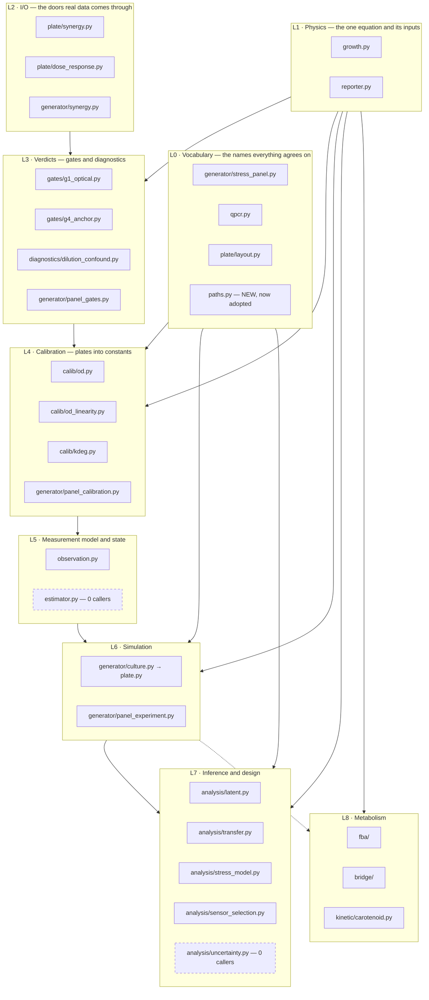
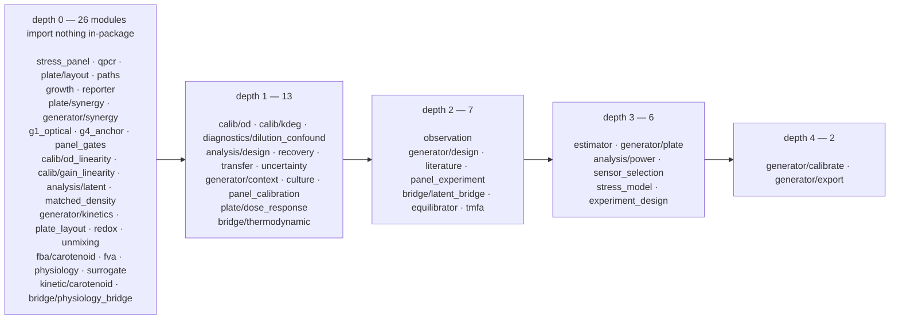
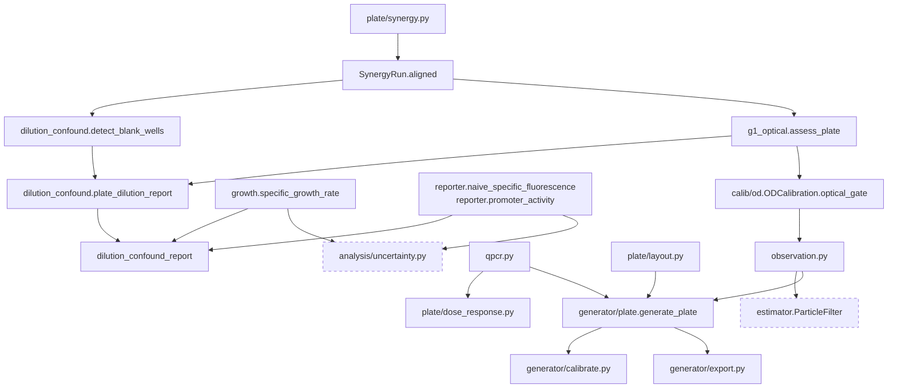
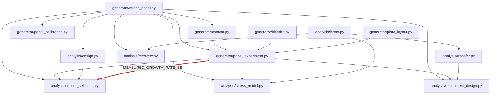

# Architecture map — `ystwin`

**Read this before changing anything.** It exists because several people and several agents
are about to edit this codebase at once, and the most expensive mistake available here is
not a bug — it is producing a claim the team cannot defend, by moving a number across the
boundary described in [§4](#4-the-two-worlds-boundary).

Scope: every module under `src/ystwin/` (154 code modules + 13 package
`__init__.py`, ~83,808 LOC), every script under `scripts/` (93), and the contracts the
10142-test suite pins down. **These five counts are checked** by
`scripts/audit_claims.py::check_architecture_scope`; they read 53 / 10 / 10,250 / 12 / 1,231
until 2026-08-31, every one of them wrong by roughly 2.5x, because nothing compared them
against the tree they describe. The dependency graph in §2 is an **AST-derived historical
snapshot**, not a current graph of every workflow added since compilation. Its depths and
caller counts must be re-queried before treating a module as dead. Sections 9–14 describe
the newer hybrid, teacher/student, stress-audit, published-HOG, product-blind transfer and
native-consistency/evidence-audit workflows.

> **Compiled 2026-08-26 against a repository under concurrent edit.** The `paths.py`
> migration and the `qpcr.gdna_share` addition landed while this was being written and are
> reflected below; anything else touched since may have moved. Line numbers are the most
> perishable claims here — treat them as pointers, not identifiers.

**Four things to hold in mind while reading:**

1. Reporter *activity* comes from the balance `dR/dt = k_synth − (μ + k_deg)·R`.
   Published phospho-Hog1 and protein-amount observations are different quantities with
   their own measurement transforms in §12; they are not fluorescent promoter activity.
2. Keep the provenance worlds separate: what was **measured on local plates** (four
   mCitrine biosensors, **no carotenoid pathway in any strain**), what was **designed ahead
   of the strain** (the product layer, stress panel and metabolic bridge), and the
   **published external measurements** used by the HOG route. §4 describes the original
   local/design split; §12 defines the external-data extension.
3. The original graph in §2 was acyclic. Current mechanistic-panel routing uses deferred
   imports to avoid an import-time cycle; do not infer present dependencies from that snapshot.
4. Uncertainty depends on the workflow. Real-plate fold intervals now use
   `analysis/uncertainty.py`; the new synthetic recovery scores are not biological confidence
   intervals. §5 records the original uncertainty audit, not a current claim that no intervals
   exist anywhere.

**Reading it in 30 minutes.** §1 (layers), §2.2–2.6 (the two sub-graphs, the hubs, the
orphans), **§4 in full — this is the one section not to skim**, §5.2 (the table of dropped
uncertainty), and §6.3 (units and hidden coupling). §3 is reference material to consult
when you touch a specific pipeline; §8 is a lookup table, not prose. §7 tells you which
eight *source* files to read next.

---

> **This file is checked, as of 2026-08.**
> `tests/test_architecture_doc_matches_the_code.py` fails if it names a module that no
> longer exists, or if a module exists that it never names. It does **not** check that what
> is said about a module is true — that is what review is for. It checks that the inventory
> is current, which is the part that goes wrong silently.
>
> When the check was written this file was missing **sixteen** modules, including
> `predict.py`, the package's own entry point, and the whole `pathway/` layer that the
> product prediction now runs through. It also still drew two modules that had been
> archived. Roughly ten of those sixteen predated the August rebuild, so it had been
> drifting for a while before anyone looked.

## 1. The layer stack

### Current shared physical engine and evidence contracts

The dynamic public entry is `predict.py::predict_protocol`. It uses the same `Protocol`,
physical state, parameter and result contracts as the protocol adapters in
`generator/culture.py`, `fba/dynamic.py` and `hybrid.py`. No adapter invents missing
parameters or runs a second physical simulation. The older empirical, fixed-volume and
allocation-conditioned implementations remain explicitly named comparison routes.

| Module | Current responsibility |
| --- | --- |
| `mech/contracts.py` | Protocols, interventions, genotype, amount-based state, observations, units, compartments and explicit validity. |
| `mech/engine.py` | One stiff integration clock; carbon/nitrogen inventories, live/dead biomass, flows, expression, metabolic pools, product intermediates and optional supported thermodynamic rate constraints. |
| `mech/signalling.py` | Carbon/PKA/Snf1, nitrogen/TOR, Yap1, Hsf1/Hsp70, source-derived HOG/volume and existing UPR feedback on the shared state. |
| `mech/adapters.py` | Single-dispatch adapters using the same schema objects and physical engine. |
| `mech/inference.py` | Explicit finite-ensemble state inference through the same physical engine and calibrated observer; complete state/history resampling and prequential diagnostics. |
| `fba/allocation.py` | Distinct state-mixture, mechanistic, fixed-objective and fixed-transition allocation policies; complete flux solutions and explicit cell/biomass weighting. |
| `analysis/validation.py` | Training-only fold construction, nested selection, shared product scoring and matched-entry branch comparisons. |
| `analysis/parameter_evidence.py` | Checked source assets, parameter evidence, uncertainty and source-native reference execution without invented physical input conversions. |
| `analysis/cosmic_data.py` | Pinned, read-only COSMIC workbook ingestion with original cell identities, normalized/coded units, inferred-versus-measured roles and explicit unresolved model/vessel mappings. |
| `analysis/mechanistic_reference.py` | Source-parameter synthetic benchmarks, separated learner inputs/evaluator truth, and explicitly labelled published-fit replay. |
| `artifacts.py` | Full-path producers and inputs, isolated regeneration, semantic comparisons and reviewed, stale-resistant reproduction receipts. |
| `analysis/frozen_runtime.py` | Explicit original-code/runtime snapshots for historical replay and auditing; no restamping frozen evidence to current code. |
| `analysis/claims.py` | Declared scientific claim inventory, conditions, units, evidence, coverage and confirmed refusals; not decimal-count heuristics. |

The shared engine is **prior-conditional**, not a validated whole-cell model. Its paired
acetate/proton-export option pays its declared ATP costs once but is not a complete
Pma1/transporter regulation model. Thermodynamic audit mode does not constrain rates;
`constrain_supported` constrains only explicitly covered molecular steps with supplied
activities. Carbon/nitrogen and tracked cofactor accounting do not imply complete mass,
charge, electron, phosphate or CoA conservation. Each result retains these limitations.

Native HOG and nutrient-signalling reference models are separate source-native checks.
Jalihal nutrient inputs are normalized and its time convention is unresolved; they are not
silently translated into reactor glucose/nitrogen concentrations or physical hours.

Two standalone transcriptions extend source reproduction, not the shared engine:

| Module | Reproduction scope and remaining boundary |
| --- | --- |
| `mech/heat_zheng2016.py` | Six-state Zheng/Krakowiak Hsf1-Hsp70 transcription with explicit published-gain and client-loss choices; no physical temperature-to-unfolded-protein or absolute abundance calibration. |
| `mech/ph_ke2013.py` | Partial Ke ion-regulation transcription: seven executable ODEs, one recorded volume equation and fifteen untranscribed ODEs; numerical discrepancies and missing buffering/export evidence remain unresolved. |
| `mech/atp_teusink2000.py` | Teusink glycolysis (BIOMD0000000064, CC0), reproducing Table 4 at a genuine steady state. REGISTERED AND UNDRIVEN: `cytosol_l_per_gdw` is refused, and the deposit's `KeqAK` is written for the reverse of `engine.py`'s adenylate reaction. |
| `mech/calcium_ke2013.py` | Ke's calcineurin/Crz1 arm, wiring over `ph_ke2013.py`'s audited executable rather than a second transcription. REGISTERED AND UNDRIVEN: Crz1p's only printed output arm has no transcribable coefficient, and the axis has no non-negative rest point below pH 6.3327. |
| `mech/carbon_williamson2009.py` | Williamson cAMP/PKA with the negative feedback the engine's own form lacks; 36 published figure landmarks inside 2% of full scale. REGISTERED AND UNDRIVEN: the unit bridge is refused, and it closes the cAMP input side only, not the panel's declared Snf1 -> Adr1/Cat8 -> CSRE module. |
| `mech/cell_wall_talemi2016.py` | Talemi osmo-stat (MODEL1606100000, CC0), Slt2 arm only; Table S6's closed forms reproduce the deposit's initial state to 1.7e-15. REGISTERED AND UNDRIVEN because its Hog1/Hog1PP duplicate the engine's own osmotic block from a different source, which its second test measures rather than asserts. |

None of these transcriptions is called by the shared engine. Their repository-authored records
in `data/transcriptions/` are not upstream executables or independently validated kinetics.
`scripts/matched_contrast.py` separately tests the empirical carotenoid ceiling against
within-paper contrasts; it does not produce held-out predictions.

The machine-readable role inventory and dependency/completion graph are
`data/repository_inventory.json` and `data/implementation_workflow.json`. Their scientific
completion conditions remain separate from a passing software test.

### 1.0 The empirical product comparison, assembled

Read this before §1.1, because it is the part that changed most recently and the diagrams
further down predate it.

`predict.py` used to advertise five layers and import three: `ystwin.fba` and
`ystwin.bridge.regulation` were never called from it. It now runs

| | module | what it does | verb |
| --- | --- | --- | --- |
| genotype → pathway flux | `pathway/flux.py` | one fitted scalar times relative entry-enzyme expression | **PREDICTS** |
| environment → growth rate | `generator/context.py`, `culture.py` | cardinal temperature, carbon source, aeration; chemostat physiology from van Hoek | BOUNDS |
| stressor + dose → state | `generator/stress_panel.py` | module activities; in a chemostat, whether a steady state exists at all | CLASSIFIES |
| flux + μ → every pool | `pathway/solve.py` | one mass balance per node, closed form | **PREDICTS** |
| flux + GEM → verdict | `fba/audit.py` | feasibility, precursor budget, growth cost | AUDITS |

with the pathway itself declared as data in `data/pathways/<product>.toml` and loaded by
`pathway/spec.py`. Nothing in `src/` names a product outside `pathway/calibrations.py`,
`kinetic/carotenoid.py` and `fba/carotenoid.py`.

**The GEM audits and cannot supply.** Capping every pathway reaction at the measured flux
magnitude leaves the FVA floor at exactly zero — an upper bound cannot make a flux
mandatory — so `fba/audit.py` checks a number that arrives from elsewhere. See
`docs/CLAIM_BOUNDARY.md`.

**The chain can now be asked whether it can run, but does not ask.**
`pathway/thermo_gate.py` takes a solved `PathwaySolution` and reports per step whether
`dG = dG0 + RT ln Q` at the solver's own concentrations leaves it able to run forward. It is
the first thing to join the layer that *produces* concentrations (`pathway/solve.py`, in
mmol/gDCW) to the layer that *consumes* them (`bridge/thermodynamic.py`), which is the join
`docs/DISTANCE_TO_THE_VISION.md` §6 item 1 asks for. Three states rather than two — `runs`,
`cannot_run`, `cannot_say` — because the vendored tables cover **44.5% of yeast-GEM's
reactions** (1840/4131; the 54.7% figure that is easy to reach for is METABOLITE
coverage, a different denominator, and it understates the blindness by ten points in
the flattering direction) and
`reaction_dg0` returns no energy rather than a partial one, and a gate that reported an
uncovered reaction as feasible would hand back a clearance it never earned.

**`cannot_say` is now four reasons, and two of them were being read as one.** `Unresolved`
splits the state that used to be a free-text note: `no_energy`, `charge_translocation`,
`no_concentration`, `refuted_uncertainty`, and the opt-in `uncertainty_exceeds_effect`. The
split came out of the beta-carotene pathway, whose three steps reported `no_energy` while
`data/pathways/beta_carotene.toml` recorded in prose that the tables "carry no formation
energy for a C40 carotenoid". They carry all three. The gap was a NAME —
`fba/carotenoid.py` invents the metabolite ids and no published alias table maps an id
invented here — and `data/thermo/heterologous_metabolites.tsv` closes it as declared data,
cross-checked against the module's own annotations by `tests/test_carotenoid_ec.py`. The
energies now resolve and are still refused, by `data/thermo/refuted_energies.tsv`, because
the two estimators this repository ships disagree on those three steps by 22, 225 and 124
kJ/mol while eQuilibrator quotes 4.9, 12.8 and 15.5 — and on `CRTI` they disagree on the
sign, −59 against +166. Same verdict, different fact, different
work: `no_energy` is closed by an identifier and `refuted_uncertainty` only by a measured
formation energy. `bridge/thermodynamic.py`'s `reaction_dg0_uncertainty` reports a standard
error beside every verdict, propagated over **net structural cues** rather than over
formation energies — quadrature over the latter triple-counts the shared CoA moiety and
gives the thiolase 36.2 kJ/mol against its own +38.07, where the net cue vector gives 4.5.
See `docs/research/CAROTENOID_ENERGIES.md`.

**It is in the chain, opt-in.** `predict.py` takes `thermo=` and gates every step the spec
declares chemistry for, at the concentrations that solve produced, swept across
`thermo_volumes`. This paragraph previously said it was not called, which was true when it
was written; `pathway/spec.py`'s `metabolite` / `reaction` / `stoichiometry` fields are the
half that was missing, and both shipped TOMLs now declare them.

**Two caveats did not go away with the wiring, and neither should be read as having.** The
mmol/gDCW → molar conversion still needs a cytosolic volume per gram dry weight that nobody
here has measured — which is why the API requires it as an argument and
`gate_across_volumes` with `volume_dependent_steps` names every verdict that flips inside the
plausible range. And the case it was built to express — `r_0103`'s +38.07 kJ/mol and its
19 mM acetyl-CoA threshold — still rests on two concentrations from two laboratories, and
the acetyl-CoA level still arrives through `background_m` rather than from the solve, because
`phb` declares acetyl-CoA as the precursor rather than as a node.

So what changed is *where* the question is asked, not how well it is answered:
`predict_product` on `phb` returns `cannot_run` at 10 µM and — after the 2026-08-30 kcal/kJ
correction in `bridge/thermodynamic.py` — `cannot_run` at 425 µM too, inside a prediction
rather than only inside `scripts/thiolase_threshold.py`. That script now records the
refutation of the lead it was written to support.

### 1.1 The rough read, corrected

The layering in the brief is close. The import graph forces four corrections:

| Brief said | Actually |
| --- | --- |
| Gates sit above Calibration | **Inverted.** `calib/od.py` imports `gates/g1_optical.py` (`ODCalibration.optical_gate()` *constructs* an `OpticalQualityGate`). `gates/g1_optical.py` imports nothing in-package at all. |
| `qpcr.py` and `plate/layout.py` are I/O | They are I/O **and the shared vocabulary.** `STRESSOR_FOR_CONSTRUCT`, `TARGET_FOR_CONSTRUCT`, `NEWPROTOCOL_LAYOUT` and `RECORDED_PLATES` are imported by the *simulation* layer. They are the widest-reaching constants outside `stress_panel.py`. |
| "everything under `generator/`" is one layer | It is **two disjoint stacks** sharing only `stress_panel.py`: a *plate-shaped* stack (`culture → plate → calibrate/export`, plus `design`, `literature`, `synergy`) and a *panel-shaped* stack (`stress_panel → context/kinetics/plate_layout → panel_experiment`). All of `analysis/` sits on the panel stack — **except `analysis/power.py`, which alone sits on the plate stack.** |
| "everything under `bridge/`" is one layer | Two unconnected halves: `physiology_bridge` + `latent_bridge` (FBA constraints) and `thermodynamic` + `tmfa` + `equilibrator` (Gibbs energies). They share no code and no caller. |

Also worth knowing before you start: `generator/synergy.py` is a **second Synergy reader**
that lives under `generator/` but is pure I/O, and `generator/panel_calibration.py` lives
under `generator/` but its whole job is testing design-side constants against real-plate
ladders. **Directory ≠ layer, and directory ≠ world.**

### 1.2 The stack



Dashed boxes are built and tested but on no pipeline.

### 1.3 What each layer owns

| Layer | Owns | Depends on | Depended on by |
| --- | --- | --- | --- |
| **L0 Vocabulary** | The names and numbers everything agrees on: which regulon exists, which construct sees which agent, which well held what. `paths.py` owns *where data lives*. | nothing | almost everything |
| **L1 Physics** | `μ` from an OD trace; the reporter ODE and its inversion. `growth.growth_rate_uncertainty()` is the only measured error bar in the package. | nothing | L3, L4, L6, L7 |
| **L2 I/O** | Parsing three genuinely different Excel dialects into tidy frames. Refuses rather than guesses (`raw_channel`, `read_positional_cq`). | `qpcr.py` (construct/dose parsing) | scripts; **nothing in `src/`** |
| **L3 Verdicts** | Three-valued gate outcomes carrying their own thresholds. Never a bare boolean. | L1, L2 | `calib/od.py`, `bridge/latent_bridge.py`, scripts |
| **L4 Calibration** | Turning a designed experiment into a constant with a stated error: reader linear range, reporter loss rate, dose EC50. | L0, L1, L3 | `observation.py` via `calib/od.py`; the rest is test-only |
| **L5 Measurement / state** | State → instrument reading, and (in principle) reading → posterior. | L4 | `generator/plate.py`, `generator/calibrate.py` |
| **L6 Simulation** | Synthetic plates in the real export shape (RFU units); synthetic panels in module-activity units. **Two different unit systems** — §6.3. | L0, L1, L5 | all of `analysis/` |
| **L7 Inference / design** | Latent state, transfer score, trained readout, sensor-set recommendation, bootstrap intervals. | L0, L1, L6 | scripts only |
| **L8 Metabolism** | GSMM validation, physiology→flux and latent→flux bridges, Gibbs energies, and the flux **audit**. | `fba/physiology.py`, `fba/solver.py`, `fba/fva.py` ← `fba/audit.py` | `predict.py` (via `fba/audit.py`), `scripts/run_scenarios.py`, `scripts/run_regulation.py`, `scripts/parked/run_d1.py` |
| **L9 Product** | A pathway declared as data, its flux predicted from the cassette, and every intracellular pool solved at steady state. The only layer that predicts a product number. | L0, L8 | `predict.py`, `scripts/predict_product.py`, `scripts/register_prediction.py`, `scripts/fit_pathway_flux.py` |

---

## 2. The actual dependency graph

Computed by AST-parsing every `import` under `src/ystwin/`, `scripts/` and `tests/`.
Nothing in the repo generates this; reproduce it with a throwaway script.

### 2.1 Topological depth

Depth = longest import chain to a module with no in-package imports. **Maximum depth 4.**



`bridge/thermodynamic.py` sits at depth 1 rather than 0 for exactly one reason: it now
imports `paths`. That single edge is the whole of the package's internal use of the path
convention.

### 2.2 The two live sub-graphs

Almost every edge falls into one of these two trees. Keeping them straight is most of what
you need to navigate the package.

**The plate tree — real data in, verdict out:**



**The panel tree — synthetic panel in, design recommendation out:**



The thick red edge is the one measured number that crosses into the design world. See
[§4.3.1](#43-where-the-boundary-is-blurred--flag-list).

### 2.3 Cycles

**None.** Tarjan over the full package finds no strongly-connected component of size > 1
and no self-edge. Three deferred (in-function) imports exist:

- `analysis/stress_model._subset` imports `generator.panel_experiment.PanelDataset`
- `analysis/power._ratio_trial` and `ratio_growth_invariance` import
  `generator.unmixing.ratio_series`

None of them closes a cycle, so all three are style rather than necessity.
**[uncertain]** whether `_subset`'s deferred import once broke a cycle that no longer
exists.

Keeping the graph acyclic is worth defending. If you find yourself adding an import that
would close a loop, the fix is almost always to move the shared constant down into L0.

### 2.4 Load-bearing hubs — change these carefully

Fan-in counted two ways: importers inside `src/ystwin`, and total including `scripts/` and
`tests/`.

| Module | In-package | Total | Why it is dangerous |
| --- | ---: | ---: | --- |
| `generator/stress_panel.py` | **8** | **40** | The biology dictionary. Every `analysis/` module and 29 tests read it. Adding a module, stressor or reporter changes what `RECOMMENDED_BUILD` resolves to — §6.1. |
| `reporter.py` | 6 | **23** | Owns the one equation. `calib/kdeg.py`, `diagnostics/dilution_confound.py` import its **private** `_smooth_derivative`. |
| `generator/panel_experiment.py` | 3 | **19** | Holds the three measured noise constants (`MEASURED_GROWTH_RATE_SE`, `MEASURED_ACTIVITY_CV`, `OBSERVED_ACTIVITY_CV`) that four analyses and both training scripts read. |
| `paths.py` | 1 | **19** | Snapshot count; adoption has grown well past it — see §6.2, which says how to re-derive it rather than quoting a figure. Change a resolver's fallback order and every real-data script changes what file it reads. |
| `analysis/sensor_selection.py` | 0 | 12 | Zero in-package importers but 10 tests + 2 scripts. Runs a 10,626-candidate search **at import time** (~0.7 s measured). |
| `growth.py` | 5 | 10 | `μ` is the divisor in the reporter equation; a bias here propagates into every activity. |
| `qpcr.py` | 4 | 10 | Two constant dicts in it reach the simulation layer. |
| `plate/synergy.py` | 0 | 10 | The only door real plate data comes through. Its `blank_subtracted` heuristic decides what "raw" means everywhere downstream. |
| `diagnostics/dilution_confound.py` | 0 | 9 | Zero library importers, three scripts, six tests including `test_pipeline_real.py`. |
| `generator/culture.py` | 5 | 7 | The mechanistic model the plate stack simulates from. |
| `bridge/thermodynamic.py` | 2 | 7 | The only in-package `paths` caller, and the default model and thermo tables for all three `bridge/` entry points. |
| `generator/context.py` | 1 | 7 | |
| `analysis/experiment_design.py` | 0 | 7 | |

### 2.5 Leaves — safe to change

"Leaf" means **nothing inside `src/ystwin` imports it.** That is not the same as unused —
many are the entry points scripts call. Split accordingly.

**Leaf, but load-bearing for a script** — change the body freely; changing the signature
breaks a pipeline:
`paths.py` (11 scripts), `diagnostics/dilution_confound.py`, `gates/g4_anchor.py`, `plate/synergy.py`,
`plate/dose_response.py`, `generator/panel_calibration.py`, `generator/panel_gates.py`,
`generator/synergy.py`, `generator/literature.py`, `analysis/power.py`,
`analysis/stress_model.py`, `analysis/sensor_selection.py`,
`analysis/experiment_design.py`, `analysis/recovery.py`, `analysis/matched_density.py`,
`bridge/latent_bridge.py`, `fba/carotenoid.py`, `fba/fva.py`.

**Leaf and genuinely safe** — no script, no in-package importer, only its own tests:
`estimator.py`, `analysis/uncertainty.py`, `calib/kdeg.py`, `calib/od_linearity.py`,
`bridge/tmfa.py`, `bridge/equilibrator.py`, `fba/surrogate.py`,
`generator/calibrate.py`, `generator/export.py`, `generator/redox.py`,
`kinetic/carotenoid.py`.

**`bridge/equilibrator.py` is still on that list and the reason changed on 2026-08-30.**
Until then it was unreachable: `pathway/thermo_gate.py` could only take a per-COMPOUND
estimator, so the chain ran on group contribution — the method this repository's own test
file says "fails where substrate and product are structurally similar" — while the better
one sat in a drawer. It covers 1,289 single-compartment reactions against group
contribution's 1,164, it never touched the kcal/kJ error corrected the same day, and on the
one reaction with an external check it is the one that is right: thiolase `r_0103` at
+24.96 ± 0.86 kJ/mol against a literature ~+26, where group contribution gives
+38.07 ± 4.55.

The gate now accepts either shape, and `PreferredEnergies` composes them — component
contribution first, group contribution as a per-reaction fallback, never mixed within one
reaction — reaching 1,355 of 2,663.

**It stays un-imported deliberately**, which is why the list above is unchanged and this
paragraph is not a claim that it moved. `equilibrator_api` is an optional dependency that
the tests `importorskip`; a gate that imported it would stop working on a machine without
it. So the backend is passed in by the caller and the gate discriminates on the interface
(`_backend_dg0`), not on the type. Un-imported and unreachable are different properties,
and only the second was ever the problem.

### 2.6 Imported by nothing but its own tests

Fourteen modules, roughly 3,100 LOC — about a quarter of the package. This is not
automatically waste; most of it is deliberately parked, or a capability built ahead of use.
A contributor should know which category each is in.

| Module | Only importer | Category |
| --- | --- | --- |
| **`scripts/extract_crosstalk_workbook.py`** | run by hand | **Derives `data/crosstalk/` from the workbook, and checks itself against the instrument export.** Not importable and not on any pipeline: it exists because the table it writes was hand-transcribed once and got one replicate of three. |
| **`scripts/score_afl_circuit.py`** | run by hand, `tests/test_afl_circuit.py` | **The auto feedback loop plates, and the sharpest test of this project's own thesis.** Naive `RFU/OD` falls across the galactose ladder for every strain; the dilution-corrected activity rises, monotonically, in all three biological replicates. The only dataset here measured over 20 hours, which is the regime `default_activity_window_h` is accurate in. |
| **`scripts/score_gain_linearity.py`** | run by hand, `tests/test_gain_linearity.py` | **Writes `outputs/gain_linearity.csv`: the fluorescence detector's linear range, from the second PMT gain every `+75100` protocol already recorded and nothing in this repository had read.** Gain 100 is 8.15x gain 75 with no drift from the fitting window to 99,998 RFU, and the channel fails by writing the flag −99,999 rather than by compressing — so zero readings used anywhere here are silently saturated. Reports the absorbance channel as an explicit negative: it is a different detector and does not move `od_linear_max`. |
| **`plate/gen5.py`** | `scripts/read_gen5_xpt.py`, `scripts/plate_readings.py`, `tests/test_gen5_xpt.py`, `tests/test_xpt_export.py` | **Reads the BioTek Gen5 `.xpt` binary, which is upstream of every `.xlsx` this project has.** A stdlib MS-CFB container reader plus an MFC `CArchive` walk, cross-checked against `olefile` where that is installed. Proven by reproducing committed plate text: fluorescence exactly, absorbance to 5e-4 because the `.xpt` stores four decimals and the export keeps three. `as_synergy_run` hands the archive to the rest of the pipeline in `plate/synergy.py`'s own shape, which is what took the biosensor panel from n=3 to n=4: `20260804`'s every workbook is blank-subtracted, so it could be *read* before this and not *used*. The time axis is decoded from `H:MM:SS` and not divided out of the milliseconds — the two are the same real number and different floats at 16 of that plate's 50 timestamps. |
| **`analysis/multiplicity.py`** | `scripts/fold_multiplicity.py`, `tests/test_multiplicity.py` | **Corrects the dose folds for each other, and shows why that is not the binding constraint.** Holm, Benjamini-Hochberg and family-wise intervals, plus the exact sign-test floor that bounds all of them at three plates, plus the within-plate permutation that is not bounded by it. |
| **`analysis/estimator_accuracy.py`** | `scripts/estimator_accuracy.py`, `tests/test_estimator_accuracy.py` | **Measures the package against itself, and is wired to a script.** It simulates a known promoter activity at the committed plates' own geometry, growth and reader noise, inverts it through `reporter.py`, and reports the error. It exists because `default_activity_window_h` justified its choice with a docstring table that no script produced and no test read -- and that was measured over a 24 h run while the plates are 4 h. It has no place in the prediction chain and should not gain one: nothing it computes is a claim about yeast, only about the estimator. |
| **`analysis/uncertainty.py`** | `tests/test_uncertainty.py` (27 tests) | **New, landed, tested, not wired.** It is the fix for §5 and no script calls it. |
| `estimator.py` | `tests/test_estimator.py` | Built, tested, never wired. The repo's only posterior. §5. |
| `fba/surrogate.py` | `tests/test_fba_surrogate.py` | Built for a filter+FBA coupling that does not exist. |
| `kinetic/carotenoid.py` | `tests/test_kinetic_carotenoid.py` | **Fitted** — the product layer, and the only layer that predicts rather than bounds. |
| `calib/kdeg.py` | `tests/test_kdeg_calibration.py` | Aspirational: needs a chase experiment nobody has run. |
| `calib/od_linearity.py` | `tests/test_od_linearity.py` | Aspirational: needs a dilution series nobody has run. **Defines a second `fit_od_linearity`** — §6.3. |
| `bridge/tmfa.py` | `tests/test_tmfa.py` | Research; its own docstring reports the answer was "no". |
| `bridge/equilibrator.py` | `tests/test_equilibrator_backend.py` | Research; optional `equilibrator_api` dependency. |
| `fba/stress_ros.py` | L8 | Makes oxidative stress DOSABLE: an H2O2 exchange and transport, a mitochondrial superoxide leak, and TSA1 restored to `r_0550`. Yeast9 has no peroxide exchange, so before this a dose could not enter. | `solver`, `physiology` | `mech/oxidative` | B | New 2026-09; verified, one alternative-oxidase free lunch found and closed |
| `fba/stress_ph.py` | L8 | Prices the proton budget: weak-acid diffusion, Henderson-Hasselbalch partitioning, Pma1 export at its ATP cost. `r_1832` is unbounded in shipped Yeast9, so protons were free. | `solver`, `physiology` | `mech/ph` | B | New 2026-09; verified |
| `fba/stress_biomass.py` | L8 | Biomass composition as PARAMETERS rather than the fixed coefficients of `r_4048`. Turns the trehalose/glucan false lethals (-100%, a pseudoreaction artefact) into finite costs. | `solver` | — | B | New 2026-09; verified |
| `fba/stress_pools.py` | L8 | Retained intracellular osmolyte pools (glycerol, trehalose) as growth-diluted demands, matching `pathway/solve.py`'s convention. Fps1 closure is retention, not export. | `solver` | `mech/population` | B | New 2026-09; verified, a negative-flux free lunch found and closed |
| `fba/stress_proteostasis.py` | L8 | Chaperone and heterologous protein as a proteome cost, with the amino-acid composition read out of the model's own protein pseudoreaction. Carries the corrected Metzl-Raz slope 0.35/ln(2). | `solver` | `mech/burden` | B | New 2026-09; verified |
| `fba/stress_oxygen.py` | L8 | Anaerobic and hypoxic modes. Shipped Yeast9 cannot grow at O2 = 0 even with ergosterol opened; this names every supplement required and why. | `solver`, `physiology` | — | B | New 2026-09; verified, a lipid-feeding hazard documented and pinned |
| `fba/stress_genes.py` | L8 | Restores stress genes absent from Yeast9's gene list (TSA1, GAS family, CRH1/2, ion transporters), as declared data. Fixes FALSE NEGATIVES in gene-level regulation, not fluxes. | `solver` | `fba/stress_pathways` | B | New 2026-09; verified |
| `fba/stress_pathways.py` | L8 | The diagram-level coverage audit: every sensor, cascade, TF and adaptation, with its representation status or an explicit refusal. | `stress_genes`, `mech` | — | B | New 2026-09 |
| `fba/stress_heterologous.py` | L8 | Installs PHB (which had a spec and no installer), prices ATP-coupled export, and reformulates `audit.py`'s precursor floor, which measured exactly zero at the declared node. | `solver`, `carotenoid` | — | B | New 2026-09; verified, phaA defaulted off as a strict negative |
| `generator/calibrate.py` | `tests/test_generator_calibrate.py` | S1 — fits the generator to an uploaded plate. No script calls it. |
| `generator/export.py` | `tests/test_generator_roundtrip.py` | Exists to make the round-trip test possible. |
| `generator/redox.py` | `tests/test_redox_ph_confound.py` | Encodes the E_GSH/pH reconciliation. |

`README.md` also lists a generator/augment.py; **no such file exists** (the gates it
describes are now `generator/panel_gates.py`).

---

## 3. Data-flow paths, end to end

Five chains, written as `module.function` steps with the type flowing between them.

### 3.1 Real plate → G1 → D2 — `scripts/run_gates.py`

```
paths.resolve_or_exit(paths.igem_results(), …)               Path, or SystemExit naming the env var
  → rglob("*.xlsx")                                          Path
  → plate.synergy.read_synergy_kinetic(path)                 SynergyRun (tuple[KineticBlock])
  → SynergyRun.aligned("OD600")                              DataFrame, cols MultiIndex(channel, well),
                                                             index = time_h
  → diagnostics.dilution_confound.detect_blank_wells(od)     list[str]  — OD floor AND not growing
                                                             ⚠ rfu= not passed, so the stronger
                                                               two-channel test is unused here
  → od[blanks].mean(), rfu[blanks].mean()                    float od_blank, float rfu_background
  → gates.g1_optical.assess_plate(od[cultures], od_blank,    DataFrame, one row/well:
        rfu[cultures], rfu_background, GATE)                   well, passed, failures, 4–5 metrics
  → survivors = table[table.passed].well                     list[str]
  → aligned.loc[:, (slice(None), survivors + blanks)]        DataFrame (re-sliced)
  → diagnostics.dilution_confound.plate_dilution_report(     PlateDilutionReport
        sub, "OD600", reporter, ReporterKinetics(k_deg=0),
        blank_wells=blanks)
      per well → dilution_confound_report(t, od, rfu, …)
          → growth.specific_growth_rate(t, od−blank)         ndarray μ, 1/h
          → reporter.naive_specific_fluorescence(sig, od)    ndarray RFU/OD
          → reporter.promoter_activity(t, spec, μ, kin)      ndarray RFU·OD⁻¹·h⁻¹
                                                             DilutionConfoundReport (+ .verdict)
  → outputs/g1_<tag>.csv, outputs/d2_g1passed_<tag>.csv
```

Order is load-bearing and the script says so: D2 asks how much of a reporter is growth
rate, which is meaningless in a well whose OD is not a quantitative biomass measurement.

`scripts/run_d2.py` is the same chain **without** the G1 filter, run over every reporter
channel rather than only the first.

### 3.2 Real plate → plate-map recovery → dilution-corrected dose response — `scripts/run_sensor_characterisation.py`

The most important real-data pipeline in the repo. It produces
`outputs/sensor_characterisation.csv`, which two other scripts consume.

```
paths.resolve_or_exit(paths.biosensor_plates(), …)           Path, or SystemExit naming YSTWIN_PLATES
  → glob("*.xlsx")                                           Path
  → plate.dose_response.read_dose_response(path)             DataFrame[construct, dose_mM, time_h, signal]
                                                             ⚠ time_h = sheet MINUTES / 60
  → plate.layout.blanks_for_export(path.name)                tuple[str] | None  — logbook, keyed by date
  → plate.synergy.read_synergy_kinetic(path)                 SynergyRun
  → SynergyRun.raw_channel("OD600" / "mCitrine")             KineticBlock — refuses an already-blanked block
  → SynergyRun.aligned(od_channel)                           DataFrame
  → TWO blank sets:
       permissive = wells with od.median() < 0.15            → ob_match, rb_match
       strict     = logbook blanks, else
                    dilution_confound.detect_blank_wells(
                        od, rfu=fl)   ← two-channel test     → ob, rb
  → for_matching = (fl−rb_match)/(od−ob_match)               DataFrame RFU/OD — the team's convention
    normalised   = (fl−rb)/(od−ob)                           DataFrame RFU/OD — the physiological blank
  → plate.layout.recover_layout(for_matching, derived)       LayoutRecovery(layout, median_relative_error,
                                                                            runner_up_error, margin)
  → layout = found.layout if margin > 1.5
             else plate.layout.NEWPROTOCOL_LAYOUT            PlateLayout
  → per (construct, dose_index): layout.wells(…)             list[str]
  → growth.growth_window(t, od_mean)                         ndarray[bool] — OD ≥ 0.02
  → growth.specific_growth_rate(tw, odw)                     ndarray μ, 1/h
  → growth.max_specific_growth_rate(t, od_mean)              float μ_max, 1/h
  → reporter.promoter_activity(tw, specific, μ, k_deg=0)     ndarray activity
  → np.nanmean over the last 25 % of the window              float mu_late, naive_late, activity_late   ← §5
  → outputs/sensor_characterisation.csv
  → printed table: af = r.activity / base.activity           bare fold ratio, no interval               ← §5
```

**Two blank sets in one function is the subtlest thing in this pipeline.** The permissive
blank reproduces the team's own derived sheets so the layout can be matched against them;
the strict blank is the one a growth rate may legitimately be computed from. Mixing them
silently shifts every fold change. The function prints both when they differ, which is the
right instinct.

Downstream, `scripts/run_calibration.py` consumes that CSV:

```
outputs/sensor_characterisation.csv                          DataFrame
  → groupby(construct, stressor) → mean per dose             DataFrame[dose_mM, activity_late, mu_late]  ← §5
  → generator.panel_calibration.calibrate_stressor(…)        CalibrationVerdict
       usable_points ∧ healthy_doses    → keep mask
       half_maximal_dose                → float | None  (a LOWER BOUND, not an EC50)
       induction_is_identifiable        → bool
       fit_dose_response                → DoseFit
  → outputs/panel_calibration.csv
```

### 3.3 qPCR export → ddCq → G4 verdict — `scripts/run_g4.py`

```
raw Bio-Rad export (lowercased OOXML zip entries — unreadable)
  → scripts/repair_qpcr_export.py                            paths.qpcr_dir()/20260724_*.xlsx
  → qpcr.read_positional_cq(path, QPCR_PLATE)                DataFrame[construct, target, dose_mM,
                                                                       tech_rep, cq, rt_minus_cq]
       ⚠ refuses if rows G/H carry readings, if the export is
         already annotated, or if UBC does not amplify
         earlier than the stress genes
paths.qpcr_raw_dir() → annotated 11 Aug / 13 Aug exports
  → qpcr.read_annotated_cq(path)                             same tidy shape
  → qpcr.rt_minus_margin(tidy)                               + margin_cycles, gdna_share,
                                                               passed, correctable
                                                               (a missing control ⇒ neither)
  → qpcr.delta_delta_cq(tidy, "UBC", control_dose=0.0)       + delta_cq, delta_delta_cq, fold_change
Biosensor Testing/*.xlsx
  → plate.dose_response.read_dose_response(path)             tidy
  → plate.dose_response.endpoint_response(tidy, 0.25,        DataFrame[construct, dose_mM, response]
        relative_to_dose=0.0)                                  = fold vs the 0 mM well
join on doses present in BOTH                                doses [0.0, 0.2, 0.5]
  + reporter_response := mean across plates                                                            ← §5
  + growth_rate       := 0.30 CONSTANT                       the confound test is disabled here        ← §5
  → gates.g4_anchor.anchor_agreement(frame,                  AnchorResult
        anchor_qc_pass_rate = qc.passed.mean())                verdict ∈ {PASS, REFUTED, INCONCLUSIVE}
  → outputs/g4_verdicts.csv
```

The gate's order of refusal is deliberate: RT⁻ QC → replicate count → dose count → anchor
SNR → growth confound → correlation. **In practice every anchor stops at the QC or the
power check**, so the growth-confound branch has never fired on real data. The script says
so in its closing note.

`rt_minus_margin` now returns a **four-column** verdict — `margin_cycles`, `gdna_share`,
`passed`, `correctable` — separating "contaminated but recoverable" from "past the 60 %
ceiling above which no published correction holds" (`qpcr.gdna_share`,
`_MAX_CORRECTABLE_GDNA_SHARE`, `docs/research/G4_STATISTICS.md`). All four reach
`outputs/g4_rt_minus_qc.csv`, but the verdict still consumes only `passed.mean()` as
`anchor_qc_pass_rate`. **The distinction is computed, written, and does not yet affect any
gate outcome.**

### 3.4 Synthetic panel → latent fit → transfer score — `run_training.py`, `run_transfer.py`

```
generator.stress_panel.{MODULES(24), STRESSORS(25), REPORTERS(24)}      the vocabulary
  → generator.panel_experiment.panel_dataset(                PanelDataset
        reporters, stressors,                                  .readings   (n, n_channels)
        doses = multiples of each agent's EC50,                            module-activity units
        noise_cv = MEASURED_ACTIVITY_CV,                       .labels     stressor name per row
        growth_rate_se = MEASURED_GROWTH_RATE_SE,              .doses      ABSOLUTE dose of members[0]
        combinations = RECOMMENDED_DESIGN,                     .modules    (n, 24) hidden truth
        contexts = [CultureContext(…) × 7])                    .n_unusable wells dropped as uncorrectable
      per treatment × dose:
        stress_panel.combination_response(applied)           dict[module → activity]
        + generator.context.baseline_activity(context)       dict[module → floor]
        steady = basal + reporter_loadings @ vector
        generator.kinetics.reporter_at_time(…)               if read_times_h given
        × N(1, noise_cv)
        × growth-correction factor 1 + ε/(μ+k_deg)           ε ~ N(0, growth_rate_se)
        × generator.plate_layout.edge_multiplier
  → generator.panel_gates.accept_panel(readings,             GateReport — SystemExit on refusal
        reference = real activity_late, reporters = …)          reference absent ⇒ gate SKIPPED, not failed
  → panel_experiment.with_growth_channel                     + μ as an extra observed channel
  → panel_experiment.pool_replicates                         one row per (label, dose, context)
  → analysis.stress_model.select_width_for_modules(…)        int k
  → analysis.stress_model.train_stress_model(fitted, k)      StressModel
       → analysis.latent.fit_latent(readings − centre, k)    LatentFit(states, loadings, bic,
                                                                       heldout_error, explained/channel)
       → lstsq(design, dataset.modules)                      readout matrix
  → analysis.stress_model.module_transfer(data, held, k)     dict[module → skill vs training mean]
                                                             0 where held-out truth does not vary
  → outputs/stress_model_{wide,build,three_sensor}.npz
```

`run_transfer.py` runs the *channel-prediction* variant of the same idea:

```
panel_dataset(…)
  → analysis.transfer.leave_one_stressor_out(data, k, obs)   DataFrame[held_out, alignment, r2, oracle_r2]
       per stressor → transfer_test
            _fit_model    → analysis.latent.fit_latent       (centre, loadings, prior var, noise)
            _predict_from → MAP under the training prior     ndarray predicted channels
            subspace_alignment                               float ∈ [0,1] — the bound on transfer
  → analysis.recovery.module_recovery(data, k, shuffle=?)    dict[module → R²] (+ shuffled control)
  → outputs/transfer_by_stressor.csv, outputs/module_recovery.csv
```

The `shuffle=True` control in `module_recovery` is the right instinct: a metric that still
scores under a permuted state is measuring the regression, not the model.

### 3.5 Generator → observation → FBA bridge → flux — `scripts/run_scenarios.py`

```
generator.plate.generate_plate(DEFAULT_PANEL,                SyntheticPlate(od, rfu, truth, blank_wells)
        PlateConditions(seed=42))
    per well → generator.culture.simulate_culture(…)         dict[biomass, growth_rate,
                 logistic biomass ODE                              promoter_activity, reporter]
                 → reporter.simulate_reporter(…)
    → true_od  = biomass/gdcw_per_od + od_blank
      true_rfu = background + (autofl + gain·R)·biomass      ⚠ inlined, NOT observation.observe_rfu
  → specific = (rfu − background)/(od − od_blank)            ndarray RFU/OD
  → growth.specific_growth_rate(t, od)                       ndarray μ, 1/h
  → growth.max_specific_growth_rate(t, od)                   float μ_max
  → reporter.promoter_activity(t, specific, μ, k_deg=0)      ndarray activity
  → np.nanmedian over the last 40 %                          float activity_late                        ← §5
  → bridge.physiology_bridge.MeasuredState(                  MeasuredState
        biomass_gl, growth_rate, glucose_mM=20.0, time_h)      ⚠ glucose is a literal, never assayed
  → bridge.physiology_bridge.physiology_constraints(state)   PhysiologicalConstraints
        q_glc ≤ q_max · S/(Km+S)   — supply, never demand
  → k_synth = (activity_late − μ·gdcw·autofl)/(gdcw·gain)    float, per-cell units
  → bridge.latent_bridge.latent_constraints(                 LatentConstraints
        LatentState(k_synth, construct, t), physical,          ⚠ raises unless
        acknowledge_unvalidated=True,                            acknowledge_unvalidated=True
        maintenance_per_activity=1200.0)                       ⚠ module default is 300.0
  → bridge.latent_bridge.compare_branches(model, physical,   DataFrame, 2 rows
        latent, REACTIONS)                                     branch, load_bearing, validation, 5 fluxes
       Branch A → physiology_bridge.predict_flux              pFBA, growth pinned at the measured rate
       Branch B → same, NGAM pinned to latent.atp_maintenance
  → outputs/scenario_predictions.csv
```

**Two things a reader must not miss.** First, the module docstring says the chain includes
*state estimation*; it does not — `estimator.ParticleFilter` is never imported by any
script, and the step is a smoothed point estimate. Second, **every input to this "measured
physiology" branch is synthetic.** `bridge/physiology_bridge.py` calls itself load-bearing
and it is well built, but it has never been run against a real plate.

---

## 4. The two-worlds boundary

> This is the section to get right. A contributor who confuses these two worlds will
> produce a claim the team cannot defend in front of judges.

### 4.1 The line

**World A — measured, against real plates.** The wet lab is characterising four mCitrine
biosensors: `UPRE1` / `UPRE2` (ER stress, challenged with DTT) and `NativeYap1` /
`AlteredYap1` (oxidative stress, challenged with H2O2). **No carotenoid pathway is in any
of these strains.** G1, D2 and G4 bear on those sensors as they stand.

The actual replication is smaller than the README implies and `docs/DATA_INVENTORY.md` is
the authority: the fluorescence channel — the one every reported result rests on — was read
on all 12 columns for only two of the four plates, so **UPRE2, NativeYap1 and AlteredYap1
have n = 2 biological replicates**, not 4.

**World B — designed ahead of the strain.** The product layer, the 24-module stress panel,
and the metabolic bridge. No current data constrains any of it, and none of it constrains
the current data. It exists so that decisions are settled before the pathway lands rather
than after. `docs/PARKED.md` is the canonical statement for the product half.

```mermaid
flowchart TB
    subgraph A["WORLD A — measured against real plates"]
        direction TB
        A1["plate/synergy.py · plate/dose_response.py<br/>plate/layout.py · qpcr.py"]
        A2["growth.py · reporter.py"]
        A3["gates/g1_optical.py · gates/g4_anchor.py<br/>diagnostics/dilution_confound.py"]
        A4["calib/od.py · calib/od_linearity.py · calib/kdeg.py"]
        A5["analysis/matched_density.py · analysis/uncertainty.py<br/>generator/synergy.py"]
        A6["generator/panel_calibration.py"]
        A7["scripts: run_gates · run_d2 · run_g4<br/>run_sensor_characterisation · run_calibration<br/>analyse_atp_sensor · repair_qpcr_export"]
    end

    subgraph B1["WORLD B1 — product layer, PARKED"]
        direction TB
        P1["fba/carotenoid.py · fba/fva.py · fba/surrogate.py"]
        P2["kinetic/carotenoid.py"]
        P3["observation.py — ONLY inner_filter_coeff,<br/>attenuation(), correct_inner_filter(),<br/>observe_rfu(carotenoid=)"]
        P4["scripts/parked/run_d1.py"]
    end

    subgraph B2["WORLD B2 — stress panel, designed ahead"]
        direction TB
        S1["generator/stress_panel.py<br/>24 modules · 25 stressors · 24 reporters"]
        S2["generator/context · kinetics · plate_layout<br/>panel_experiment · panel_gates<br/>redox · unmixing · culture · design<br/>literature · plate · calibrate · export"]
        S3["ALL of analysis/ except<br/>matched_density and uncertainty"]
        S4["scripts: run_training · run_transfer · run_power"]
    end

    subgraph B3["WORLD B3 — metabolic bridge, literature-anchored"]
        direction TB
        M1["fba/physiology.py — van Hoek 1998,<br/>published, not this lab's data"]
        M2["bridge/physiology_bridge.py — 'load-bearing',<br/>only ever run on synthetic input"]
        M3["bridge/latent_bridge.py — REFUSED by G4"]
        M4["bridge/thermodynamic · tmfa · equilibrator"]
        M5["bridge/maintenance_calibration.py — PMID 40181231,<br/>published, not this lab's data"]
        M6["bridge/stress_energetics.py — joins M3 to M5,<br/>REFUSED on both halves"]
    end

    A2 -.->|"the one equation, reused"| S2
    A1 -.->|"STRESSOR_FOR_CONSTRUCT<br/>NEWPROTOCOL_LAYOUT"| GEN["generator/plate · calibrate · export"]
    A6 -.->|"tests panel EC50s<br/>against real ladders"| S1
    S2 ==>|"MEASURED_GROWTH_RATE_SE"| S3
    A7 -.->|"sensor_characterisation.csv<br/>as the predictive reference"| S4
    GEN -.->|"synthetic input to a<br/>'load-bearing' branch"| M2

    style A fill:#e8f5e9
    style B1 fill:#fff3e0
    style B2 fill:#e3f2fd
    style B3 fill:#f3e5f5
    linkStyle 3 stroke:#c62828,stroke-width:3px
```



### 4.2 Module by module, and function by function where a file straddles

**Unambiguously World A (measured):**
`plate/synergy.py` · `plate/dose_response.py` · `plate/layout.py` · `qpcr.py` ·
`growth.py` · `reporter.py` · `gates/g1_optical.py` · `gates/g4_anchor.py` ·
`diagnostics/dilution_confound.py` · `calib/od.py` · `calib/od_linearity.py` ·
`calib/kdeg.py` · `analysis/matched_density.py` · `analysis/uncertainty.py` ·
`generator/synergy.py` · `generator/panel_calibration.py` · `paths.py`.

**Updated 2026-09-03, twice, and the second update retracts the first.** `stress_diversion`
originally quoted its channel at 0.25–2.0 mmol/gDCW/h and called it large. A literature sweep
of all 24 stress modules put physiological numbers on those fluxes and they are one to three
orders of magnitude lower — glutathione's entire pool is 8.8 µmol/gDW, so holding it at
`mu` = 0.18 costs 0.00158, against the 0.5 that was quoted. **At real flux, 0 of 24 modules
clear the 22.2% floor on a rich carbon budget and 3 of 24 on a lean one**, and catalase — the
ESR's peroxide sink — is metabolically **free**. The full ledger lives in
`outputs/stress_module_ledger.csv`, and the cost depends on the carbon budget by a factor of
seven, so a number quoted without the budget means nothing.

**The costs ADD, and that is what makes a multi-module stress state computable.** For each
effector pair the joint infeasibility point along `(t·W_a, t·W_b)` was found: a shared budget
predicts `t*` = 0.5, independent budgets 1.0. **All 45 pairs came back 0.5000–0.5137**, and
ten effectors at once gave `Σ(f/W)` = 1.011 against 1.0 shared and 10.0 independent. One
budget, to 1.1%. Sharing an intermediate does *not* make effectors cheaper together —
trehalose and glycogen both come off UDP-glucose and still give exactly 0.5000. The residual
is mild super-additivity from convexity, not competition. So `combined_cost` is
`−Σ(f_i / W_i)` over thirteen measured walls, and those walls are **not** metabolic ceilings:
max growth is exactly linear in total diversion, so `D_max(mu) = D0·(1 − mu/0.88769)`.

**And then the required flux was supplied from a measurement, and the channel collapsed
further.** A search of ~53 papers across five product families found exactly one aerobic
dataset measuring a stress effector in absolute units on one strain across graded conditions
(Hakkaart 2020, PMID 31654410). Priced through `combined_cost`, every condition costs about
**−0.1%**, and the stress-induced *increment* is **0.008 percentage points** — **2,700×**
below the floor, not 1.5×. The glycerol row that carried the largest diversion is retracted:
1.49 mmol/gDCW/h is close to the *unstressed anaerobic* baseline, and aerobically
`q_glycerol` = 0.00 ± 0.00 at every oxygen level (PMID 18613954).

**The sign is also the other way round.** Every published dataset that dosed a stressor and
measured absolute biomass-normalised content found it **rising** — astaxanthin +83% with
biomass *falling*, β-carotene 35.77 → 117.62 µg/gdw under NaCl with biomass flat, 20 °C vs
30 °C ×59. Where anyone measured the mechanism it is **transcriptional**: under H₂O₂, HMG1 and
ERG12 did not move while CAR0/CAR1/CAR2 all fell (PMID 31487889) — precursor supply unchanged,
the pathway's own genes changed.

So the module models the **wrong mechanism**. Its arithmetic is right and reproduces; stress
reaches a product by changing how much *pathway enzyme* exists, which a metabolic model cannot
represent, not by stealing the pathway's carbon. That also explains the size mismatch without
appealing to anything else.

**Added 2026-09-03 — `bridge/stress_diversion.py`, the first stress channel large enough to
reach the product.** Six earlier routes from a stress state into the GEM all failed, the
largest moving titre **0.17–1.73%** against a 22.2% floor. Every one was a **scalar tax** —
NGAM adds ATP demand, the protein pool shrinks a budget. This is a different shape: flux
**required** into the named metabolic effectors of the stress response.

Checked rather than assumed: Yeast9 carries those effectors in full (5 trehalose reactions,
265 glycerol, 26 glutathione, 11 thioredoxin, 4 catalase) and **none** of the signalling —
MSN2, MSN4, HOG1, HAC1, YAP1, SKN7 and PBS2 are all absent, because a metabolic model has no
regulators. So the GEM has the machinery and no reason to use it; FBA maximises growth and
trehalose costs carbon. That missing decision is exactly what a learned latent state supplies.

Measured at glucose −10.0, oxygen free, growth **held** at 0.18 /h — so this is diversion and
not the growth channel — against a 0.7257 GGPP baseline: glutathione **−14.8%** at 0.5
mmol/gDCW/h and −60.6% at 2.0; trehalose −12.8% and −51.7%; glycerol −3.5% and −14.2%. Ten to
forty times the NGAM channel, and 20 of 52 combinations clear the floor. Both trehalose and
glutathione go **infeasible at 5 mmol/gDCW/h**, which is itself informative.

The limit is stated in the code: it does **not** know how much effector flux a given
environment causes. That number is the learned state and it is unmeasured, so the flux is a
required argument with no default. What the module contributes is the transfer function from
that flux to the product — a property of the host, and therefore the half that generalises.

**Added 2026-09-03 — the chain run end to end, and the ecModel question settled.**
`scripts/env_to_product.py` runs environment → product on both products that have anything
to say and **scores** it, because a chain that produces plausible numbers and is never
compared against a measurement is not evidence. On PHB, leave-one-state-out over Kocharin's
eleven states: `mu` alone **1.505×**, `mu` + environment **1.320×** — the environment channel
removes about a third of the error `mu` leaves. The tail is the other half of the story and
`tests/test_env_to_product.py` pins it too: worst held-out state **2.55×** off, and the count
of states wrong by more than 2× goes *up* from one to two. A four-parameter law on eleven
states tightens the middle and widens the tail.

`data/gem/ecYeastGEM_yeast902.xml.gz` is a GECKO 3.2.5 ecModel built on this repo's own
yeast-GEM 9.0.2 (`scripts/gecko/build_ecyeastgem.m`) — the first on any 9.x, since upstream
ships 8.3.4 and GECKO's tutorial ships 8.6.2. It is **not** the default: it is better on
growth (+4.5% against +5.8%) and **produces no ethanol at all**, reaching that growth
respiratively where the 8.3.4 model ferments. Every culture here ferments, so that is
disqualifying; `tests/test_ec_model_choice.py` pins the trade-off in both directions.

**Added 2026-09-02 — `pathway/gem_environment.py`, and it reopens a question two workflows
closed.** Both asked the GEM for a **ceiling** — "how much product could the host supply?" —
and that fails for a real reason: the predicted flux sits 12.8–195× below the ceiling so it
never binds, and scaling by each state's own measured uptake gives a captured fraction
spanning **216×**, because at high growth rate the measured biomass yields collapse and the
inferred uptake explodes with them. The conclusion drawn — that the GEM cannot carry the
environment signal — did not follow.

**Content is not set by a ceiling, it is set by a yield**, and yield is what FBA is good at.
Asked for maximum precursor per C-mol at matched carbon and matched growth rate, Yeast9 ranks
the carbon sources correctly on the one axis where a measurement exists. Under the SHIPPED
formulation -- a bare precursor sink at the growth rate Kocharin measured the contrast at --
ethanol yields <!-- audit:value table=outputs/gem_environment_predictions.csv column=ethanol_over_glucose row="product=phb; growth_rate_per_h=0.05" -->1.3584x
the maximum PHB per C-mol that glucose does.
It gets the **direction** and not the magnitude.

*This read `glucose 0.716, ethanol 1.000` until 2026-09-04, naming neither its formulation nor
its growth rate. That pair reproduces only under the FULL-PATHWAY formulation, which this
repository does not ship, and at mu = 0, where "matched growth rate" is vacuous. The paragraph
below was rewritten in the same edit and this sentence was left behind -- which is the exact
drift the marker now attached to it exists to catch.*
Leave-one-**carbon-source**-out on the eleven Kocharin states, predicting a feed never seen:
`mu` only <!-- audit:value table=outputs/gem_environment_scores.csv column=leave_one_carbon_source_out_fold_error row="law=mu only" -->**1.7237×**,
`log(GEM max)` <!-- audit:value table=outputs/gem_environment_scores.csv column=leave_one_carbon_source_out_fold_error row="law=log GEM max" -->**1.4683×**,
the pure carbon contrast <!-- audit:value table=outputs/gem_environment_scores.csv column=leave_one_carbon_source_out_fold_error row="law=GEM carbon contrast" -->**2.1942×**,
empirical `z` <!-- audit:value table=outputs/gem_environment_scores.csv column=leave_one_carbon_source_out_fold_error row="law=z empirical" -->**1.3439×**. The
middle number is not a win — `corr(log(GEM max), log mu) =`
<!-- audit:value table=outputs/gem_environment_scores.csv column=corr_with_log_mu row="law=log GEM max" -->**-0.8190**, so it beats `mu` by *being* `mu`.
Stripped of that collinearity the GEM's carbon signal correlates
<!-- audit:value table=outputs/gem_environment_scores.csv column=corr_with_log_content row="law=GEM carbon contrast" -->**+0.3656** with content against `z`'s
<!-- audit:value table=outputs/gem_environment_scores.csv column=corr_with_log_content row="law=z empirical" -->**+0.5801**. What survives is a falsifiable,
product-generic **sign** prediction that needs no data; the magnitude, where all the
predictive value lives, it does not supply.

*These six numbers read 1.587×, 2.345×, −0.922, +0.190 and +0.633 until 2026-09-04. They were
the PRE-CARRIER-FIX values: commit 385b6b8 corrected the precursor drain to return its group
carrier — a 15.5× error on a CoA-thioester — and regenerated every number a marker pointed at,
which at the time meant `pathway/gem_environment.py` and nothing here. That is the gap
`check_docstring_claims_are_marked` was extended to close; this paragraph now carries markers,
so the next regeneration cannot leave it behind.*

**The formulation is pinned, and that is not a detail.** The bare precursor sink and the full
PHB reaction carrying its NADPH cost are two different questions, and `Formulation` records
which one was asked. `comparable_with` refuses cross-formulation comparisons. An earlier
analysis read the sensitivity as "the coefficient's sign reverses" and treated it as a
refutation; it is really the statement that an unpinned formulation has no defined answer.

*This paragraph said "1.09–1.25 for PHB; a full PHB reaction … gives 1.40–2.00" until
2026-09-04, and neither half was a number this repository could produce. The sink half was the
PRE-CARRIER-FIX value; the full half had never been computed at all, because
`Formulation.precursor_sink_only` was declared, labelled and compared on but never READ by
`_max_precursor`, so both arms returned identical numbers under different labels. The flag is
now wired to the spec's declared net cofactor balance and both arms are written to
`outputs/gem_environment_formulation.csv` — see that table and `pathway/gem_environment.py`.
The measured gap is a few percent, not the 1.09→1.40 this sentence claimed.*

**It commits a falsifiable prediction** (`scripts/gem_environment_predictions.py` →
`outputs/gem_environment_predictions.csv`): at `mu` = 0.05 /h β-carotene shares PHB's sign —
ethanol favoured, GGPP ratio
<!-- audit:value table=outputs/gem_environment_predictions.csv column=ratio_low row="product=beta_carotene; growth_rate_per_h=0.05" -->1.2362–<!-- audit:value table=outputs/gem_environment_predictions.csv column=ratio_high row="product=beta_carotene; growth_rate_per_h=0.05" -->1.9505
across the swept supply — while gadusol and glycogen cross 1.0 inside that sweep and are not
predictions, so "the host is constant" buys the machinery and not one shared coefficient.

<!-- audit:retracted gadusol and glycogen flip at low growth rate -->
*Two corrections live in that sentence. "GGPP ratio 1.24–1.33" was pre-carrier-fix. And
"gadusol and glycogen flip at low growth rate" was WITHDRAWN by commit cf34701 on 2026-09-03,
which propagated the retraction to the module and the script and not to this file; both rows
carry `is_a_prediction=False` because their sign is a property of the unswept supply
parameter. The `mu` = 0.10 and 0.15 rows lost their prediction flag too, on 2026-09-04, for
the same class of reason one level down — see `pathway/gem_environment.py`.*

Two things it still cannot do:
the **magnitude** (about 30% of the measured log effect) and the **reversal** (Kocharin's
ethanol advantage shrinks and flips at `mu` = 0.1718 /h; the GEM's grows). That second gap is
the boundary between the halves of the vision — the GEM says what is *possible*, and how much
a cell takes is what a learned regulatory state must supply.

**Added 2026-09-02 — `pathway/environment_flux.py`, the environment channel.** The chain was
MEASURED to have exactly one route from the environment to the product — `mu`
(`scripts/product_environment_sweep.py`: 62 environments at a held growth rate return one
content value; 92 batch environments re-predicted at their own `mu` disagree by 6.4e-07
mg/gDCW). Yeast disagrees. Kocharin 2013 (`data/phb/kocharin2013_chemostat_states.tsv`) moved
PHB content from 4.33 to 16.55 mg/gDW between glucose and ethanol at an **identical** growth
rate — one genotype, one vessel, carbon matched at 0.666 Cmol/L, **64 standard deviations**
apart. That is 15× the entry-flux law's 22.2% noise floor, and the chain answered it with zero.

**And the effect reverses with growth rate**, which is why the module fits an interaction and
not a coefficient: ethanol is 3.82× glucose at `mu` = 0.05 and 0.89× at `mu` = 0.15, with the
sign flipping at **`mu` = 0.1718 /h — inside the measured window**. Leave-one-state-out median
fold error: constant 1.645×, `mu` only 1.505×, `z` only 1.344×, `mu`+`z` 1.441×,
`mu`+`z`+`mu·z` **1.320×**. Dropping the interaction is worse than dropping `mu`.

Two limits are structural. The **channel** is established without a model (64 SD); the
**coefficients** are not and cannot be — three carbon sources put the permutation floor at
1/3! = 0.1667, attained exactly. And they are fitted on ONE product whose limitation is
acetyl-CoA, fed directly by ethanol through ACS — a pathway mechanism, not a host one — so
`environment_factor` **refuses** for any product that has not measured its own.
`predict.py::_environment_layer` is therefore `REPORTED` for `beta_carotene`; it is
deliberately **not** `INERT`, which would record the absence of a coefficient as the absence
of an effect. The layer count is now nine.

**Corrected 2026-09-04 — it is `REPORTED` for `phb` too, and was never `IN_CHAIN`.** The
layer returned `IN_CHAIN, sets_the_number=True` and printed `ethanol -> 4.679x on content`,
while `predict_product` returned a **bit-identical** 1.7363905332 on glucose and on ethanol.
The factor was computed, formatted into the detail string, and never applied — the one layer
in nine whose label was false. It survived because `TestTheLayerIsWired` asserted the LABEL
and never the number; the class is now `TestTheLayerReportsAndDoesNotSetTheNumber` and carries
`test_the_content_does_not_move_with_carbon_source`, which checks `predict_product`'s return
value instead.

It was fixed by relabelling rather than by wiring the factor in, because wiring it could not
have produced information. `phb.toml` declares every node above the product passthrough, so
`solve_pathway` returns `content = v_in/mu`, **which is its own input** — the spec says no
content it produces "disagrees with any measurement at any parameter value". Multiplying an
unfalsifiable quantity by 4.679 leaves it unfalsifiable, and it would match Kocharin only by
restating Kocharin. The coefficient is also unscoreable (permutation floor attained exactly),
and `LayerState.REPORTED` is documented as "what an unvalidated branch gets". Keeping the
3.82× unspent leaves it available as a **held-out target** for a mechanistic factor — GEM
precursor yield, which transfers across products, times the promoter's own measured response
— which is what would earn `IN_CHAIN` honestly.

**Added 2026-09-02 — `fba/fedbatch.py`, the chemostat's replacement.** The vessel every
steady-state result in this package divides by a growth rate for, and the one piece of
equipment in the design the team does not have. An exponential feed
`F(t) = F0·exp(mu_set·t)` makes `mu` a stable fixed point of `d(ln q_S)/dt = mu_set − mu(q_S)`
for **any** monotone uptake→growth map, so the yield enters only through the loop's initial
condition — simulated against a Crabtree-kinked map with the yield wrong by 10×, `mu` still
lands within 2% of setpoint. It supplies what the chemostat supplied (a set `mu`, a balanced
state whose residual substrate is the chemostat's own Monod residual, so `pathway/solve.py`
is unchanged) and one thing it never did: **`mu` is measured afterwards from the biomass
series, with a standard error**, rather than asserted from a pump.

Two refusals, both at design time, and the second was found by simulation contradicting the
algebra. `mu_set` must sit below `mu_max` with margin, or the feed stops setting `mu`. And
`q_S(0) = mu_set / Y_assumed` must sit under the strain's uptake ceiling — a feed that opens
too rich starts the culture *already* past its ceiling, growing at `mu_max` and accumulating
carbon, and **no vessel size rescues it** because `F0` scales with `X0·V0` and `q_S(0)`
divides it straight back out. The practical rule that falls out: when the yield is uncertain,
guess it **high**. `predict.py`'s `Environment.dilution_rate` is now
`growth_rate_setpoint_per_h` and `WashedOut` is now `SetpointUnreachable` — a chemostat past
its critical rate empties, a fed-batch accumulates.

**Also added 2026-09-02, both World B3 (literature-anchored):**
`bridge/maintenance_calibration.py` carries the measured maintenance coefficients from PMID
40181231 — another lab's chemostats, in the same position as `fba/physiology.py`'s van Hoek
1998. `bridge/stress_energetics.py` composes `reporter.py` → `bridge/latent_bridge.py` →
`bridge/maintenance_calibration.py` → `fba/dynamic_rates.py`, which is the reporter → stress
→ maintenance → growth chain, and it is the ONLY module in the package that refuses on two
independent grounds at once: G4's verdict on the local constructs, and an unresolved SIGN in
the measurement that fixes its scale. It computes and reports; it does not set a number.

Note the last three under `generator/` and `analysis/`: `generator/synergy.py` is a second
Synergy reader used only by the ATP-sensor plates, `generator/panel_calibration.py` exists
to test World-B constants against World-A ladders, and `analysis/uncertainty.py` /
`analysis/matched_density.py` operate on real plate frames. **Directory ≠ world.**

**Unambiguously World B (designed ahead):**
`fba/carotenoid.py` · `fba/fva.py` · `fba/surrogate.py` · `fba/physiology.py` ·
`kinetic/carotenoid.py` · `bridge/*` ·
`generator/{stress_panel, context, kinetics, plate_layout, panel_experiment, panel_gates,
redox, unmixing, culture, design, literature, plate, calibrate, export}.py` ·
`analysis/*` except `matched_density.py` and `uncertainty.py` · `estimator.py`.

**Files that straddle — the dangerous ones:**

| File | World A part | World B part |
| --- | --- | --- |
| `observation.py` | `observe_od()`; `ReporterOptics.gain` / `.background` / `.autofluorescence` / `.detector_max`; the non-carotenoid part of `observe_rfu()` | `ReporterOptics.inner_filter_coeff`, `ReporterOptics.attenuation()`, `correct_inner_filter()`, the `carotenoid` argument of `observe_rfu()`. Named in `docs/PARKED.md`. |
| `generator/stress_panel.py` | `STRESSORS["DTT"].lethal_dose = 1.55` and `STRESSORS["H2O2"].lethal_dose = 1.0` — **both measured on the real plates.** `_DEFAULT_BASAL = 0.9`, set so a fully induced reporter reads ≈1.4× its undosed well, which is what UPRE1/UPRE2 measured. | Every other field. `.ec50` for DTT (1.0 mM) and H2O2 (0.5 mM) is **still literature** and the `source` string says so explicitly. All 24 reporters are idealised — **none of them is one of the lab's four constructs.** |
| `generator/panel_experiment.py` | `OBSERVED_ACTIVITY_CV = 0.146` (28 matched conditions, two real plates); `MEASURED_GROWTH_RATE_SE = 0.0117` (median over 210 real wells); `MEASURED_ACTIVITY_CV = 0.14` | `panel_dataset()` and everything it simulates |
| `estimator.py` | The filter itself is a general measurement model | `Observation.carotenoid` (default `0.0`) flows into `observe_rfu` → `ReporterOptics.attenuation`, so the likelihood carries a product term that is permanently inert |
| `analysis/sensor_selection.py` | `MEASURED_GROWTH_RATE_SE` and `REFERENCE_GROWTH_RATE = 0.22` (UPRE1 under 1 mM DTT — a measured rate) | Everything the search then decides |

### 4.3 Where the boundary is blurred — flag list

**1. A measured error bar decides which strains to build.**
`analysis/sensor_selection.py:20` imports `MEASURED_GROWTH_RATE_SE` from
`generator/panel_experiment.py`; `growth_penalty_cv()` divides it by
`REFERENCE_GROWTH_RATE = 0.22` (giving `_GROWTH_CV = 0.0532`); that is passed to
`select_sensors()` **at module import time** to compute `RECOMMENDED_BUILD`. A number
measured on 210 real wells therefore determines which four reporters the team is told to
build. This is defensible and arguably the point — but it is three hops from measurement to
recommendation, and nothing at the recommendation says so. Re-measure the growth-rate SE
and `RECOMMENDED_BUILD` changes silently, taking every number in `run_training.py`'s output
with it.

**2. Real plate facts flow into the synthetic generator.** `generator/plate.py`,
`generator/calibrate.py` and `generator/export.py` import `qpcr.STRESSOR_FOR_CONSTRUCT` and
`plate/layout.NEWPROTOCOL_LAYOUT`. Editing the real plate map changes synthetic plate output
and the round-trip test. Deliberate — a synthetic plate should have the shape of a real one
— but it means `plate/layout.py` is not a leaf you can quietly retitle.

**3. One dataclass, two worlds, one field apart.** `Stressor.ec50` is literature;
`Stressor.lethal_dose` for DTT and H2O2 is measured. The only thing distinguishing them is
the prose in `.source`. Any code reading `.ec50` is on the design side; any code reading
`.lethal_dose` for those two agents is quoting a measurement. `healthy_ladder()` reads
`lethal_dose`; `module_ec50()` reads `ec50`.

**4. `run_scenarios.py` runs a synthetic plate through a branch labelled "load-bearing".**
The script prints a clear disclaimer for Branch B (latent) and none for the fact that
Branch A's `MeasuredState` came out of `generate_plate()` and that `glucose_mM=20.0` is a
literal. Nothing in `scenario_predictions.csv` marks its inputs as synthetic. **This is the
single most likely place for a defensible-claim failure.**

**5. `fba/surrogate.py` justifies itself by a coupling that does not exist.** Its docstring
opens "A particle filter needs ~1e5 LP solves per culture". `estimator.py` does not import
`fba` at all, and nothing calls `build_surrogate` outside its test.

**6. `bridge/physiology_bridge.py` says "Load-bearing" in line 1.** True of its design — it
takes only measured quantities and can call a measurement impossible — but the evidence path
is empty: its only caller is `run_scenarios.py`, on synthetic input.

**7. `scripts/run_training.py` feeds real data into a simulation gate — the good direction,
with a silent failure mode.** `reference_readings()` reads
`outputs/sensor_characterisation.csv` (World A) and passes it to
`generator/panel_gates.accept_panel` as the posterior-predictive reference (World B). This
is the only check anywhere that compares simulated data against measured data. But if
`run_sensor_characterisation.py` has not been run, the reference is `None`, the gate is
**skipped**, and the report says `skipped` rather than `failed`. Run the real-data script
first, always.

**8. `analysis/uncertainty.py` is World A living in a World B directory.** It imports
`growth` and `reporter`, takes real plate frames keyed by `plate`, and is the only module
under `analysis/` besides `matched_density.py` that touches measured data. Do not let its
location pull it onto the panel stack.

---

## 5. Where uncertainty lives, and where it is dropped

### 5.1 What is produced

| Source | Quantity | Fate |
| --- | --- | --- |
| `estimator.Posterior.std`, `.interval()` | Full per-state posterior sd for biomass, reporter, activity, μ | **Never leaves the test suite.** No importer outside `tests/test_estimator.py`. |
| `growth.growth_rate_uncertainty()` | SE of μ, 1/h, **absolute** not relative | Collapsed to the frozen constant `MEASURED_GROWTH_RATE_SE = 0.0117`. Re-used properly by `analysis/uncertainty.activity_uncertainty` — which no script calls. |
| `analysis.uncertainty.FoldChange.low/.high/.estimable` | Cluster-bootstrap interval on a dilution-corrected fold, refused below 3 plates | **Zero callers outside tests.** `docs/DATA_INVENTORY.md` ran it by hand and reports all eight README rows as `INCONCLUSIVE` at n = 2. |
| `analysis.uncertainty.ActivityUncertainty.sigma` | Pointwise sd on recovered activity, with the R/μ correlation handled by Monte-Carlo | Same — tested, not wired. |
| `analysis.latent.LatentFit.heldout_error` | Cross-validated reconstruction MSE | Survives only as a scalar noise level in the MAP precision (`analysis/transfer.py:72`, `analysis/stress_model.py:113`). Never becomes an interval on a reported module activity. |
| `analysis.latent.LatentFit.bic`, `.explained_per_channel` | Model evidence, per-channel R² | Computed; written to no output. |
| `analysis.power.PowerEstimate.low/.high` | Wilson interval on a simulated power, plus an adaptive `tolerance` loop | **Live** — `replicates_needed(require_confidence=True)` requires the *lower* bound to clear the target. The best-behaved uncertainty in the repo, and it is on the design side. |
| `calib.od.ODCalibration.residual_std` | Fit residual sd, OD units | Carried on the dataclass; no caller reads it. |
| `calib.kdeg.DecayFit.stderr`, `ChaseFit.stderr` | SE of a loss rate, 1/h | Test-only. |
| `gates.g4_anchor.AnchorResult.anchor_spread`, `.replicates_needed` | Between-replicate sd; replicates to reach target SNR | **Live.** The signal-to-noise ratio — absolute anchor effect over between-replicate spread — is what forces INCONCLUSIVE. The one place uncertainty drives a *reported* verdict, and it is on the path that stops at QC. |
| `generator.panel_calibration.ReplicateVerdict.low/.high` | A genuine interval across biological replicates | **Not on the pipeline** — see 5.2. |
| `fba.fva.FluxRange.relative_width` | FVA width as a fraction of the max | **Live** in `scripts/parked/run_d1.py` — and the whole D1 conclusion is that width, so the parked path is the one place a range *is* the result. |
| `bridge.physiology_bridge.FluxPrediction.ranges` | Per-reaction FVA interval | Empty dict in every reported row — `with_ranges` defaults to `False` and `run_scenarios.py` never sets it. |

### 5.2 The exact line where uncertainty is discarded, per path

| Path | Line | What is lost |
| --- | --- | --- |
| **Sensor characterisation** | `scripts/run_sensor_characterisation.py:118–120` — `float(np.nanmean(mu[late]))`, `float(np.nanmean(specific[late]))`, `float(np.nanmean(activity[late]))` | Three means over the last 25 % of the window, no spread. These three floats **are** the reported dose response. |
| Sensor characterisation (report) | `scripts/run_sensor_characterisation.py:142–143` — `nf = r.naive / base.naive`, `af = r.activity / base.activity` | The printed fold change is a ratio of two means across plates, with no interval and no plate pairing. `analysis/uncertainty.fold_change` was written to replace exactly this line and is not called. |
| **Panel calibration** | `scripts/run_calibration.py:38` — `group.groupby("dose_mM")[["activity_late","mu_late"]].mean()` | Biological replicates are pooled into one ladder **before** `calibrate_stressor`, so `calibrate_replicates`'s replicate interval can never be formed. The interval-producing function exists and is tested; the pipeline calls the point-estimate one. |
| **G4** | `scripts/run_g4.py:146` — `"growth_rate": 0.30` | A per-dose, uncertain, now-recoverable quantity replaced by a constant. `g4_anchor` correctly reports `growth_r2` as NaN and prints "the confound is untested" — the gate is honest, the script starves it. |
| G4 (reporter side) | `scripts/run_g4.py:139` — `response = r.groupby("dose_mM").response.mean()` | Plate-to-plate spread of the reporter response is averaged away before the gate sees it, so only the anchor's spread can ever drive a verdict. |
| G4 (QC side) | `scripts/run_g4.py:150` — `anchor_qc_pass_rate=float(margin.passed.mean())` | `rt_minus_margin` now also returns `gdna_share` and `correctable`; the verdict consumes only the boolean pass rate, so "recoverable" and "past the correction ceiling" are written to CSV and then treated identically. |
| **Scenarios** | `scripts/run_scenarios.py:62` — `activity_late = float(np.nanmedian(activity[late]))` | The activity trajectory collapses to one number before becoming an FBA constraint. |
| Scenarios (flux side) | `scripts/run_scenarios.py:86` — `compare_branches(model, physical, latent, reactions=REACTIONS)` | `with_ranges` is never passed, so `FluxPrediction.ranges` is `{}` and every flux in `scenario_predictions.csv` is a bare pFBA point value with no FVA width beside it. |
| **Training** | `scripts/run_training.py:120` — `reached = sum(v > 0.25 for v in model.recovery.values())` | A continuous per-module R² thresholded to a count. `LatentFit.heldout_error` reaches no output at all. |
| **Transfer** | `analysis/transfer.py:195` — `score = float(table["r2"].median())`, and the same pattern at `analysis/experiment_design.py:64` | The spread of transfer R² across held-out stressors decides nothing; only the median selects the latent width or the design. |
| **Generator (input side)** | `generator/panel_experiment.py:43` | `MEASURED_GROWTH_RATE_SE = 0.0117` is the *median* of a distribution whose IQR (0.0079–0.0200) is documented in the very next paragraph and then not carried. Every simulated well draws `N(0, 0.0117)` as if the SE were known exactly. |

### 5.3 The shape of the gap

**This paragraph was written before `analysis/uncertainty.py` was wired in, and half of it
is now false.** It read: *"Three of the four uncertainty producers on the real-data path are
orphans (`estimator.py`, `calib/kdeg.py`, `analysis/uncertainty.py`) … So every headline
number in `outputs/` is a point estimate."* Measured on 2026-09-01, `analysis/uncertainty.py`
is imported by six scripts and **8 of 70 committed tables carry an interval or standard
error**. `estimator.py` is still an orphan — nothing under `src/` imports it.

What survives, and it is sharper than the original claim: **the intervals are on the
biosensor path and absent from the product path.** `late_window_sensitivity.csv`,
`fold_multiplicity.csv`, `autofluorescence_*.csv` and `gain_linearity.csv` all carry bounds;
`product_prediction.csv`, `scenario_predictions.csv` and `condition_sweep.csv` are point
estimates. The flux law has a fitted spread — `loso_rmse_log = 0.2002`, 1.22x typical error —
and `registered_prediction_D018.csv` already carries it as `flux_low`/`flux_high`, so the
machinery is present and simply stops at the flux rather than propagating through the
pathway solve into a content and a titre.

`analysis/uncertainty.py` is aimed precisely at rows 1–2 of §5.2. It has landed and is
well tested (27 tests, including a coverage check on clustered data), and it is worth
reading for its reasoning even before it is wired in:

- the unit of replication is the **plate**, not the well — resampling wells as independent
  narrows the interval by roughly `sqrt(wells per plate)`;
- the fold is computed **within** each plate and only then combined geometrically, because
  a plate-level multiplicative shift cancels in a per-plate ratio and does not cancel in a
  ratio of pooled means — this changes the *point estimate*, not merely its spread
  (`AlteredYap1` at 1.0 mM moves 1.50 → 1.44 on that change alone, and `NativeYap1` at
  1.0 mM moves 1.34 → 1.27; every other row is unchanged to two decimals);
- below `MIN_PLATES_FOR_INTERVAL = 3` it returns `estimable=False` with a reason string
  rather than a tight-looking number, and `excludes_unity` is then `False` by construction;
- `equivalence()` makes the positive claim ("the induction is *absent*") as two one-sided
  tests against a margin the caller must name in advance.

**Wiring it in is the highest-value change available on the real-data path**, and the entry
point is `scripts/run_sensor_characterisation.py` — it already writes the long-form frame
(`plate`, `construct`, `dose_mM`, `activity_late`, `naive_late`) that `fold_change` expects.

---

## 6. Extension points and hazards

### 6.1 Where a new X goes, and what must change with it

**A new stressor** — `generator/stress_panel.STRESSORS` is the entry point, but a stressor
that will actually be dosed on a plate touches six files:

| File | What |
| --- | --- |
| `generator/stress_panel.py` | `STRESSORS[name] = Stressor(agent, units, ec50, targets, source, lethal_dose?, target_ec50?)`. Every key in `targets` must exist in `MODULES`. |
| `qpcr.py` | `STRESSOR_FOR_CONSTRUCT` — which construct sees this agent. Without it, `generate_plate` silently falls back to `"DTT"` (`generator/plate.py:129`, `.get(construct, "DTT")`). |
| `qpcr.py` | `TARGET_FOR_CONSTRUCT` — the anchor gene G4 will compare against. |
| `plate/layout.py` | `_DOSES` and the relevant `RECORDED_PLATES` entry. |
| `generator/plate.py` | `DEFAULT_DOSES[name]`. |
| `generator/literature.py` | `_CONSTRUCTS`, if a new construct comes with it. |

Tests that will move: `test_stress_panel`, `test_dose_toxicity`, `test_per_module_potency`,
`test_full_landscape`, `test_what_the_build_resolves`.

**A new reporter (panel-side)** — `generator/stress_panel.REPORTERS`. Set `module` (must
exist), `also_reads` (keys must exist and must not name its own module), `kind`,
`integrates_hours`, `spectral_slot` (biochemical sensors only), `demonstrated_in_yeast`,
`validated_ph`, `basal`.
⚠ **`analysis/sensor_selection.RECOMMENDED_BUILD` is computed at import time**, so adding
one reporter can silently change the recommended build and every number in
`run_training.py` / `run_transfer.py`. Tests: `test_full_landscape`,
`test_sensor_selection`, `test_sensor_availability`, `test_spectral_feasibility`,
`test_what_the_build_resolves`.

**A new reporter (real construct)** — **eight places for one name**, and this is the
largest hidden coupling in the repo:

```
qpcr._CONSTRUCT_ALIASES                        normalised spelling from a sheet name
qpcr.TARGET_FOR_CONSTRUCT                      its qPCR anchor gene
qpcr.STRESSOR_FOR_CONSTRUCT                    which agent it is challenged with
qpcr.QPCR_PLATE.construct_columns              its three qPCR plate columns
plate.layout.NEWPROTOCOL_LAYOUT.construct_columns
plate.layout._STANDARD.construct_columns       a second, VERIFIED-IDENTICAL copy
generator.plate.DEFAULT_PANEL                  its CultureParameters
generator.literature._CONSTRUCTS               its literature-grounded parameters
```

Nothing enforces that these eight agree. `NEWPROTOCOL_LAYOUT == _STANDARD` compares equal
today (two separate objects with identical contents in one file); nothing keeps them so.

**A new module (regulon)** — `stress_panel.MODULES` **and** `_CASCADE_ORDER`. `_propagate`
walks `_CASCADE_ORDER` in sequence and relies on drivers appearing before what they drive;
a module missing from that tuple is never propagated, and one in the wrong position picks
up a stale driver value. **Nothing checks either condition.** Add a `Reporter` that reads
it too, or `analysis/design.module_standard_errors` will correctly report it as `inf`
forever.

**A new gate** — no registry, no discovery. The conventions to copy:

1. A frozen dataclass of thresholds, **carried on the result** (`WellQualityResult.gate`).
2. A three-valued verdict with a distinct INCONCLUSIVE, and a `reason` string that names
   the number that produced it (`AnchorResult`, `CalibrationVerdict`, `GateReport`).
3. A `summary()` method — `tests/test_reporting_api.py` asserts the human-readable
   surfaces do not crash.
4. A script under `scripts/` that writes a CSV to `outputs/`.

### 6.2 The path convention — `paths.py`, now the way data is found

`src/ystwin/paths.py` fixed a real problem: real-data locations were written inline in a
dozen places and several pointed into one person's home directory, which made every
real-data result in the README unreproducible by anyone else. **The migration has now
happened** — this is the convention, not a proposal.

The contract, and it is worth internalising because every new data reader should follow it:

- Each asset has one resolver. Resolution order is **env var → in-repo copy →
  sibling-directory convention → (for two assets) a known Desktop layout**, first hit wins.
- A resolver returns `None` when the asset is absent. **Nothing downloads, creates or
  guesses** — "an analysis that silently substitutes a different file is worse than one
  that does not run."
- `require(resolved, what, env_var)` turns `None` into a `FileNotFoundError` **naming the
  variable to set**. `resolve_or_exit(...)` does the same as a bare `SystemExit` with no
  traceback, which is what a command-line entry point should hand someone who has just
  cloned the repo.
- A caller that should *skip* rather than fail checks for `None` itself. Every real-data
  fixture in `tests/conftest.py` does exactly this, so the suite passes on a machine that
  has never seen a plate reader.

| Resolver | Env var | Asset |
| --- | --- | --- |
| `igem_results()` | `YSTWIN_IGEM_RESULTS` | the 2026-07 Synergy exports (`../igem-results`) |
| `biosensor_plates()` | `YSTWIN_PLATES` | the NewProtocol biosensor replicates |
| `atp_sensor_plates()` | `YSTWIN_ATP_SENSOR` | the two ATP-sensor exports |
| `qpcr_dir()` | `YSTWIN_QPCR` | the one **repaired** Cq export, vendored in-repo |
| `qpcr_raw_dir()` | `YSTWIN_QPCR_RAW` | the Cq exports that open as written |
| `thermo_dir()` | `YSTWIN_THERMO` | ModelSEED aliases + the pytfa thermo database |
| `yeast_gem()` | `YSTWIN_YEAST_GEM` | Yeast9 v9.0.2 SBML |
| `ec_yeast_gem()` | `YSTWIN_EC_YEAST_GEM` | GECKO `ecYeastGEM_batch` — **built on yeast-GEM 8.3.4**, a version mismatch the docstring flags as mattering for provenance |
| `data_dir()`, `outputs_dir()` | `YSTWIN_OUTPUTS` | vendored data; the table destination (created on demand) |

**Adoption is broad and is not censused here.** This paragraph used to read "11 of 12
scripts … 19 importers in total", name `src/ystwin/bridge/thermodynamic.py` as the only
in-package caller, and name `scripts/repair_qpcr_export.py` as the only script that does not
import it. All three were true of a 12-script tree and none is true now; nothing checked
them, so they aged silently in the same way the scope line in the header did. Re-derive the
count instead of trusting a sentence — an AST walk for `ystwin.paths` imports over
`scripts/`, `src/` and `tests/` is the whole measurement, and on 2026-09-09 it returned 64 of
93 scripts, 66 test modules and 4 in-package callers. A script that takes its paths as argv,
like `scripts/repair_qpcr_export.py`, is correctly not among them.

**What is left:**

- The two `pathlib.Path.home() / "Desktop/…"` literals inside `paths.py` itself
  (`biosensor_plates`, `qpcr_raw_dir`) are the deliberate final fallbacks, not leftovers.
  They are the reason migration was behaviour-preserving on this machine.
- Every script still does `sys.path.insert(0, parents[1] / "src")` by hand — harmless, but
  it is the last piece of path arithmetic in the tree. `scripts/parked/run_d1.py` uses
  `parents[2]` and says why in a comment, which is the right way to handle being one
  directory deeper.
- `paths.py` has **no test of its own.** Its resolution order is now load-bearing for every
  real-data result in the repo and nothing pins it.

### 6.3 Hidden coupling — conventions two modules must agree on

> **The correction-state half of this section is now enforced and the tables below are
> history.** `src/ystwin/readings.py` (added 2026-08-31) makes raw and blank-corrected
> readings different *types*, so the three tables that follow — "blank-corrected or raw?",
> "background-subtracted or raw?", and the per-OD/per-gDCW mismatch — describe conventions
> a caller can no longer get wrong by accident. They are kept because they record what the
> convention *was* and which functions sit on which side of it, which is still the fastest
> way to read the package. Where a row says "the parameter name is the only warning", the
> parameter's type is now the warning.
>
> **Time and dose are still unenforced**, and remain the live hazards in this section.

#### Units, per function — the classic silent-error source here

**Time.**

| Function | Unit | Note |
| --- | --- | --- |
| `plate/synergy._to_hours` | **hours** | Five input branches, one return unit: `HH:MM:SS`; **`MM:SS`** (so `"30:00"` = 0.5 h, not 30 h); `datetime.time`; `datetime.datetime`; `timedelta`; and a bare float as an **Excel serial day fraction × 24** (so `2.0` = 48 h). Tested by name in `test_input_validation.py`. |
| `plate/dose_response._extract_dose_block` | **minutes → hours** | `time_h = float(minutes) / 60.0`. The *only* place minutes appear. |
| `generator/export.write_synergy_export` | **hours → minutes** | Writes dose sheets as `float(time_h) * 60.0`, kinetic sheets as `HH:MM:SS`. **This is the inverse of the line above and the two must stay paired** — change one and every dose-response time axis rescales by 60. |
| `generator/synergy._clock` | **hours** | `HH:MM:SS` only. A second, simpler parser for the same instrument. |
| everything else | **hours**, ascending, strictly increasing | `growth`, `reporter`, `calib/kdeg`, `estimator`, `kinetic/carotenoid`, `diagnostics`, `analysis/uncertainty` all validate this. |
| `reporter.ReporterKinetics`, `growth`, `calib/kdeg`, `generator/culture` rates | **1/h** | `k_deg`, `k_mat`, `μ`, `mu_max`, `bleach_per_read` (per read, divided by interval in hours). |

**Optical density — blank-corrected or raw?** This alternates between adjacent functions and
nothing enforces it.

| Function | Expects |
| --- | --- |
| `growth.specific_growth_rate(optical_density=)` | **blank-corrected**, strictly positive. Raises with an explicit message if not. |
| `growth.growth_window`, `growth.max_specific_growth_rate` | **blank-corrected** |
| `growth.growth_rate_uncertainty(od=)` | **blank-corrected** (filters `y > 0`) |
| `gates/g1_optical.assess_well(optical_density=, od_blank=)` | **RAW**; blank passed separately and subtracted inside |
| `diagnostics.dilution_confound_report(optical_density=, od_blank=)` | **RAW**; subtracted inside |
| `calib/kdeg.fit_kdeg_from_chase(optical_density=, od_blank=)` | **RAW**; subtracted inside |
| `calib/kdeg.minimum_consistent_kdeg(optical_density=, od_blank=0.0)` | **`RawOD`**. The `0.0` default remains, and it is now harmless: passing a `CorrectedOD` here is a type error, so the default can only mean "this raw trace happens to have no blank" |
| `calib/od.fit_od_calibration(measured_od=, blank=)` | **`RawOD`**; subtracted inside via `minus_blank` |
| `calib/od.ODCalibration.linearise(measured_above_blank=)` | **already corrected** — the parameter name is the only warning |
| `calib/od_linearity.fit_linear_range(measured_od=)` | **`CorrectedOD`** |
| `analysis/uncertainty.activity_uncertainty(optical_density=)` | **blank-corrected**, strictly positive |
| `observation.observe_od` | *returns* a raw reading, blank included |

~~⚠ **Two different functions are named `fit_od_linearity`**, in `calib/od.py` and
`calib/od_linearity.py`, with different signatures and different return types
(`ODCalibration` vs `LinearityFit`). Nothing prevents importing the wrong one.~~
**Fixed 2026-08-31.** Both were renamed for what they return, so neither name is a guess:
`calib/od.fit_od_calibration` (fits the saturation model, takes `RawOD` and a blank) and
`calib/od_linearity.fit_linear_range` (finds the highest density still inside a tolerance,
takes `CorrectedOD`). The shared parameter name `measured_od` meant opposite things in the
two, which is now a type error rather than a wrong number.

**Fluorescence — background-subtracted or raw?**

| Function | Expects |
| --- | --- |
| `reporter.naive_specific_fluorescence(rfu, optical_density)` | **both already corrected** — subtracts nothing |
| `reporter.promoter_activity(reporter=)` | already per-cell and background-corrected |
| `gates/g1_optical.assess_well(rfu=, rfu_background=)` | RAW; subtracted inside |
| `diagnostics.dilution_confound_report(rfu=, rfu_background=)` | RAW; subtracted inside |
| `analysis/uncertainty.activity_uncertainty(reporter=)` | already `(RFU − background)/(OD − blank)` |
| `observation.observe_rfu` | *returns* raw, background included |
| `observation.correct_inner_filter` | takes raw, returns raw (adds background back) |
| `plate/synergy.KineticBlock.blank_subtracted` | **a detected flag, not a declaration**: `nanmin(rows) < 0`. A blank-subtracted block whose values all happen to stay positive is reported as raw, and `SynergyRun.raw_channel` will hand it back. **[uncertain]** whether this has bitten in practice; the workbooks it was written for do go negative. |

**Per-OD versus per-gDCW — the mismatch to know about.**

- `reporter.simulate_reporter` / `promoter_activity` document `reporter` as "per-cell mature
  reporter concentration (background-corrected RFU divided by biomass)". **Every real caller
  passes RFU/OD, not RFU/gDCW.** So `promoter_activity` returns RFU·OD⁻¹·h⁻¹ — reader units,
  not molar.
- `estimator.ParticleFilter`'s `reporter` state is **per gDCW** (it feeds
  `observe_rfu(reporter_mature, biomass_g_per_L, …)` where `ReporterOptics.gain` is "RFU per
  unit mature reporter per gDCW").
- ~~The two are never used together and **there is no converter.**~~ **There is one as of
  2026-09-01**: `readings.SpecificFluorescence.per_gdcw(gdcw_per_od)` returns a
  `ReporterPerGDCW`, which is the basis the filter's state is in. It **requires** the factor
  and refuses to default it, because `generator/calibrate.py` fits `gain x gdcw_per_od` as a
  single product and reports the pair as unidentifiable without a measured dry weight — so a
  default would invent the half nobody separated. 0.42 g/L per linearised OD unit
  (`PlateConditions.gdcw_per_od`) is this project's working value and belongs at a call site
  that can cite it. The two bases are now distinct types, so a per-OD trace reaching a
  per-gDCW slot is a `TypeError` rather than a silent error of about 2.4x.
- What remains for `estimator.py` is the wiring itself, not the reconciliation: nothing under
  `src/` imports it, and a real-data entry point still has to be written.
- `generator/calibrate.py` handles the same ambiguity honestly: it reports
  `gain × gdcw_per_od` as a single product and lists `("gain", "gdcw_per_od")` in
  `unidentifiable` unless a measured dry-weight factor is supplied.

**Dose.**

- `Stressor.units` is **free text**, and there are nine unit systems in one dict: `mM`,
  `ug/mL`, `uM`, `M`, `degC above 30`, `fraction removed`, `percent`, `nM`,
  `pH units above 5`. `viability`, `module_ec50`, `healthy_ladder` and `module_response` all
  take `dose` as a bare float in the agent's own units and never check.
- `panel_dataset(doses=)` is in **multiples of EC50** (`applied = multiple * ec50`), but the
  resulting `PanelDataset.doses` field stores the **absolute** dose of `members[0]`.
  Argument and field are different quantities under the same name.
- `qpcr`, `plate/dose_response` and `gates/g4_anchor` all use a column literally named
  `dose_mM` — correct for DTT and H2O2, wrong for any other agent.
  `qpcr.assert_single_stressor` guards against pooling two *agents*; nothing guards the unit.

**Biomass and flux.**

- `observation.observe_od(viable, dead, …)` — g/L. `gdcw_per_od` = g/L per linearised OD.
- `fba/*` and `bridge/*` fluxes are **mmol/gDW/h**; `kinetic/carotenoid.py` is
  **mmol/gDCW/h**. Same quantity, two spellings, across the boundary.
- `bridge/latent_bridge._MAINTENANCE_PER_ACTIVITY = 300.0` mmol ATP/gDW/h per unit promoter
  activity; `scripts/run_scenarios.py:35` overrides it with `1200.0` and calls it "a
  plausible scale, not a fitted one". Two numbers, one meaning, 4× apart.

**qPCR.**

- `qpcr.delta_delta_cq(efficiency=)` is in **(0, 1]** with
  `fold_change = (1 + efficiency) ** (−ddCq)`; `efficiency=1` means each cycle doubles. This
  is **not** the common "E ∈ [1, 2]" convention — passing `2.0` raises, and passing `0.9`
  gives base 1.9.
- `rt_minus_margin`: `margin_cycles = rt_minus_cq − cq`, and a **missing** control fails
  (NaN → `passed=False`). Intended: an unrun control is not a passed one.

**Thermodynamics — same constants, three scalings.**

| | `bridge/thermodynamic.py` | `generator/redox.py` |
| --- | --- | --- |
| Energy | kJ/mol | mV |
| R | `GAS_CONSTANT_KJ = 8.314e-3` | `_GAS_CONSTANT = 8.314` |
| F | `FARADAY_KJ_PER_V = 96.485` | `_FARADAY = 96485.0` |
| T | `STANDARD_TEMPERATURE_K = 303.15` | `_TEMPERATURE_K = 303.15` |
| Cytosolic pH | `CYTOSOLIC_PH = 7.5` | `_REFERENCE_PH = 7.0` |

`bridge/equilibrator.py` defines a *third* `CYTOSOLIC_PH = 7.5`, and
`generator/stress_panel.py` a `CYTOSOLIC_PH = (6.4, 7.4)` **tuple meaning something else
entirely** — the range the cytosol *reaches*, not its resting value. Four constants, one
name, three meanings.

**Duplicated model reaction ids.** `"r_2111"` (biomass), `"r_1714"` (glucose), `"r_1992"`
(oxygen) are each redefined in **three** modules — `fba/physiology.py`, `fba/fva.py`,
`bridge/physiology_bridge.py` — plus inline in `scripts/run_scenarios.py` and
`scripts/parked/run_d1.py`. Nothing keeps them in sync.

#### Cross-module private imports

Five places reach into another module's underscore namespace:

```
calib/kdeg.py:15                      from ..reporter import _smooth_derivative, …
diagnostics/dilution_confound.py:19   from ..reporter import … _smooth_derivative …
plate/dose_response.py:15             from ..qpcr import …, _normalise_construct, _parse_dose
generator/panel_calibration.py:23     from .stress_panel import STRESSORS, _LETHAL_HILL
bridge/{tmfa,equilibrator}.py         from .thermodynamic import _default_model
```

Each is defensible — `_smooth_derivative` genuinely is the shared derivative, and
`_LETHAL_HILL` genuinely must match between the generator and the fit — but renaming any of
those private names breaks a module in a different sub-package, with no type and no test to
warn you at the definition site.

#### Import-time work

`import ystwin.analysis.sensor_selection` runs `select_sensors(n_channels=5, n_reference=1,
…)` over C(24,4) = **10,626** candidate reporter sets, each with a 24×24 pseudo-inverse.
Measured at **~0.7 s**. Any module or test touching `RECOMMENDED_BUILD` or
`THREE_SENSOR_BUILD` pays it once; twelve callers do.

#### A missed strength worth knowing about

`diagnostics.detect_blank_wells(od, rfu=…)` has a two-channel mode whose docstring explains
exactly why it matters: on a real plate two medium wells drifted 1.10× in OD (evaporation,
settling debris), which an OD-only test reads as growth, while their fluorescence stayed
flat. **`plate_dilution_report` calls `detect_blank_wells(od)` without `rfu`**
(`dilution_confound.py:307`) even though `rfu` is in scope two lines above, and
`scripts/run_gates.py:39` does the same. Only
`scripts/run_sensor_characterisation.py:50` passes the reporter channel. The stronger test
is tested (`test_reporting_api.TestBlankDetectionUsesBothChannels`) and mostly unused.

### 6.4 Where this code is genuinely good

Worth saying explicitly, because it is also the fastest way to learn the house style.

- **Refusals are typed and they explain the fix.** `ODCalibration.linearise` refuses a
  reading past the detector asymptote rather than extrapolating; `correct_inner_filter`
  refuses an uncalibrated coefficient rather than treating it as zero; `partition_loss`
  refuses one read interval because the split is unidentifiable; `latent_constraints`
  refuses without `acknowledge_unvalidated=True`; `assert_single_stressor` refuses to pool
  two dose axes; `SynergyRun.channel` refuses a bare fluorophore name when the run holds two
  reads of it, "they differ in gain"; `read_positional_cq` refuses a layout the data
  contradict; `fba/surrogate` refuses to extrapolate; `fold_change` refuses an interval
  below three plates. Every one is the difference between a wrong number and no number, and
  every message names the experiment that would resolve it.
- **Gates return three values, never a boolean**, and carry their own thresholds on the
  result (`WellQualityResult.gate`, `AnchorResult.reason`, `CalibrationVerdict.note`,
  `GateReport.checked`/`.skipped`, `FoldChange.method`). A result is auditable without the
  call site, and a skipped check reports `skipped` rather than passing quietly.
- **Constants carry provenance in an attached docstring, with a PMID.**
  `MEASURED_GROWTH_RATE_SE`, `OBSERVED_ACTIVITY_CV`, `DEFAULT_WELL_CV`, `_AXIS_PRIORITY`,
  `_MAX_NET_CHARGE`, `CYTOSOLIC_PH`, `RECOMMENDED_DESIGN`, `THREE_SENSOR_BUILD`,
  `STRESSORS[*].source`. Several also record what the *previous* value was and why it was
  wrong (`MEASURED_GROWTH_RATE_SE`: "an earlier version … came to 0.048 — four times too
  large"). This is the single reason the two-worlds boundary is recoverable at all.
- **`detect_blank_wells` is the model of a root-cause fix.** The docstring names the actual
  failure (a stressed culture folded into the blank shifted OD by 0.014 and pushed every
  derived growth rate above the physiological maximum for yeast) and the fix uses the
  decisive channel — a medium well makes no fluorescence — rather than a tighter threshold.
- **`analysis/latent._centre` refuses to rescale to unit variance**, and says why: a
  pure-noise sensor would earn its own latent state. `_heldout_error` exists because BIC is
  degenerate at full rank, and `select_dimension` says so in one sentence.
- **`analysis/power.PowerEstimate` subclasses `float`** so it formats and compares like the
  bare number it replaced while carrying its Wilson interval, and `replicates_needed`
  defaults to requiring the *lower* bound to clear the target because "the answer is the
  number of cultures somebody then goes and grows". That is the right instinct applied at
  the right end.
- **The tests are the best documentation in the repo.** `test_network_wiring.py` asserts each
  cascade edge against a PMID and, more usefully, asserts the edges that were *removed*
  after checking. `test_what_the_build_resolves.py` states plainly that a build which cannot
  separate H2O2 from menadione should not be called "oxidative stress in general".
  `test_pipeline_real.py` locks in what the real plates showed, with a header saying that a
  change in these numbers is a signal to re-derive the conclusions rather than relax the
  test. **When a source module and a test disagree, read the test first.**

### 6.5 Docstrings and labels that disagree with behaviour

1. **`generator/panel_gates.physically_possible(readings, reporters=None, ceiling=…)`** —
   `reporters` is accepted, is documented in `accept_panel` as letting "the sign rule tell a
   promoter fusion from a ratiometric sensor", and **is never read in the body.** Every
   channel gets the same `values.min() < 0` rule. `test_panel_gates.py` passes the argument
   and asserts `is None`, which currently holds for an unrelated reason (the `basal = 0.9`
   floor keeps ratiometric readings positive), so the test does not catch it.
2. **`scripts/run_scenarios.py` docstring** — "Chain: mechanistic generator → observed
   OD/RFU → **state estimation** → measured physiology → FBA constraints → flux." There is
   no state estimation. `estimator.ParticleFilter` is not imported. The step is
   `reporter.promoter_activity`, a smoothed point estimate.
3. **`fba/surrogate.py` docstring** — "A particle filter needs ~1e5 LP solves per culture."
   No particle filter calls it; `estimator.py` does not import `fba`.
4. **`bridge/physiology_bridge.py` docstring** — "Branch A … Load-bearing." True of the
   design; the evidence path is empty (only caller is `run_scenarios.py`, on synthetic
   input).
5. **`generator/stress_panel.py:48–54`** — an orphan string literal that reads as
   documentation for `_DEFAULT_BASAL`, placed *after* `CYTOSOLIC_PH`'s docstring and eleven
   lines below the `_DEFAULT_BASAL` assignment it describes. It documents nothing. Harmless
   at runtime, misleading to read.
6. **`kinetic/carotenoid.steady_state_pools`** — defines a nested `solve_pool()` with a full
   docstring and a considered error message, then **never calls it**; the function
   integrates to steady state instead. Dead code that reads as the implementation.
7. **`qpcr._BLOCK_WIDTH = 4  # tech rep 1, tech rep 2, average, RT- control`** — defined,
   commented, **never used.** `_extract_annotated` hard-codes `col + 3` and `offset in (0,1)`
   and `QPCR_PLATE.roles` is three wide. Three descriptions of one plate block, one unused
   and disagreeing on the width.
8. **`analysis/sensor_selection.py` and `analysis/experiment_design.py` docstrings say
   "seven modules".** The panel now carries **24 modules, 25 stressors and 24 reporters**.
   `experiment_design` also says "Eight single-agent rays already span all seven modules".
   The code reads `len(MODULES)` and is correct; the prose is stale by an audit.
9. **`scripts/run_transfer.py` labels three tables wrongly.** `"all 28 pairs"` is
   `itertools.combinations(PANEL, 2)` over 12 stressors = **66 pairs**;
   `"recommended 6 pairs"` is `RECOMMENDED_DESIGN`, which holds **8**; `"full panel (7)"` is
   `READERS`, which holds **8**. Cosmetic in the code, not cosmetic in a report.
10. **`scripts/parked/run_d1.py`'s usage line still says `python scripts/run_d1.py`** —
    the script now lives one directory deeper and its path arithmetic has been fixed
    (`parents[2]`, with a comment saying why), but the docstring was not updated with it.
11. **`analysis/power.py:19`** imports `ReporterKinetics`, `promoter_activity` and
    `simulate_reporter` from `reporter.py` and **uses none of them**, so the graph edge
    `analysis.power → reporter` is real to a linter and phantom in behaviour. Separately,
    `_one_trial:178` inverts dilution as `recovered = signal * growth`, i.e. `k = R·μ` —
    correct only when `k_deg == 0`. `parameters_from_literature` defaults to `k_deg=0`, so it
    is right today and silently wrong the first time anyone passes a degron reporter.
12. **`README.md` is stale in four places** — it lists generator/augment.py (no such file;
    it is `generator/panel_gates.py`), describes `stress_panel.py` as "Seven yeast stress
    regulons … eight stressors, seven reporters" (actually 24/25/24), claims "149 tests"
    (3,241), and gives `python3 scripts/run_d1.py` (now `scripts/parked/run_d1.py`).
    `docs/DATA_INVENTORY.md` is the corrective for the dose-response table in it.

**Fixed since the previous revision of this map, recorded so nobody re-reports them:**
`bridge/thermodynamic.py`'s hardcoded home path and its `parents[3]` data path (both now go
through `paths`); `scripts/parked/run_d1.py`'s two off-by-one path offsets; every script's
and `tests/conftest.py`'s hand-rolled data locations.

Minor unused imports and dead bindings, all harmless but all verified:
`estimator.py` (`field`), `bridge/latent_bridge.py` (`REFERENCE_AEROBIC_BATCH`),
`bridge/tmfa.py` (`Zero`), `generator/synergy.py` (`numpy`),
`bridge/equilibrator.py` (`Q_` inside `load`). `gates/g1_optical.assess_well` binds `t` at
line 92 and never uses it. `generator/plate_layout.edge_multiplier` is public and used by
`panel_experiment` but is missing from `__all__`.

---

## 7. A newcomer's reading order — eight files, about two hours

| # | File | Time | The one sentence to hold |
| --- | --- | --- | --- |
| 1 | `docs/PARKED.md` | 5 min | The product layer is designed ahead of the strain and nothing in the current data touches it — read this before any code so you never quote a parked number as a result. |
| 2 | `src/ystwin/reporter.py` | 15 min | `dR/dt = k_synth − (μ + k_deg)·R` is the one equation the whole repo turns on, and everything called "activity" is `promoter_activity`'s inversion of it. |
| 3 | `src/ystwin/growth.py` | 10 min | μ is the divisor in that equation, so a biased μ is a biased activity — and `growth_rate_uncertainty` is the only measured error bar anywhere in the package. |
| 4 | `src/ystwin/diagnostics/dilution_confound.py` | 20 min | D2 — "how much of this reporter is the culture slowing down?" — is the question the repo exists to answer, and this file is the cleanest example of the verdict-carries-its-own-thresholds pattern. |
| 5 | `src/ystwin/plate/synergy.py` | 15 min | The only door real data comes through; read `blank_subtracted` and `raw_channel` closely, because they decide what "raw" means for everything downstream. |
| 6 | `src/ystwin/generator/stress_panel.py` | 20 min | The biology dictionary and the most-depended-on file in the repo — skim the `source` strings, then read `module_response`, `viability` and `module_ec50` properly. |
| 7 | `scripts/run_sensor_characterisation.py` | 20 min | The entire real-data pipeline in 149 lines — every convention from files 2–5 used at once, including the two blank sets and the three `nanmean` calls where the uncertainty goes. |
| 8 | `src/ystwin/analysis/uncertainty.py` | 20 min | What the numbers from file 7 are missing and how it is meant to be supplied — read it beside `docs/DATA_INVENTORY.md`, which applied it by hand and turned all eight reported folds into INCONCLUSIVE at n = 2. |

If you have another twenty minutes, read `tests/test_network_wiring.py` and
`tests/test_what_the_build_resolves.py`. They will tell you more about what this model does
and does not claim than any prose here.

---

## 8. Every module

Layer keys: **L0** vocabulary · **L1** physics · **L2** I/O · **L3** verdicts ·
**L4** calibration · **L5** measurement/state · **L6** simulation · **L7** inference/design ·
**L8** metabolism.
World: **A** = measured against real plates · **B** = designed ahead ·
**A/B** = straddles (see §4.2). Fan-in shown as `in-package / total including scripts+tests`.

### `src/ystwin/` — top level

| Module | L | Purpose | Depends on | Depended on by | World | Stability |
| --- | --- | --- | --- | --- | --- | --- |
| `paths.py` | L0 | Resolve every data location by env var → in-repo → sibling dir; return `None` rather than guess. `require` / `resolve_or_exit` name the variable to set. | — | `bridge/thermodynamic` + 11 scripts + 7 test modules (1/19) | A | **The convention, newly adopted.** Nine resolvers, all verified to resolve on this machine. ⚠ **Has no test of its own**, and its resolution order is now load-bearing for every real-data result. |
| `readings.py` | L0 | The correction-state types: `RawOD`, `CorrectedOD`, `RawRFU`, `CorrectedRFU`, `SpecificFluorescence`, and `require`. Conversions (`minus_blank`, `minus_background`, `per`) are the only route between states; shape is deliberately not part of the type, so a well's trace and a plate's frame use the same five names. | — | `growth`, `reporter`, `observation`, `calib/od`, `calib/od_linearity`, `calib/kdeg`, `gates/g1_optical`, `diagnostics/dilution_confound`, `analysis/uncertainty`, `analysis/matched_density`, `generator/calibrate` (11) | A | **Hub, and a leaf: it imports nothing from the package.** Added 2026-08-31 to enforce §6.3's first two tables. Adding a state means adding a type, not a parameter name. |
| `growth.py` | L1 | μ = d(ln OD)/dt by Savitzky–Golay; detection floor; robust peak; SE of the slope. | — | `analysis/power`, `analysis/uncertainty`, `calib/kdeg`, `diagnostics/dilution_confound`, `generator/calibrate` (5/10) | A | **Hub.** Expects blank-corrected OD and raises otherwise. Run the full suite on any change. |
| `reporter.py` | L1 | The reporter ODE, its inversion, and the smoothing-window policy (with the measured error-vs-window table in the docstring). | — | `analysis/power`\*, `analysis/uncertainty`, `calib/kdeg`, `diagnostics/dilution_confound`, `generator/calibrate`, `generator/culture` (6/23) | A | **Hub.** Two modules import its private `_smooth_derivative`. \*`analysis/power` imports three names and uses none. |
| `photophysics.py` | L1 | Citrine's pH response and its measured pKa 5.7 (Griesbeck 2001, PMID 11387331), lifted out of `generator/context.py` so `observation.py` can reach it. One unit of cytosolic acidification removes 30% of the fluorescence with the promoter untouched, against induction folds of ~1.5 -- so this is the seam by which pH corrupts the measurement channel itself. | — | `generator/context`, `observation` | A | New 2026-09; pure refactor, `observe_rfu` bit-for-bit unchanged |
| `qpcr.py` | L0+L2 | ddCq relative expression, no-RT QC (now with `gdna_share` and a correctable/uncorrectable split), two Cq readers, and the construct↔stressor↔target vocabulary. | — | `generator/calibrate`, `generator/export`, `generator/plate`, `plate/dose_response` (4/10) | A | **Hub.** Its two constant dicts reach the simulation layer. `_BLOCK_WIDTH` is dead. The new `correctable` column reaches CSV but no gate. |
| `observation.py` | L5 | State → instrument reading; the product inner-filter correction. | `calib/od` | `estimator`, `generator/calibrate`, `generator/plate` (3/5) | **A/B** | Straddles: `observe_od` is World A, `inner_filter_coeff` / `correct_inner_filter` are parked. |
| `estimator.py` | L5 | Particle filter over biomass / reporter / activity / μ. Missing channels skipped, never zero-filled; refuses to run backwards. | `calib/od`, `observation` | **tests only** (0/1) | B | **Orphan.** The repo's only posterior. Safe to change; wiring it in requires the per-OD vs per-gDCW reconciliation in §6.3. |

### `src/ystwin/plate/`

| Module | L | Purpose | Depends on | Depended on by | World | Stability |
| --- | --- | --- | --- | --- | --- | --- |
| `synergy.py` | L2 | Synergy H1 kinetic reader: finds blocks by content, strips protocol padding, keeps repeat reads distinct, aligns channels onto one clock. | — | 3 scripts + 7 tests (0/10) | A | **The only door for real plate data.** `blank_subtracted` is a heuristic — §6.3. |
| `layout.py` | L0+L2 | Recovers the plate map by matching the derived sheets, reports the margin over the runner-up, and carries the logbook layouts and blank positions. | — | `generator/calibrate`, `generator/plate` (2/6) | A | `NEWPROTOCOL_LAYOUT` and `_STANDARD` are separate objects with identical contents; nothing keeps them so. |
| `dose_response.py` | L2 | Per-construct dose-response sheets — the reporter signal as the team reads it. | `qpcr` (incl. two private names) | 2 scripts + 1 test (0/3) | A | The only place time arrives in **minutes**. |

### `src/ystwin/gates/` and `src/ystwin/diagnostics/`

| Module | L | Purpose | Depends on | Depended on by | World | Stability |
| --- | --- | --- | --- | --- | --- | --- |
| `gates/g1_optical.py` | L3 | Is an optical channel quantitative for this well? Linear range, blank separation, sustained decline, dynamic range. | — | `calib/od` (1/6) | A | Depth 0 — nothing in-package below it. Takes **raw** OD. `od_linear_max=1.0` is a placeholder the docstring flags as the most important number to measure — and it is **still** one: `calib/gain_linearity.py` measured the *fluorescence* detector's range, which is a different detector and does not set it. |
| `gates/g4_anchor.py` | L3 | Does a biosensor track an independent anchor, or track growth? PASS / REFUTED / **INCONCLUSIVE**. | — | 1 script + 1 test (0/2) | A | The one gate where uncertainty drives the verdict. Leaf. |
| `diagnostics/dilution_confound.py` | L3 | D2: how much of a reporter's dynamic range is growth rate. Per-well and plate-level. | `growth`, `reporter` (incl. private) | 3 scripts + 6 tests (0/9) | A | **Zero library importers, three pipelines.** The most-exercised analysis in the repo. Its plate roll-up does not use the two-channel blank test — §6.3. |

### `src/ystwin/calib/`

| Module | L | Purpose | Depends on | Depended on by | World | Stability |
| --- | --- | --- | --- | --- | --- | --- |
| `od.py` | L4 | Dilution-series fit for detector saturation: `A_meas = A_true/(1+k·A_true)`; yields `od_linear_max` for G1 plus `linearise` and `to_dcw`. | `gates/g1_optical` | `estimator`, `observation` (2/4) | A | ⚠ **Second module defining `fit_od_linearity`.** |
| `od_linearity.py` | L4 | Where the reader stops responding linearly, never extrapolated past the densest well actually run. | — | **tests only** (0/1) | A | Orphan — needs an experiment nobody has run. ⚠ Same function name as above, different return type. |
| `gain_linearity.py` | L4 | The same question for the **fluorescence** detector, answered from data already in hand: every AFL-era `.xpt` read mCitrine twice at two PMT gains, which is a dilution series in the light. Ratio 8.15, no roll-off anywhere, and a hard overflow flag at 100,000 RFU. | — | `scripts/score_gain_linearity.py` + tests (0/2) | A | **Deliberately does NOT feed `od_linear_max`** — photomultiplier vs photodiode, and a test holds the placeholder at 1.0. |
| `kdeg.py` | L4 | Reporter loss rate: chase fit, bleaching/degradation split, and a free lower bound from ordinary growth data. | `growth`, `reporter` (private) | **tests only** (0/1) | A | Orphan — needs a chase experiment. `minimum_consistent_kdeg` is the one route that works on data already in hand. |

### `src/ystwin/generator/` — the plate stack

| Module | L | Purpose | Depends on | Depended on by | World | Stability |
| --- | --- | --- | --- | --- | --- | --- |
| `culture.py` | L6 | S0: the mechanistic culture — growth inhibition × promoter induction × reporter dilution. `nutrient_factor` decouples the two axes. | `reporter` | `analysis/power`, `calibrate`, `design`, `literature`, `plate` (5/7) | B | Hub of the plate stack. `_hill` is computed in log space to survive exponents that overflow. |
| `plate.py` | L6 | Whole synthetic plates in the real export shape, with per-construct inocula and the ground truth beside them. | `culture`, `observation`, `plate/layout`, `qpcr` | `calibrate`, `export` (2/6) | B | **Inlines the optics formula rather than calling `observe_rfu`** — two copies of one equation. |
| `calibrate.py` | L6 | S1: fit the generator to an uploaded plate; report `gain × gdcw_per_od` as unidentifiable; separate reader noise from well-to-well spread. | `culture`, `plate`, `growth`, `observation`, `plate/layout`, `qpcr`, `reporter` | **tests only** (0/1) | B | Deepest module in the graph (depth 4). Orphan, but the noise-decomposition reasoning is worth reading. |
| `export.py` | L6 | Write a synthetic plate as a Synergy workbook so the round-trip test is possible. | `plate`, `qpcr` | **tests only** (0/1) | B | ⚠ Its `time_h * 60.0` must stay paired with `plate/dose_response`'s `/ 60.0`. |
| `design.py` | L6 | The decoupling grid, and `collinearity` as an explicit diagnostic on a planned design. | `culture` | `analysis/power` (1/5) | B | Small and clear; 60 lines. |
| `literature.py` | L6 | Grounded parameters with sources, kept separate from published expectations the generator was *not* fitted to. | `culture` | 1 script + 3 tests (0/4) | B | `Value.verified` marks what has not been read in full. |
| `synergy.py` | L2 | A second, simpler Synergy reader — layout block plus one table per read. Used only by the ATP-sensor plates. | — | 1 script + 1 test (0/2) | A | Duplicates `plate/synergy.py`'s job under different assumptions; lives in the wrong package. |

### `src/ystwin/generator/` — the panel stack

| Module | L | Purpose | Depends on | Depended on by | World | Stability |
| --- | --- | --- | --- | --- | --- | --- |
| `stress_panel.py` | L0 | 24 regulons with literature crosstalk, 25 stressors, 24 reporters; dose response, viability, cascade propagation. | — | 8 modules + 32 scripts/tests (**8/40**) | **A/B** | **The most dangerous file in the repo.** Two `lethal_dose` values are measured; everything else is literature. `_CASCADE_ORDER` must contain every module, drivers first, and nothing checks it. |
| `context.py` | L6 | The physiological baseline a stress is added to: carbon source, growth phase, oxygen, temperature. | `stress_panel` | `panel_experiment` (1/7) | B | Its `_CARBON` docstring is a short essay on why galactose is not simply "not glucose". |
| `kinetics.py` | L6 | When a reporter reaches the level a steady-state model assumes it already has, and why the bias runs the wrong way. | — | `panel_experiment` (1/2) | B | Tiny, exact, well tested. |
| `plate_layout.py` | L6 | Well positions and the edge-evaporation multiplier that replicates cannot average away. | — | `panel_experiment` (1/2) | B | `edge_multiplier` is public and used but missing from `__all__`. |
| `panel_experiment.py` | L6 | Simulated reporter panels across the whole stressor set; carries the three measured noise constants. | `context`, `kinetics`, `plate_layout`, `stress_panel` | `analysis/{experiment_design, sensor_selection, stress_model}` (3/19) | **A/B** | **Hub.** Holds World-A constants inside a World-B module. |
| `panel_calibration.py` | L4 | Test the panel's encoded EC50s against measured ladders; report what survives, with a replicate interval and a shape-free cross-check. | `stress_panel` (private `_LETHAL_HILL`) | 1 script + 3 tests (0/4) | A | `calibrate_replicates` produces the interval the pipeline does not use — §5.2. `half_maximal_dose`'s docstring is exemplary about being a lower bound. |
| `panel_gates.py` | L3 | Physical / posterior-predictive / diversity gates on simulated panel data. | — | 1 script + 2 tests (0/3) | B | ⚠ `physically_possible(reporters=)` is accepted and ignored — §6.5.1. |
| `redox.py` | L1 | Glutathione oxidation degree → potential, with pH where it belongs. | — | **tests only** (0/1) | B | Orphan; encodes the E_GSH/pH literature reconciliation. Carries its own R/F/T constants. |
| `unmixing.py` | L6 | Spectral mixing, least-squares unmixing, and the exact growth cancellation in a matched co-expressed ratio. | — | `analysis/power` (1/4) | B | Clean. |

### `src/ystwin/analysis/`

| Module | L | Purpose | Depends on | Depended on by | World | Stability |
| --- | --- | --- | --- | --- | --- | --- |
| `latent.py` | L7 | Multi-channel latent state; missing readings masked not zero-filled; dimension by held-out error, not BIC. | — | `recovery`, `stress_model`, `transfer` (3/6) | B | Hub of the inference stack. Small and very well reasoned. |
| `transfer.py` | L7 | Withhold a stressor, reveal some channels, predict the rest — with `subspace_alignment` as the bound that explains the score. | `latent` | `experiment_design` (1/6) | B | MAP, not least squares, and the docstring says why. |
| `recovery.py` | L7 | Do the fitted states carry the modules, or only compress them? Includes a shuffled control. | `latent`, `stress_panel` | 1 script + 1 test (0/2) | B | 51 lines, leaf. |
| `stress_model.py` | L7 | The trained artefact: readings in, named module activities out. Save/load to `.npz`. | `latent`, `panel_experiment`, `stress_panel` | 1 script + 3 tests (0/4) | B | `_subset` defers its import; not a cycle. |
| `design.py` | L7 | Fisher information, module standard errors, and D-optimal design value with an explicit null-space check. | `stress_panel` | `sensor_selection` (1/5) | B | Replaced three ad-hoc criteria with one statistical one — read the docstring. |
| `sensor_selection.py` | L7 | Which reporters to build under a channel cap; spectral and pH feasibility; `RECOMMENDED_BUILD`, `THREE_SENSOR_BUILD`. | `design`, `panel_experiment`, `stress_panel` | 2 scripts + 10 tests (0/12) | **A/B** | ⚠ **~0.7 s of combinatorial search at import time**, and the red edge in §4.3.1. Docstring still says "seven-module landscape". |
| `experiment_design.py` | L7 | Which stressor pairs to co-dose, scored on simulated transfer rather than a proxy. | `transfer`, `panel_experiment`, `stress_panel` | 2 scripts + 5 tests (0/7) | B | `RECOMMENDED_DESIGN` is a literal with its search recorded in the docstring, not recomputed at import. |
| `power.py` | L7 | Detection vs attribution power; replicates needed; the **plate**, not the well, as the unit of analysis; Wilson intervals on every estimate. | `culture`, `generator/design`, `unmixing`, `growth`, `reporter`\* | 1 script + 3 tests (0/4) | B | \*Imports three names from `reporter` and uses none. `_one_trial` assumes `k_deg == 0` — §6.5.11. |
| `uncertainty.py` | L7 | Cluster-bootstrap intervals on the dilution-corrected folds; refuses below 3 plates; TOST equivalence; Monte-Carlo activity error with the R/μ correlation handled. | `growth`, `reporter` | **tests only** (0/1) | **A** | **New, landed, tested, unwired.** The fix for §5. Its own docstrings are the best statement in the repo of why the plate is the unit. |
| `matched_density.py` | L7 | Compare cultures at the same OD rather than the same clock time. | — | 1 script + 1 test (0/2) | **A** | 47 lines; with `uncertainty.py`, the only World-A code under `analysis/`. |
| `archive/code/deconvolve.py` | L7 | N co-expressed reporters: growth from a mismatched pair or a reference, then every activity with maturation divided out. | — | **tests only** (0/1) | B | Orphan; needs co-expressed reporters that do not exist yet. |

### `src/ystwin/fba/`, `kinetic/`, `bridge/`

| Module | L | Purpose | Depends on | Depended on by | World | Stability |
| --- | --- | --- | --- | --- | --- | --- |
| `fba/physiology.py` | L8 | Pin the GSMM to a measured phenotype (van Hoek 1998) before any bound it yields is used. Handles ec-model `_REV` splitting. | — | `fba/audit`, `bridge/latent_bridge` (2/6) | B (literature) | The only `fba/` module not marked PARKED. |
| `fba/carotenoid.py` | L8 | Install crtE / crtYB(PSY) / crtI / crtYB(LCY) into Yeast9 or GECKO, mass-balanced, precursor ids resolved not assumed. | `scripts/fit_carotenoid_kinetics.py` | 5 tests | **B — in use** | Supplies the pathway the kinetic fit is calibrated against. |
| `fba/insulin.py` | L8 | Install a human insulin precursor demand on Yeast9: an 86-residue chain (UniProt P01308 25–110) polymerised off the **aminoacyl-tRNA pool `r_4047` itself uses**, plus 2 GTP per residue for the elongation factors, plus Ero1p oxidative folding at three H₂O₂ per molecule. Stoichiometry is computed from the sequence, ids read out of the host model rather than tabulated. | — | 31 tests | **B — bound only** | The first **protein** product in the repository, and the first with **no measurement of any kind** behind it. Reports a ceiling of **0.0099 mmol/gDCW/h (0.52 g/g glucose)** at yeast-GEM's default glucose bound and nothing else; there is deliberately **no `data/pathways/insulin.toml`**, because insulin has no measurement of any kind behind it, a `PathwaySpec` is a chain of metabolite nodes rather than a polypeptide, and its entry "enzyme" would be the ribosome. Those three reasons are each independently sufficient and all survive the 2026-09-01 export outlet, which moved the *secreted* refusal from load to solve time and unlocked nothing here. Its formula derivation is checked against the published formula of human insulin, C257H383N65O77S6. |
| `fba/fva.py` | L8 | D1: feasible product-flux range and capacity sweep — FBA bounds the product and never predicts it. | — | 1 parked script + 3 tests (0/4) | **B — PARKED** | Docstring says PARKED. |
| `fba/surrogate.py` | L8 | Grid interpolator standing in for repeated LP solves; refuses to extrapolate; counts infeasible nodes. | — | **tests only** (0/1) | **B — PARKED** | Orphan; justified by a coupling that does not exist (§6.5.3). |
| `kinetic/carotenoid.py` | L8 | GGPP → phytoene → lycopene → β-carotene with a shared bifunctional crtYB pool and growth dilution; intermediate ratios name the limiting enzyme. | `scripts/fit_carotenoid_kinetics.py` | fitted + tested | **UN-PARKED**: fitted to Elizondo & Saa 2025 (PMID 40891387), six chemostat steady states, three strains x two dilution rates. See docs/research/KINETIC_FIT.md.** | The nested `solve_pool` is now called. |
| `bridge/physiology_bridge.py` | L8 | Branch A: measured physiology → supply-limited bounds → pFBA flux. Can call a measurement impossible. | — | `latent_bridge` (1/4) | B | Docstring says "load-bearing"; only ever run on synthetic input (§4.3.6). `MeasuredState` deliberately contains no latent quantity. |
| `bridge/latent_bridge.py` | L8 | Branch B: latent stress state → NGAM constraint, as a pre-solve constraint rather than a post-solve multiplier. | `physiology_bridge`, `fba/physiology` | 1 script + 1 test (0/2) | B | Refusal enforced by a required `acknowledge_unvalidated=True`, with the G4 verdict string travelling on every result. The best refusal pattern in the repo. |
| `bridge/thermodynamic.py` | L8 | Transformed formation energies, compartment pH and membrane potential, electrical work, Mg²⁺ binding, per-reaction uncertainty over net structural cues, and the two authored tables (`heterologous_metabolites.tsv`, `refuted_energies.tsv`) that say which species a repository-invented id is and which energies must not be used. | `paths` | `equilibrator`, `tmfa` (2/7) | B | The only in-package `paths` caller; its former hardcoded home path is now `paths.yeast_gem()` and the docstring records why. `_same_skeleton` catches a real mis-resolution bug (ribose-5-phosphate → a chlorinated herbicide), and now also checks every declared row's formula. ⚠ `dgf`'s absolute values are on pytfa's default kJ/mol reading of a kcal/mol table — water resolves to +32 — and its docstring carries the measured size of that. |
| `bridge/tmfa.py` | L8 | Thermodynamic flux analysis, Henry 2007 style, one binary per *direction* rather than per reaction. | `thermodynamic` | **tests only** (0/1) | B | Orphan. Its own docstring reports the answer was "no", and `measurement_value` insists on a control. |
| `bridge/equilibrator.py` | L8 | Component-contribution energies replacing the group-contribution table that broke the pentose phosphate pathway. | `thermodynamic` | **tests only** (0/1) | B | Orphan; needs the optional `equilibrator_api` dependency. |


### `src/ystwin/mech/` — the mechanistic layer

Built 2026-09-06. The mechanistic blocks remain separate from `predict.py`, but
`generator/panel_experiment.py` now has two optional reporter routes: DTT/UPR and
H2O2/oxidative. The default phenomenological panel remains available as a comparator.
`mech/chain.py` is a separate environment-to-product/reporter workflow; reachability there
does not mean every mechanism is used by the new teacher/student loop.

| Module | L | Purpose | Depends on | Depended on by | World | Stability |
| --- | --- | --- | --- | --- | --- | --- |
| `mech/params.py` | L0 | `Param(value, units, tag, source)` with a mandatory tag and a REFUSED sentinel that raises on `float()`. SWEPT refuses a bare float so nobody takes a midpoint. Carries `FreeScalarGate`, criterion (e). | — | every `mech/` module | A | New; the enforcement layer |
| `mech/state.py` | L0 | Named states with units and time constants, for the reduction audit. | `params` | `integrate` | A | New |
| `mech/integrate.py` | L1 | Stiff (BDF/LSODA) driver plus the tau/T reduction audit. Reduce iff tau/T < 0.146. `Encoding.FREQUENCY` cannot be reduced by ratio alone (Cai 2008, PMID 18818649). | `state`, `params` | the blocks | A | New |
| `mech/ablation.py` | L1 | Criterion (a) made executable: refits BOTH arms at stated parameter counts and REFUSES if the floor is not named. Exists because four rescue attempts scored a mechanism against a frozen incumbent. | `params` | the blocks | A | New |
| `mech/ph.py` | L5 | Weak-acid entry and cytosolic pH with the charge-balance repair in place. The old dynamic reporter-ablation claim is retracted; pH is algebraically reducible on the audited windows. Pma1 cost and Citrine quench remain bounded mechanisms, not a promoter-response law. | `params`, `integrate`, `bridge/maintenance_calibration` | `mech/chain` | B | Repaired; not a mechanistic reporter route in the panel |
| `mech/upr.py` | L5 | ER unfolded load -> Kar2 titration -> Ire1 -> HAC1 splicing -> Hac1 -> UPRE occupancy. Declares the dose-entry function REFUSED rather than writing a Hill. Scored held-out against real plates: 3 of 5 blocks clear 0.146, 2 miss. | `params`, `integrate` | — | B | New; verified, a Hill found in `PlateUpr.predict` |
| `mech/oxidative.py` | L5 | Three states: extracellular H2O2, cytosolic H2O2, Yap1 nuclear fraction. The only block whose sensor input is physical diffusion rather than an invented `u_j`. | `params`, `integrate`, `fba/stress_ros` | — | B | New; verified, headline effect 7x inflated by two fitted nuisances |
| `mech/burden.py` | L6 | Ribosome allocation and proteome sectors as a declared GENOTYPE axis; criterion 1 explicitly not claimed. `b` is SWEPT 0.43-0.53. | `params`, `fba/stress_proteostasis` | — | B | New; verified, criterion (a) comparison is degenerate |
| `mech/population.py` | L7 | Two-population plasmid-bearing/free dynamics with segregational loss, plus the fed-batch ethanol diagnostic. The only block that survives reduction in the vessel that makes the titre. | `params`, `integrate` | — | B | New; verified |
| `mech/chain.py` | L8 | Intended wiring from environment through the mechanistic states to the product and reporter code. **Imported by nothing but its own test.** | the blocks | **tests only** | B | New; ORPHAN |

### `scripts/`

| Script | Chain | World | Note |
| --- | --- | --- | --- |
| `run_gates.py` | §3.1 — G1 then D2 on real plates | A | `paths.igem_results()`. Uses OD-only blank detection. |
| `run_d2.py` | §3.1 without the G1 filter, all reporter channels | A | `paths.igem_results()`. |
| `run_sensor_characterisation.py` | §3.2 — **the main real-data pipeline** | A | Produces `sensor_characterisation.csv`, consumed by `run_calibration.py` and `run_training.py`. Where the uncertainty is dropped (§5.2). |
| `run_calibration.py` | §3.2 tail — tests panel EC50s against real ladders | A | Requires `run_sensor_characterisation.py` first; pools replicates before fitting (§5.2). |
| `run_g4.py` | §3.3 — qPCR anchor vs reporter | A | Substitutes a constant growth rate (§5.2), averages the reporter across plates, and uses only the boolean half of the new RT⁻ QC. |
| `repair_qpcr_export.py` | Fixes lowercased OOXML zip entries | A | Standalone; takes both paths as argv and imports no `ystwin` — correctly the one script not using `paths`. |
| `fba/secretion.py` | The oxidative cost of secretory folding: ER peroxide, its export, and one O2 -> one H2O2 per disulfide bond | A | yeast-GEM v9.0.2 has no protein-disulfide reaction, no ERO1/PDI1 gene and no ER peroxide. This adds them. |
| `measure_autofluorescence.py` | The reporter-free strain's per-biomass signal, as a slope | A | Answers `observation.py`'s `a`, which three documents recorded as never measured. |
| `analyse_atp_sensor.py` | ATP-sensor plates compared at matched density | A | Uses `generator/synergy.py`, the *other* reader. `--figures` writes `outputs/atp_sensor_*.png`, which had no writer until 2026-08-30. |
| `run_training.py` | §3.4 — trains and saves three stress models | B (real reference) | Feeds real activity into the posterior-predictive gate; the gate is silently *skipped* if the CSV is absent (§4.3.7). |
| `run_transfer.py` | §3.4 — channel-prediction transfer sweep | B | Three table labels disagree with what is computed (§6.5.9). |
| `run_power.py` | Design collinearity, detection vs attribution power | B | The one script whose numbers carry intervals. |
| `run_scenarios.py` | §3.5 — synthetic plate → FBA branches | B | ⚠ Docstring claims state estimation; there is none. All inputs synthetic (§4.3.4). |
| `parked/run_d1.py` | D1 product-flux width | **B — PARKED** | Path offsets fixed; only its usage line is stale. |

### Modules this file had never mentioned

Added when `tests/test_architecture_doc_matches_the_code.py` was written and found them.
Grouped by why they were missed, because the pattern is more useful than the list.

**The product chain, built 2026-08** — the layer §1.0 describes.

| Module | L | Purpose | World |
| --- | --- | --- | --- |
| `predict.py` | L9 | The chain, joined. Genotype and environment in, product out. **The package's entry point, and this file did not name it.** | A |
| `pathway/spec.py` | L0 | A pathway declared as data. Refuses a secreted or degraded fate on an INTERMEDIATE node at load time; a terminal node carrying either is refused by `pathway/solve.py` when its constants are missing. | — |
| `pathway/solve.py` | L9 | One mass balance per node, closed form for every rate law. Product-agnostic. | B |
| `pathway/flux.py` | L9 | Entry-enzyme expression → pathway flux. The layer that removed the circularity. | A |
| `pathway/calibrations.py` | L0 | Fitted constants for the shipped pathways, each beside its citation. | A |
| `pathway/enzyme_capacity.py` | L0 | `vmax = kcat * [E]` -- the pathway ceiling computed from properties of the ENZYME rather than fitted to the product. Audits the fitted capacity and refuses to replace it, because it is scored against nothing. Reaches the 63x ceiling refutation from first principles. | A |
| `pathway/limiting_step.py` | L0 | Ranks candidate genes by how well `flux = alpha * expression` fits, and reports whether the ENTRY enzyme is the one that binds. On the shipped panel the entry enzyme and the cyclase are indistinguishable while every native gene loses to the mean -- so the fitted scalar reads cassette expression, not that enzyme. Product-agnostic: it is what decides a NEW pathway's shape. | A |
| `pathway/proteome.py` | L0 | Enzyme abundance from vendored PaxDb (6,351 proteins, molar ppm), so a capacity needs no per-product fit. **Owns the whole ppm → mmol/gDCW unit map since 2026-09-04**, in two functions named for their conventions — molar ppm and PRM mass fraction. `enzyme_capacity.py` held the second one behind an argument called `proteome_fraction`, which said nothing about which convention it carried, and this module's docstring pointed callers at it. Returns None for every HETEROLOGOUS enzyme, because PaxDb measured wild-type cells. Validated against native enzymes: within 6% for ERG9, short by up to 20x for ERG1 -- an order-of-magnitude, one-sided-low error bar. | A |
| `fba/dynamic.py` | L0 | Batch and fed-batch integrated over time: `dX/dt = mu X`, `dS/dt = -q_S X + feed`, `dP/dt = q_P X`. The only module here where TITRE is an integral rather than a balance. Decides no biology -- it integrates a caller-supplied rate closure. | A |
| `fba/dynamic_rates.py` | L0 | Builds that closure, and is where four layers stop auditing: the GEM sets `mu`, latent stress constrains NGAM before the solve, regulation scales enzyme ABUNDANCE (not a ceiling), and `kcat x [E]` sets `q_P` in place of a fitted alpha. | A |
| `pathway/published_cassettes.py` | L0 | A typed reader for the 29-row published-strain survey `data/carotenoid_batch/published_batch_titres.tsv`, which had **no code reader at all** while five docstrings made categorical claims about it — all of them false by 2026-09-04. Declares a domain per column and RAISES on anything outside it, and derives the reason the crtYB-dosage coefficient is unfittable (two distinct numeric dosages, confounded with host, promoter, medium and assay) so `capacity.py` quotes one computed sentence instead of five copies of a retracted one. | A |
| `pathway/capacity.py` | L0 | Which enzyme sets a pathway's ceiling, and a refusal where the scaling is unmeasured. The 1.2483 mg/gDCW ceiling is refuted ~63x and the repair is this coefficient. **Reachable from `predict.py` since 2026-09-02** — `_cassette_layer` calls `capacity_for`, so the refusal fires on a prediction instead of only in its own test. It was listed under `scripts/` until then, which is not what it is. | A |
| `fba/audit.py` | L8 | Audits a predicted flux against the GSMM. Never supplies one. | A |
| `fba/solver.py` | L0 | Pins GLPK and the tolerance; `growth_or_none` handles cobra's nan. | — |
| `gates/artefact.py` | L3 | Refuses to replace a tracked table with one built from fewer inputs. | — |

**Older modules that were simply never written up.** These predate the August rebuild, so
this file had been drifting before any of it.

| Module | L | Purpose | World |
| --- | --- | --- | --- |
| `bridge/regulation.py` | L8 | E-Flux (Colijn 2009): expression scales reaction upper bounds. Bounds only. | B |
| `analysis/splits.py` | L7 | Named held-out partitions with a committed hash. | A/B |
| `analysis/nulls.py` | L7 | Rotated-subspace and shuffled-loadings nulls for the transfer score. | B |
| `analysis/optimism.py` | L7 | Bootstrap optimism correction. | B |
| `generator/families.py` | L6 | Structurally different generator families, for Tier 2 robustness. | B |
| `viz/figures.py` | L7 | The four story figures. Writes through `savefig`, which is why the reproducibility audit could not attribute them. | — |
| `plate/replay.py` | L2 | Replays the committed plate text in place of the workbooks, so more than one script is reproducible on a clone. | A |
| `citations.py` | L0 | The vendored citation table and its lookups. | — |

---

## Appendix — quick reference

**Navigation notes; the older dependency census is a snapshot, not deletion evidence:**

- Check current callers before changing import boundaries; the mechanistic-panel seam now
  has deferred imports that the original depth diagram predates.
- `estimator.py` is used by `scripts/run_calibration_nis.py` and forecasting diagnostics.
- `analysis/uncertainty.py` is used for real-plate intervals, not only standalone tests.
- `paths.py` locates data; use its resolvers rather than duplicating machine-specific paths.
- `gates/g1_optical.py` sits *below* `calib/od.py`, not above it.
- `promoter_activity` returns RFU·OD⁻¹·h⁻¹; `estimator`'s reporter state is per gDCW. They
  are never used together and there is no converter.
- `analysis/*` readings are dimensionless module activity, not RFU. Never compare them to a
  plate reading.
- Time is hours everywhere except the per-construct dose-response sheets, which are minutes
  — and `generator/export.py` writes that conversion back.
- `Stressor.units` spans nine unit systems; the `dose_mM` column name is only right for DTT
  and H2O2.
- Correction state is a **type**, not a parameter name: `ystwin.readings` carries `RawOD`,
  `CorrectedOD`, `RawRFU`, `CorrectedRFU` and `SpecificFluorescence`, and the conversions
  between them are the only route. Handing a function a bare array raises.
- ~~Two functions are named `fit_od_linearity`~~ — renamed to `fit_od_calibration` and
  `fit_linear_range`, for what each returns.
- Importing `analysis.sensor_selection` runs a ~0.7 s, 10,626-candidate search.
- The broader panel catalogues **24 entries / 25 stressors / 24 reporters**, not 24 learned
  biological pathways. Historical seven-programme designs and the current three-aggregate
  teacher/student model have different scopes; see §10–11.
- Recovered instrument exports give **n = 4** plates for every biosensor construct; the
  earlier parser-era replicate census is superseded (`tests/test_xpt_export.py`, README).
- Data locations go through `ystwin.paths`. Do not add another `Path.home()` or
  `parents[n]` literal; add a resolver.

**Where to look when a document and the code disagree:** the test, then the code, then
`docs/DATA_INVENTORY.md` and `docs/research/*.md`, then `docs/PARKED.md`, then this file,
then the README. The README is the most out of date.

**Companion documents,** all of which are narrower and more current than the README:
`docs/PARKED.md` (the product layer and its unparking checklist),
`docs/DATA_INVENTORY.md` (what the plates measured and the history of recovered exports),
`docs/PROTOCOLS.md` (the experiments P1–P3 that would close the
open calibrations), `docs/REPRODUCING.md` (which script writes which table in `outputs/`),
and under `docs/research/`: `G4_ANCHOR.md`, `G4_STATISTICS.md`, `IDENTIFIABILITY.md`,
`CIRCULARITY.md`, `PREDICTION.md`.

## 9. Product-measurement-withheld hybrid benchmark

`scripts/run_hybrid_benchmark.py` is a separate computational workflow, not a change to
`predict.py`'s existing treatment of the unvalidated latent-to-maintenance branch.

| Module | Interface and role |
| --- | --- |
| `analysis/hybrid_stress.py` | `fit_sensor_model` calibrates sensor responses on explicitly selected plates, integrates the reporter ODE to generate training features, and fits a two-axis latent/readout model. `CalibratedSensorModel` returns a typed `StressEstimate`, with observation provenance and extrapolation status. |
| `fba/product_panel.py` | `prepare_panel_model` applies a shared set of native protein-abundance priors to the frozen EC model; `install_product` declares real net-product demands/exchanges. `biomass_pool_quota` reads the existing storage quota from model composition, never from validation targets. |
| `fba/dynamic_rates.py` | `build_network_rates` applies the inferred empirical growth-retention cap before solving. Growth, product, and actual substrate uptake come from one coupled feasible network. Allocation remains an explicit, unfitted policy, not a measured metabolic task. |
| `fba/dynamic.py` | Adaptive batch integration with depletion events and exact feed accounting. Product rate, accumulated titre, and yield use explicit molecular bases and actual consumed substrate. |
| `hybrid.py` | `simulate_hybrid_case` joins inference, metabolic constraints, and process integration. It accepts supplied sensor features or clearly labelled simulated features, refuses extrapolated sensor conditions, and records the assumptions that reach each result. |
| `analysis/hybrid_validation.py` | Scores independent target tables only after prediction. Retains unsupported, infeasible, censored, and invalid rows; requires explicit unit and measurement-basis compatibility. |

The benchmark trains on sensor summaries, not on product amounts. Its native products have
preexisting information in the GEM and proteome, including storage fractions in the biomass
composition. Consequently this is a **retrospective product-label holdout**, not a blind test
of chemically unknown products.

The learned-to-metabolic coupling is an empirical growth-cap transfer. It does not identify
an ATP-per-reporter coefficient or a gene-specific regulatory law, and it does not establish
that synthetic latent labels are measured pathway activities. External product scores are
physiology-conditioned checks; no source in the benchmark pairs the reporter observations
with product measurements from the same cultures.

Every run keeps its frozen protocol, input and implementation hashes, sensor-calibration
provenance, enzyme inputs, scenario results, ablations, sensitivity checks, and external
coverage. Sensitivity ranges are not confidence intervals. See `docs/REPRODUCING.md` for
commands and `data/hybrid_benchmark/sources.json` for source and assay qualifications.

`run_hybrid_benchmark.py::assess_run` reads existing artifacts without refitting. Execution
completion, numerical refinement, external coverage, and improvement over declared baselines
are different questions and remain different fields. A successful run is not a validated
production model.

Two structural limits matter before extending this workflow. A fixed storage fraction in the
biomass composition is a lower bound on total-content predictions with nonnegative extra
accumulation; changing the allocation fraction cannot represent a measurement below that
prior. Shared enzyme caps can also constrain an apparently unrelated product through mandatory
biomass synthesis: the ERG9 capacity prior reaches glycerol scenarios through sterol demand.
Neither is repaired by tuning the held-out product values. Independent physiology calibration
remains separate work. Section 10 supplies an opt-in variable-storage basis; it does not
silently reinterpret or replace the fixed-composition retrospective benchmark.

## 10. In-silico teacher/student laboratory

`scripts/run_in_silico_loop.py` tests a learned observer and controller against a fully
specified virtual world before asking it to reproduce an experiment. The **teacher** is
the declared dynamics and control law used to generate reference states and observations.
The **student** is fitted on synthetic state, derivative, and control labels. A **latent
state** is unobserved by the student at prediction time, not an unsupervised factor whose
biological meaning has been discovered. **Controls** are quantities that alter actual
metabolic constraints or allocation decisions.

| Module | Contract |
| --- | --- |
| `generator/in_silico.py` | `simulate_teacher` integrates bounded UPR, oxidative, and delayed-burden states plus the existing reporter ODE. Four independently informative virtual reporter channels and a cell-density proxy provide observations. `SyntheticEpisode` keeps observations separate from known latent, derivative, and control labels. All constants and instrument assumptions are explicit. |
| `analysis/in_silico.py` | `fit_student` fits a causal activity-to-state encoder, invariant activation/relaxation dynamics, and a state-to-control decoder. `infer` accepts only time and observations. `forecast` accepts only an observation prefix and the known imposed-input schedule. `initialize` performs covariance-weighted constrained state estimation, retaining raw estimates and adjustment diagnostics. |
| `fba/storage.py` | `separate_storage_biomass` removes selected glycogen/trehalose incorporation from the reference biomass recipe and reexpresses structural biomass, metabolic flux bounds, enzyme amounts, and protein budgets consistently. `StorageBasis` keeps the reference conversion and explicit pool-mass accounting together. |
| `in_silico.py` | `apply_synthetic_control` explicitly sets the simulated maintenance demand and protein supply. `simulate_controlled_product` applies inferred growth retention and allocation to coupled GEM solves, then integrates structural biomass, substrate, and the tracked product inventory under a declared sample-and-hold controller. |

The scope is **three synthetic aggregate coordinates, two imposed normalized inputs and
four virtual reporters plus cell density**, not the broader yeast stress catalogue. The
virtual panel is designed to reveal the coordinates; it is not a validated lab reporter
panel. `TeacherParameters` declares the fixed synthetic dynamics/control coefficients and
`model_scope` provenance. The student fits separate weights from labels, rather than importing
those coefficients. This is still a shared-model experiment: GEM, enzyme priors, control
family and observation physics are supplied on both sides.

The learned maps are small regularized system-identification models, not product-amount
regressions. The encoder learns from four causal synthesis-activity estimates. The dynamics
learn nonnegative activation and relaxation coefficients so that the declared state domain
is invariant. The decoder learns growth retention, available protein fraction, ATP
maintenance demand, and allocation fraction. Stoichiometry, pathway identity, native enzyme
priors, reporter kinetics, initial conditions, and the controller update schedule remain
provided model inputs. Gene-specific regulation is not inferred by these four global controls.

### Measurement invariance is a contract

The virtual observation law is `A = b + Lz` and `dR/dt = A - (mu + k_deg)R`, with full-rank
state information in the activity channels. Therefore changing growth alone must not create
stress after dilution correction. The first encoder violated this: it appended growth and
reporter levels to otherwise sufficient activity features, and learned the assay's accidental
growth/state correlation. Those extra regressors are removed, and the encoder is refitted.
Paired tests re-observe the same latent trajectory under independently changed growth and
density, including noise-free cases. Growth remains necessary inside the reporter balance;
it is not an extra stress surrogate. This invariant, not performance on selected product
amounts, determines the representation.

Raw noisy state estimates remain visible. Bounded initialization is a stated constrained
estimation problem, not clipping away a failed dynamics model. Large incompatible prefixes
still refuse, and `score_student` preserves those rows with `forecast_rejected=True`.
Forecast integration stops at each known input knot. Neither rejected rows nor uncertain
prefixes are silently removed from the assessment denominator. At a controller update,
only observations already available at that time can supply a state estimate; later sensor
samples are not interpolated backwards. Executed controls use the accepted bounded estimate,
including at the forecast boundary, while raw prefix diagnostics remain separate.

A numerical solver stall is not evidence that a biological constraint should be relaxed.
The reserve-free glutathione regression exposes GLPK primal warm-start stalling after the
minimum-uptake point. Coupled solves now bound primal iterations and retry a nonterminal
solver status with dual simplex on the identical LP. Tolerances and metabolic bounds do
not change, every accepted solution still passes full physical checks, and solver method,
iteration limit, presolve, and tolerance settings are restored to the caller.

### Variable mass and reference truth

Structural biomass excludes the selected reserve pools. If the removed reference mass
fraction is `1-f`, metabolic quantities formerly expressed per reference gram are converted
to the structural-gram basis while specific growth retains its per-hour meaning. Reimposing
the original reserve production as explicit demands recovers the old reference flux and
yield mapping; a storage-free growing state is also feasible. Initial structural mass is
supplied total mass minus explicit intracellular inventories, not automatically `f * total`.

The tested process is synthesis-only: intracellular tracked product adds to total cell dry
mass once; secreted product does not. Other removed reserves start at zero. No reserve
withdrawal or remobilization source is opened. Model molecular species, including the
glycogen glucose-equivalent basis, are retained. The original growth-associated energy
convention is reexpressed rather than given an invented reserve-removal energy refund.

Held-outs separate complete input/latent trajectories before scoring. Product quantities
are never training labels. Production observations are generated from the reference GEM
culture's own sampled structural growth and density; the student sees only the prefix.
The zero-state and oracle-state comparisons isolate the contribution of inference and
control learning. Changed-equation teacher families are a separate misspecification test,
not silently pooled with recovery of the trained virtual world.

Run artifacts retain weights, parameters, splits, rejection/projection diagnostics,
code hashes and a source snapshot, process quantities, and acceptance checks.
`assess_teacher_recovery` separates `teacher_recovery_passed` from
`cross_equation_generalization_passed`, using the same forecast-RMSE criterion for both
families. `biological_validation` remains false. The frozen `closed_loop_04` review passes
teacher recovery but not cross-equation generalization; the old run is unchanged.
`--assess-run DIR --assessment-output NEWFILE` writes a hashed review without refitting.
Commands and artifact names are in `docs/REPRODUCING.md` section 10.

## 11. Conceptual stress atlas and model-specific association audit

`data/gem/stress_response_map.json` maps biological branches and names unparameterized
extensions. Its branch inventory is declared in that data file, not a new kinetic model.
`scripts/audit_stress_map.py` joins its references to the stable 97-item
`stress_pathway_coverage.tsv` catalogue and calls
`fba/stress_pathways.py::model_gene_coverage` on each actual model. That API queries ORF
identifiers and current gene-reaction associations; it neither guesses from symbols/titles
nor optimizes a model. The original TSV layers preserve the supplied diagram's placement,
not a corrected ontology. The expanded map distinguishes Hog1's MAPK role, Pma1/V-ATPase
effectors, alkaline Rim101 signaling, and amino-acid sensing by SPS.

The scopes must not be pooled: `generator/stress_panel.py` catalogues 24 programmes/pools
(19 transcriptional programmes and five pools) and 25 stressors;
`panel_experiment.MECHANISED_CHANNELS` routes only DTT/UPR and H2O2/oxidative through optional
mechanisms; the current student learns only the three synthetic aggregates in section 10.
GPR presence, including enzyme-accounting reactions, is not a signaling or regulation model.

The local `outputs/stress_map_audit_02/scope.json` records each supplied model's identity,
input hash, gene/reaction/metabolite census and count of catalogue items with GPR associations.
These model-specific counts are not percentages of biological pathway coverage; read the
structured report rather than transferring historical Yeast9 reaction IDs or ablation numbers
to the EC model. The audit emits scope, association, pathway and teacher-assumption tables
plus expanded/overview figures, without changing equations or bounds. Reproduction commands
are in `docs/REPRODUCING.md` section 11.

## 12. Published HOG dynamics and measured-data fitting

This is a separate source-backed workflow, not another coordinate silently appended to the
synthetic student or another virtual fluorescent reporter.

| Module or entry point | Responsibility |
|---|---|
| `mech/kinetic_sbml.py` | Executes an explicit supported SBML subset using libSBML syntax, constant-compartment stoichiometry, assignment rules and scoped kinetic functions; rejects unsupported constructs |
| `mech/hog.py` | Verifies the published WT artifact, applies an explicit NaCl/time protocol, and derives a Gpd1 amount ratio relative to a time-matched unstressed control |
| `analysis/hog_data.py` | Verifies source hashes and workbook headers; imports nonduplicated measurements with cells, units, normalization, strain and split provenance |
| `analysis/hog_learning.py` | Fits positive parameter adjustments and a training-only observation scale; reports sensitivity and scores untouched measured waveform holdouts |
| `scripts/fetch_hog_reference.py` | Acquires identified primary supplements, checks internal mutant identities against the correction, and preserves original bytes |
| `scripts/run_hog_learning.py` | Freezes the run protocol, fits measured data, evaluates holdouts, exports native trajectories, and optionally probes the existing GEM capacity interface |

The Petelenz-Kurdziel 2013 WT model has 29 SBML state species and 58 reactions. Dynamic
water volume is a state named `cellvol`, not a changing SBML compartment. Source reactions
already implement dilution, and `*_measured` assignments already remove volume-induced
concentration changes for comparison with the processed assays. Applying either correction
a second time is wrong. Numeric source variables retain their native units; protein Westerns
use a separately fitted observation scale rather than an assumed SBML-to-molar conversion.

The source has substantial priors: an imposed OD-time fit, lumped glycolysis without ATP/ADP
or NAD(H) states, literature-calibrated protein measurements, and historically fitted
parameters. Some mutant variants additionally force time-dependent responses. Their original
caption mismatch is corrected in the source manifest; availability is not genetic holdout
validation. Neither all upstream HOG signaling nodes nor the entire osmotic/ionic response
are explicit states.

### Measurement and fitting contracts

S2 contributes processed HPLC and literature-scaled Western values, not simulated labels.
Normalized/molar duplicates and inferred unphosphorylated Hog1 are not additional observations.
Missing gpd1-deletion intracellular glycerol remains missing. GPD1 mRNA and direct cell-volume
measurements are absent from these workbooks; OD is not substituted for relative cell volume.

The frozen default fits 13 WT phospho-Hog1 means at the source calibration dose. A two-rate
training-only diagnostic showed a strongly ill-conditioned sensitivity matrix and both rates
moving toward the search ceiling. The implemented default therefore estimates the activation balance by varying
`kv16f_1` with `kv16r_1` fixed, not two supposedly measured fast rates. The observation gain is
profiled using training values only. This is conditional parameter estimation in a supplied
reaction structure, not symbolic discovery or global identifiability.

S4 explicitly labels its data as not used for the original parameter fit. The whole stronger-dose
WT condition (38 values) and other calibration-dose WT assays (52 values) stay outside the optimizer. Only
known percent blocks are divided by 100. Their unlabelled time axis is explicitly accepted as
relative minutes from publication conventions. Predictions use their own sampled peak for
shape comparison; no held-out offset or scale is fitted. Scores average traces within a
measurement block before averaging blocks, without inventing biological replicate counts.
These are retrospective within-paper holdouts, not prospective new-laboratory validation.

### Metabolic connection and its limits

`fba/product_panel.py::apply_relative_abundances` updates the structured GPD1 protein draw
using its verified ORF/protein identity. It scales the abundance prior before intersecting it
with the independent original hard cap; scaling an already-clipped effective cap would be
wrong. Mismatched references, double application and inconsistent dry-mass bases refuse.
The shared protein pool, other enzymes and native competing pathways remain unchanged.

`install_product(..., "glycerol", output_compartment="c")` adds an explicit intracellular
retention task. The default glycerol task remains native extracellular secretion. Neither
opens a glycerol import route or invents transport energy. The capacity probe fixes an explicitly
chosen growth scenario, not measured YPD growth, and queries an exact uptake-grid endpoint.

Gpd1 amount is not Fps1 regulation: the latter is retained as a native diagnostic, not relabelled
as an enzyme or transport-capacity multiplier. Roundoff close to complete channel closure is
not clipped. The demonstrated Gpd1 bound increases but the tested glycerol capacity does not
change; enzyme availability alone does not impose osmolyte demand or flux allocation.
No realized product titre, Fps1-to-GEM permeability law, or condition-matched carbon/cofactor
feedback is claimed.

`tests/test_kinetic_sbml.py` checks analytic systems, full-source BDF/Radau agreement and,
when installed, all source reaction rates against RoadRunner at the same states and model times.
The RoadRunner check uses `reference.model.setTime`, not a Python attribute that shadows the
engine's clock. Full CVODE integration at strict tolerances failed during the source
trajectory and is not represented as a passing trajectory comparison. The data, learning, metabolic
seam and runner contracts have focused regression tests; commands are in reproduction section 12.

## 13. Product-blind native training and sealed transfer

The native learner and the downstream task are separate interfaces. The training process has
no product identifier, product outcome, pathway definition or product-fitted constant as an
input. A new chemical task is supplied only after model and executable-code identities are
frozen. This isolates the new learning procedure; it does not erase the historical repository's
knowledge of products.

| Module or entry point | Responsibility |
|---|---|
| `analysis/hog_data.py::load_native_hog_data` | Reads the source native observations without opening the preliminary Western workbook |
| `analysis/hog_learning.py::fit_native_hog_parameters` | Jointly fits native protein and glycerol trajectories; synthesis paths share a multiplier and unresolved uptake remains a prior |
| `analysis/native_physiology.py` | Learns empirical native growth/exchange curves; censored observations remain unquantified and extrapolation refuses |
| `mech/hog.py::hog_glycerol_balance` | Derives exact synthesis, transport and accumulation balances from source laws and the measurement-volume chain rule |
| `fba/native_obligations.py` | Couples an explicitly sourced native glycerol commitment to actual molecular glucose input in the same mass-balanced solve |
| `fba/chemical_task.py` | Installs independently supplied, mass/charge-balanced chemistry without product-name switches or outcome-derived flux constants |
| `analysis/blind_transfer.py` | Computes balanced-growth content envelopes under explicit native physiology and compartment roles, preserving all hard input bounds |
| `analysis/training_freeze.py` | Enforces positive input/code allowlists, write-once checkpoints, precommitted evaluator identities, fixed readout units and prediction-before-label scoring |
| `scripts/run_native_training.py` | Runs native-only fitting and diagnostics under a scoped project-read guard, then freezes the effective model and forward code |
| `scripts/evaluate_frozen_transfer.py` | Introduces chemical/condition inputs, seals predictions, and opens outcomes only in a separate scoring phase |

### Native evidence and actuation

The HOG fit uses native wild-type source observations, including the unstressed glycerol
control, with an explicit new selection protocol. HPLC concentration gains are not fitted;
only literature-scaled protein observation gains are profiled. Named kinetic groups and
local sensitivity diagnostics prevent separate claims for confounded synthesis paths or
unresolved fast deactivation/uptake mechanisms.

The native chemostat table was checked against its original publication. It supports empirical
growth-dependent exchange relations, not unique intracellular enzyme allocations. Reported
zero values mean below detection; missing detection limits do not become exact zero targets.
Native interpolation validation retains unquantified readouts and reports coverage rather
than dropping them from the denominator.

The glycerol commitment is a source-model synthesis/current-glucose ratio on a common
reference basis. It is not an atom-traced allocation or an absolute concentration-to-dry-mass
conversion. The source can mobilize precursor/reserve carbon; no corresponding free-carbon
credit is opened in the GEM. Native exports already present in the network count toward the
commitment. Its internal sink and export split are not treated as calibrated retention rates.

An enzyme ceiling alone need not move flux. The native obligation instead reserves actual
carbon and cofactor expenditure through the existing network. Molecular uptake constraints
use explicit boundary stoichiometry and may only tighten existing bounds. Medium opening,
if ever required, must be a separate explicit decision; this native host already has the
declared glucose-only carbon supply. Intracellular/extracellular roles are explicit IDs, so
renaming a compartment or product cannot change its interpretation.

### Freeze and evaluation contracts

A checkpoint binds native source bytes, the training protocol, effective parameters,
empirical fitted knots, software declarations and all approved forward/evaluator modules.
The retained artifact digest is supplied explicitly; rehashing a modified checkpoint does
not retroactively authorize it. Task preparation cannot introduce a new evaluator identity
or change a frozen quantity/unit. Chemistry and experimental conditions may be new inputs;
executable prediction dependencies may not.

The native runner's Python audit hook and loaded-module check provide scoped read evidence.
They are not an OS sandbox, proof of arbitrary native-code I/O, or cryptographic authorship.
Keep the recorded numerical environment as well as source/code hashes unchanged.

Prediction artifacts are sealed before outcome files are supplied. Conditions are joined by
explicit experiment IDs. Missing, infeasible and unsupported predictions remain present.
When native data do not identify realized engineered-pathway allocation, the model returns
a feasible envelope, not an invented point estimate. Interval width, containment and
violations are reported separately; a broad envelope containing a measurement is not accurate
titre forecasting. Product mass enters the total-dry-mass denominator under the declared
balanced-growth readout; unmeasured native retained-pool mass remains a stated limitation.

## 14. Native consistency and evidence-qualified learning

The new review does not replace the frozen predictor. It adds separate diagnostic and evidence
modules, preserving the original native inputs, executable identities and scored experiment.
Its outcome is conditional native fitting, not a claim of independently discovered biology.

| Module or entry point | Interface and invariant |
|---|---|
| `fba/native_reconciliation.py` | Explicit physical observables and observation constraints; copy-only native solves, full residual audits and bounded discrepancy diagnostics |
| `scripts/run_native_reconciliation.py` | Native point/rounding, energy, protein-budget and obligation experiments; every failed condition retained |
| `analysis/biology_learning_audit.py::collect_learning_evidence` | Reconstructs source-bound fit, structure, measurement and historical-exposure facts from the current checkout |
| `analysis/biology_learning_audit.py::assess_claim` | Advisory metadata interpretation only; never a release authorization |
| `analysis/biology_learning_audit.py::require_claim` | Re-collects authoritative facts at an explicit root, rejects changed collector fields and fails closed for unimplemented evidence grades |
| `scripts/check_biology_readiness.py` | Re-runs native consistency and verified claim checks together, rather than trusting serialized pass flags |
| `tests/test_native_observability.py` | Locks down exact source-model scale and pool-counterflow ambiguities; mathematical counterexamples, not empirical validation |

### Reconciliation is not hidden recalibration

The native host can fail before adding any new glycerol obligation. The new interface keeps
reported dilution rates fixed while treating quantified exchange points, verified printed
rounding and censored readouts as different evidence types. It uses the primary publication's
tokens, not padded TSV formatting, to define a diagnostic nearest-rounding range. These ranges
are not measurement confidence intervals, and missing detection limits remain missing.

The source model remains unchanged. Optional energy counterfactuals change the complete,
balanced ATP-hydrolysis vector in a copy and declare their provenance. The raw biomass assembly
coefficient includes polymerization as well as historically fitted energy costs; it cannot be
silently relabeled as a measured maintenance parameter. Bounded minimum discrepancy is not a
new observed flux, a parameter estimate, or authorization to relax production constraints.

Full condition results distinguish a feasible witness from identified realized allocation.
No native inconsistency is erased by dropping a row, loosening solver tolerances or installing
a product-fitted multiplier. Original hard bounds and the same pinned numerical policies remain
in force. Legitimate unbounded diagnostic metadata has an explicit representation rather than
being written as nonstandard JSON infinity.

### What the observations identify

The native HOG fit is responsive to measured timing: tested shuffles and simple time/static
baselines perform worse. That result is useful but retrospective. The source kinetic structure,
most parameters, initial conditions, imposed OD trajectory and observation assumptions were
already supplied or historically selected using these experiments.

A source-model scale transformation can increase Gpd1 abundance and translation while decreasing
its catalytic coefficient and observation gain, leaving fitted readouts unchanged. Fixing those
priors and restricting parameter groups removes a direction from the optimizer; it does not
measure that direction. Separately, opposed glycerol transport columns cancel in the pool
balances. Kinetic-form priors can restrict that ambiguity, but pool observations alone do not
identify gross counterflow. These are reasons to separate biological quantities from observation
calibration and conditional effective capacities at their interfaces.

Native exchange interpolation is a different module from mechanistic rate inference. Stored
training knots can fit shuffled data exactly. Similarly, synthetic teacher state/control
recovery establishes that software reproduces supplied patterns; it cannot certify biological
mechanisms. Feasible allocation envelopes remain distinct from learned realized-allocation laws.

### Verified evidence, not status-shaped metadata

The claim interface separates advisory interpretation from verified authorization. A caller
cannot promote a ledger by changing its predicates, adding reference-shaped records or
recomputing an internal digest. The verified gate uses an explicit root, reconstructs all
collector-owned facts and compares exact finite JSON representations. It never takes its root
or source paths from untrusted ledger references.

Implemented grades cover conditional parameter estimation, empirical interpolation, execution
of supplied kinetic laws and file integrity. Stronger grades require new authoritative evidence
assessors and genuinely independent evidence. They remain blocked even when every supplied flag
says true. This assumes trusted running code and a stable filesystem, not a compromised-interpreter
security guarantee or a proof of causality from metadata.

Historical source-model fitting matters as well as the current training split. Verified upstream
yeast-GEM and GECKO procedures use native van Hoek data, including a condition later withheld by
the local interpolation learner. Exact ancestral EC build details remain incomplete. The evidence
in `data/validation_candidates/yeast_gam_lineage.json` and the native reconciliation source audit
therefore does not certify remaining conditions as independent merely because one file omits them.

### Evidence needed for the next version

`data/biochemical_evidence/enzyme_activity_sources.json` separates measured mixed-extract
activity and protein detection from intrinsic turnover, active abundance, localization and
intermediate-consumption kinetics. A molecular weight or gene-copy count cannot fill the missing
enzyme fraction and active-state measurements. No numerical target capacity was adopted from
those incomplete measurements.

`data/validation_candidates/granados2018.json` records the initial metadata-only candidate stage,
not a passing validation. It records actual source-file identities, duplicated replicate content,
biological replicate structure, media-switch controls and co-measured factor pairs. Subsequently,
only the explicitly approved source-cohort development projections in section 15 were released;
other groups remain reserved. The imaging proxy is not phospho-Hog1 concentration. Whole experiments,
normalization, comparator models and negative controls must be registered before a final
measurement test. Already-scored product and development data are not reusable fresh blind tests.

## 15. Measured population development and phase-specific custody

`data/native_law_v2/protocol.json` retains the original stronger standard. Its two candidate
sources did not meet that standard: internal reaction flux labels were model-derived, and the
localization experiment lacked required independent units/provenance. Neither a new filename
nor successful engineering tests repair that evidence gap.

The separately defined `development_protocol.json` permits a narrower retrospective question:
fit an experiment-level mean of individual deposited intensity ratios, conditional on a fixed
source-cohort prefix and the measured frame coordinate. It does not silently replace raw
localization with a standardized trace or a ratio of mean intensities. Original whole-trace
processing/cohort selection remains an unresolved limitation of the published data.

`analysis/native_population_development.py` implements the fixed empirical families, parameter
domains, training-start selection and nonnegative observation map. The population estimand uses
equal-group/frame squared error; this is distinct from the earlier individual-observation MAE
interface. Canonical family membership is set-based and iteration follows protocol order, so
canonical JSON serialization cannot alter a valid fit. Inference rechecks parameter domains
against the training-only scale instead of trusting cached success flags.

The data interface separates training release, executor-code admission and development-response
release. These are different approvals connected by explicit artifact lineage, not equal hashes.
All canonical candidate predictions were sealed before development responses were released.
`analysis/native_population_scoring.py` verifies these typed phase records and uses the frozen
predictions and predeclared selection rule; it does not refit on response labels.

Reusable admissions retain immutable pins. On reuse, the scorer rereads the pinned manifest and
receipt bytes and reconstructs their phase lineage. Mutable cached dictionaries or consistently
recomputed cache hashes cannot replace an approved projection. The original scoring adapter and
its corrected reusable-interface version have separate retained code snapshots; the numerical
score verification is unchanged. The post-seal adapter integration is explicitly operational,
not a claim of stronger preregistration or biological independence.

`analysis/native_rate_learning.py` and `analysis/native_response_learning.py` retain distinct
quantity contracts for reaction-rate and observed-response candidates. The rate interface checks
physical measurement and derivation ancestry across target and feature roles, including aliases
within the same group. Renaming an outcome to an enzyme feature does not create independent
protein evidence. Their stronger native-study fits remain gated by data eligibility.

`analysis/native_law_validation.py` checks the sealed registry, dataset/lineage, prediction
freeze, observations and controls against typed issuer and role contracts. Fixture authorities
remain distinct from real evidence. Passing its software tests does not supply the missing
independent measurements or authorize an otherwise ineligible candidate.

## 16. Partial orders and magnitude robustness

`analysis/partial_orders.py` supplies a small modelling seam around an explicit order and an
admissible magnitude domain. It does not decide biological importance from names or topology.
A scope names the relation kind, quantity, estimand, units, calibration and context. Compatible
raw observations can retain their ordering under a shared unknown positive gain; that fact does
not identify absolute enzyme abundance or catalytic activity.

Order compilation preserves incomparable nodes and explicit tie classes. Strict cycles carry
source diagnostics. Causal feedback is not coerced into a poset, and magnitude, temporal and
causal relations are never silently interchanged. Cross-scope positive-affine conversions must
be declared; they cannot change relation kind, quantity or estimand.

An order-preserving numerical embedding may have a declared zero gap without asserting strict
magnitude separation. Orders alone need not bound a numerical query. Explicit bounds and anchors
produce a feasible domain; affine extrema carry primal/dual/residual checks and the numerical
tolerance used. These are conditional numerical LP certificates, not rational proofs or an
experimental probability distribution.

The sampler separately records the requested scheme, whether the explicit base proposal exists,
whether its conditioning event has positive probability, and what draws actually succeeded.
Unbounded boxes, empty events and zero-probability slices do not inherit a fictitious uniform law.
No biased fallback manufactures samples. Forward callbacks receive read-only admissible magnitude
maps; failed samples remain in the denominator and incomplete evaluation cannot certify a sign.
A sampled nonlinear envelope is never promoted to a global extremum certificate.

`scripts/run_native_order_robustness.py` uses verified native development readouts and primary
printed-precision bands. It derives conditional within-quantity orders only where those bands
support them; overlapping or censored evidence cannot create an edge or zero anchor. The orders
and bounds are explicitly the same source information, not independent confirmations. The
native glucose/oxygen and yield examples illustrate information retained without exact values,
while preserving the distinction from causal order, calibrated uncertainty and law validation.

## 17. Portable evidence is not the original serialization

`analysis/portable_evidence.py` exports a separately identified, path-neutral view of retained
scientific records. Only declared storage-location pointers change; model parameters, observations,
predictions, assay units, metrics and scientific assumptions retain their content identities.
Original hashes remain lineage identifiers, not purported hashes of rewritten bytes. The original
machine-specific records stay local and unchanged; the repository's privacy check is not exempted
or weakened to admit them.

The public manifest is externally pinned. Its graph is checked against owning phase schemas and
the existing role/source contracts. Active training or evaluation references cannot silently become
lineage-only boundaries because a filename is unfamiliar. Historical execution and private-custody
boundaries remain explicit and unverified where their bytes are unavailable.

`analysis/portable_replay.py` checks the pinned native input/code identities and recorded runtime,
replays the fixed HOG response and native obligations, and recomputes the exchange, transfer and
population score arithmetic. It does not rerun fitting, candidate selection or the transfer LPs.
The public result is a replay of previously recorded scientific content, not proof of the original
serialization timestamp, custody independence, or a fresh biological test.

The audit interface exposes `artifact_source="portable"` and a distinct
`portable_scientific_content` grade. It leaves original-checkpoint byte integrity unestablished.
The original mode still requires the actual local bytes. Neither mode changes the existing
strong biological/mechanistic readiness boundary.
