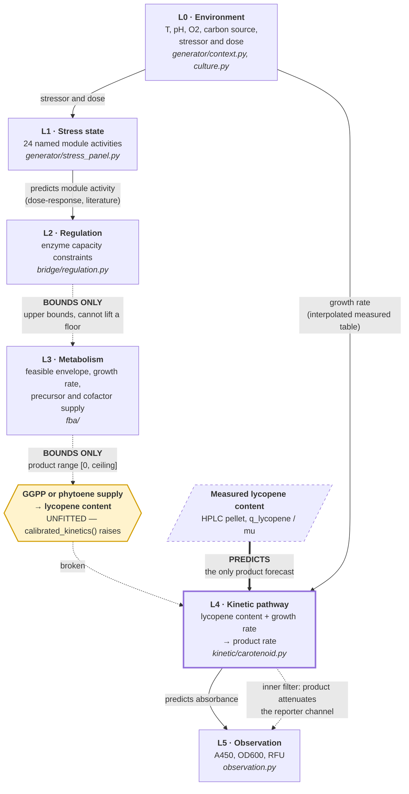

# Product architecture

The question this document answers: **if I want to predict product X through pathway Y under
environment Z, how much product do I get?**

The honest answer today is: **the model gives you a number only if you already measured the
lycopene content.** From an environment specification alone it does not close. What follows
says exactly where it stops and why.

---

## Verdict

**FBA bounds. Kinetics predicts.**

The genome-scale model does not forecast titre and cannot be made to. Under every
constraint this repository knows how to impose, the feasible β-carotene flux is
`[0, ceiling]` — the floor stays at zero, so the model permits a producing solution and an
identically feasible zero-product solution. That is not a tuning problem. An upper bound
cannot make a flux mandatory.

The only layer in this repository that returns a product number is **L4**, a two-parameter
kinetic law fitted to six chemostat steady states. It carries a leave-one-out error of
17.4 % and it refuses outside 0.101–0.254 /h.

Anyone who reads this document and comes away thinking the GSMM forecasts titre has read it
wrong.

---

## The chain



Solid arrows predict. Dashed arrows bound, or are broken. The one heavy arrow is the only
route to a product number, and it starts at a measurement rather than at an environment.

---

## L0 — Environment

**Verdict: predicts growth rate, within a measured table, and refuses outside it.**

| | |
| --- | --- |
| **Takes in** | Temperature °C, medium and cytosolic pH, gas-phase O₂ fraction, carbon source, growth phase, glucose charge, anaerobic supplements, strain |
| **Puts out** | Unstressed specific growth rate (1/h), biomass yield, q_glucose, q_ethanol, q_O₂, carrying capacity |
| **Module** | `generator/context.py` (`CultureContext`, `context_growth_rate`), `generator/culture.py` (`chemostat_physiology`) |
| **Parameters from** | van Hoek 1998 Table 1 (PMID 9797269), ten measured dilution rates 0.025–0.40 /h, linearly interpolated. Cardinal temperatures from Salvadó 2011 (mean T_min 2.8, T_opt 32.3, T_max 45.4 °C) in Rosso's CTMI form. Anaerobic µ_max 0.31 /h from Verduyn 1990 (PMID 1975265). mCitrine pK_a 5.7 from Griesbeck 2001. |
| **Tier** | 1(b) for the physiology lookup — a deterministic interpolation of a measured table. Tier 0 for the sub-air oxygen interior, the pH→reporter form, and dose-as-a-fraction composition. |
| **Predicts or bounds** | **Predicts**, inside 0.025–0.40 /h. Outside it, `chemostat_physiology` raises. In the default environment sweep the refusal fires on **46 %** of rows and travels as a `physiology_refusal` column rather than as an exception. How much of the environment space the generator can ground is itself the result. |

**pH→growth is deliberately refused.** Arroyo-López 2009 finds pH significant for the hybrid
and for *S. kudriavzevii* and not for the *S. cerevisiae* strain, so no factor was asserted.
`ph_medium` is recorded and not used.

**Two known defects, unfixed.** `ChemostatPhysiology.fermentative` is `ethanol > 0`, which
under linear interpolation between the D = 0.25 non-detect and the D = 0.28 first detection
turns true **immediately above µ = 0.25**, not at the documented
`CRITICAL_GROWTH_RATE_PER_H = 0.28`. Bisected against the module directly: `fermentative` is
False at 0.250000 and True at 0.250001, and at µ = 0.26 it reports ethanol 0.0367. Every
grounded sweep row in `0.25 < µ ≤ 0.28` therefore carries `fermentative=True` beside
`above_critical_growth_rate=False`, and both columns ship in the CSV. Its docstring also claims
a growth-rate-conditioned fit cannot see the switch; it is an exact deterministic step function
of growth rate, so a fit can.

---

## L1 — Stress state

**Verdict: predicts which stress, not how much.**

| | |
| --- | --- |
| **Takes in** | Stressor identity and dose (or a dict of several) |
| **Puts out** | Activation of each of **24** named modules, dimensionless |
| **Module** | `generator/stress_panel.py` — `module_response`, `combination_response`, `reporter_loadings` |
| **Parameters from** | Literature transcription. 24 modules, 25 stressors, 24 reporters. **52 identifiers are cited from this one file**, and every identifier in the repository — 604 across PMID, PMC, DOI and arXiv tables — is re-resolved by `scripts/refresh_citations.py` into a tracked table carrying the paper's actual title. 603 of the 604 resolve to a title. |
| **Tier** | **0.** Transcribed is not measured. The loadings matrix, the crosstalk topology and the EC50s are all asserted, and everything in the known-loadings path rests on them. |
| **Predicts or bounds** | **Predicts, as a classifier.** Not as a magnitude estimator. |

**Why the classifier/magnitude split is load-bearing.** Hansen & O'Shea 2015 (PMID 25985085)
measure the information a single Msn2 target carries and conclude the channel is "limited to
error-free transduction of signal identity, but not signal intensity information." Keren 2013
(PMID 24169404) finds "60–90 % of promoters change their expression between conditions by a
constant global scaling factor that depends only on the conditions and not on the promoter's
identity" — the panel's response is close to rank 1, so a 24-reporter panel does not buy 24
independent magnitudes.

**One quantity claim in `FINDINGS.md` is stated wrongly and is corrected here.** Hansen's
1.2–1.3 bits is the *amplitude-channel* information for one gene (HXK1, SIP18). The 1.67 and
1.83 bits are the *joint* amplitude-plus-frequency information for two genes, in the 1× and 2×
diploids respectively — two strains, not a range, and not the same quantity scaled by gene
count.

The citation guard proves an identifier resolves. It does not prove the paper supports the
sentence. That stays a hand check, and this repository has been wrong on it twice — once on a
digit, once on a quantity (a 22.0 mmol *ethanol* anaerobic fermentative capacity read as an
aerobic glucose uptake ceiling).

---

## L2 — Regulation

**Verdict: bounds only. Proven it cannot lift a product floor.**

| | |
| --- | --- |
| **Takes in** | Module activities from L1 |
| **Puts out** | Per-reaction upper-bound scale factors on the GEM |
| **Module** | `bridge/regulation.py` — `eflux_layer`, `apply_eflux`; `bridge/latent_bridge.py` for the older single-scalar form |
| **Parameters from** | SGD regulon membership plus MacIsaac 2006 conserved motifs (PMID 16522208); the GEM's own gene-reaction rules; E-Flux from Colijn 2009 (PMID 19714220) |
| **Tier** | 1(b) — a deterministic computation on adopted models |
| **Predicts or bounds** | **Bounds. Structurally, and it is proven.** |

E-Flux constrains `|v| ≤ c·e`. That is a statement about how much flux is *permitted*. No
upper bound can make a flux mandatory, so it cannot raise a lower bound off zero. The module
records this as `EFLUX_LIFTS_LOWER_BOUND = False`.

**The measured result, stated at its true strength.** `outputs/regulation_product_range.csv`
carries 4 stressors × 7 growth fractions = 28 rows. **0 of 28 narrowed. Every regulated floor
is exactly 0.0, 28 of 28.** Those are the load-bearing halves and they are exact. The
universal claim "relative width 1.000 at all seven growth fractions" is **26 of 28**: at
`growth_fraction = 1.0` for H₂O₂ and menadione the ceiling is numerical noise
(−1.0 × 10⁻¹⁴) so no relative width is defined at all. A repression sweep down to 1 % of
reference capacity leaves the floor at zero with growth already at 1.8 % of maximum.

**E-Flux is also not a free win on yeast.** The one quantified head-to-head over 9 yeast
conditions puts plain E-Flux at r = 0.7829 against pFBA's 0.8337 — below a no-data control
(Kim & Lun 2016, PMID 27327084). Only E-Flux2 with an L2 term edges ahead, by Δr = 0.035.

The mechanism that *does* lift a floor is lexicographic task efficiency (COSMIC-dFBA,
PMID 38387677, doi `10.1016/j.ymben.2024.02.012`). It lifts the floor from a **measured
secretion rate**, not from the model. No strain here carries the pathway, so
`task_priority_order` raises on this repository's own product. Naming the missing measurement
is what that function delivers.

---

## L3 — Metabolism

**Verdict: bounds only. Relative width 1.000 on the product.**

| | |
| --- | --- |
| **Takes in** | Uptake bounds, growth constraint, regulation scale factors |
| **Puts out** | Feasible flux envelope, maximum growth rate, precursor and cofactor supply, product **ceiling** |
| **Module** | `fba/physiology.py` (live), `fba/carotenoid.py`, `fba/fva.py`, `fba/surrogate.py` (parked) over Yeast9 / ecYeastGEM |
| **Parameters from** | Yeast9 and ecYeastGEM as published; van Hoek 1998 Table 1 at D = 0.40 /h as the reference phenotype (glucose 11.1, O₂ 3.7, ethanol 13.9, CO₂ 18.9 mmol/gDW/h) |
| **Tier** | 1(b). The D1 width result is the most robust Tier 1 fact in the repository. |
| **Predicts or bounds** | **Bounds.** |

D1 measured it directly: the feasible product flux is `[0, ceiling]`, relative width 1.000 at
every growth level. D3 then proved it structurally with a per-reaction regulation layer
instead of D1's single ATP scalar, which retires the objection that the width was an artefact
of the scalar coupling.

**The content ceiling is refuted as a bound.** The arithmetic behind "≈33 mg/gDCW" is right
(32.84) and the bound is not: five of 28 published *S. cerevisiae* contents exceed it, up to
2.41×, across four independent groups. The cause is `growth_fraction = 0.90`, which is nowhere
measured. The frontier is exactly linear, so the content ceiling is `111.38/µ − 295.58`
mg/gDCW and **diverges as µ → 0**. FBA places no finite bound on specific content in a
non-growing cell.

**One reference-phenotype correction travels with this layer, and it is not finished.**
`REFERENCE_AEROBIC_BATCH` used to carry glucose 21.3, ethanol 27.4 and CO₂ 20.4 attributed to
van Hoek 1998. Those strings occur zero times in that paper, which runs no batch culture at
all. `CLAIM_BOUNDARY.md` states that the old numbers "were not preserved". **They are
preserved.** `src/ystwin/generator/literature.py` still carries 21.3 and 27.4 attributed to
van Hoek in four places, each with a note reading "same source; not read in full" — a note
that is now false, because the paper has been read and the numbers are not in it. And
`tests/test_literature.py:45` asserts they stay present and calls them "the reference
phenotype". A refuted phenotype pinned by a passing test is worse than one merely left lying
around.

---

## L4 — Kinetic pathway

**Verdict: this is the only layer that predicts product.**

| | |
| --- | --- |
| **Takes in** | Intracellular **lycopene content** (mmol/gDCW) and specific growth rate (1/h) |
| **Puts out** | β-carotene content (mmol/gDCW) and specific production rate (mmol/gDCW/h) |
| **Module** | `kinetic/carotenoid.py` — `beta_carotene_content`, `predict_beta_carotene_rate`, `calibrated_cyclase` |
| **Parameters from** | **Fitted**, to Elizondo & Saa 2025 (PMID 40891387), six chemostat steady states on three β-carotene CEN.PK2-1c strains at two dilution rates. Data vendored from the authors' own released pre-processing output, cross-checked against Table 2 in the PMC JATS: all twelve rates and their 95 % CIs match. |
| **Tier** | **1.** A deterministic fit to real measurements, scored on states it did not see, computed after the measurement rather than registered before it. Not Tier 3. |
| **Predicts or bounds** | **PREDICTS.** |

The law:

```
[β-carotene] = capacity · [lycopene] / (km + [lycopene])     mmol/gDCW
q_β-carotene = µ · [β-carotene]                              mmol/gDCW/h
```

| parameter | fitted | fit scatter, 95 % | measurement error, 95 % | across six LOO refits |
| --- | ---: | --- | --- | --- |
| capacity | **2325 nmol/gDCW** (1.25 mg/gDCW) | [1756, 3078] | [2112, 2599] | [2192, 2695] |
| km | **597 nmol/gDCW** (0.32 mg/gDCW) | [296, 1205] | [408, 910] | [426, 786] |

**Both constants are FITTED. Neither is a literature value and neither may be presented as
one.** There was nothing to look up: PubMed returns zero records for `"lycopene cyclase" AND
(kcat OR "turnover number")`. Elizondo's own team hit the same wall and sampled a
thermodynamically-constrained ensemble rather than parameterising from a database.

The two log parameters correlate **+0.85**, so they are not independently pinned — a larger
capacity with a larger km fits nearly as well. Quote the intervals, not the point values.

**Held-out score.** Leave-one-out over all six states: RMSE(log) **0.186**, MAPE **17.4 %**,
worst state **33 %**, skill **0.82** against the best of three baselines (predicting the
training mean content, RMSE(log) 0.437). Three geometric-mean baselines built independently
by the verifier score 0.4446, 0.4365 and 0.9919, so the 0.82 is not a weak-baseline artefact.
The winning predictor consumes only lycopene content and growth rate — never the target — so
the score is genuinely held out.

**Two corrections to how that score has been reported.** Against the best baseline the law
wins **4 of 6 states**, not 5 of 6; it loses 2D01 (−6.4 % against the baseline's +3.5 %) and
4D01 (+33.0 % against −19.2 %), and on 3D01 its 12.5 % against the baseline's 11.8 % is a
loss, not a tie. The "5 of 6" figure is true only against the *weaker* baseline (training-mean
rate, 0.4537). And the fitted capacity moves **−5.7 % / +15.9 %** across folds against the
reported point estimate, not "±11 %".

**Four of the six branch parameters are structurally unidentifiable, not merely
poorly constrained.** Phytoene and GGPP were never measured. The desaturase flux is pinned,
but for any vmax above that flux there is a phytoene pool delivering it exactly.
`calibrated_kinetics()` raises `NotImplementedError` naming `psy`, `crti`, phytoene and the
PMID, rather than returning four plausible numbers.

**What the data refutes, before what it supports.** A Michaelis-Menten cyclase with a
growth-rate-independent vmax is refuted, in all three strains, in the same direction, with no
fitting involved. Nine times the lycopene buys three-quarters of the rate:

| strain | [lycopene] ratio (high µ / low µ) | q_β-carotene ratio | MM violated |
| --- | ---: | ---: | --- |
| β-car2 | 2.82 | 0.82 | yes |
| β-car3 | 9.40 | 0.77 | yes |
| β-car4 | 4.88 | 0.41 | yes |

Every growth-rate-independent form scores negative out of sample: shared vmax −0.15,
vmax ∝ measured CrtYB mRNA −0.79, vmax free per strain −0.58. The measured enzyme proxy makes
things *worse*. Per-strain vmax is fifth of seven candidates on training residual, not second.

**The mechanism is not established.** A growth-rate-independent content relation is
arithmetically the same statement as a cyclase vmax proportional to growth rate, and
Elizondo's own RT-qPCR has CrtYB mRNA *falling* by a third from the low dilution rate to the
high one. Two candidates — a membrane capacity ceiling, or a genuinely growth-coupled vmax
from translation, folding or membrane insertion — and this dataset does not separate them.
They make different predictions outside the window, which is why the function refuses there.

**One defect in the scoring harness, not in the winner.**
`scripts/fit_carotenoid_kinetics.py`'s `predict()` — its `km <= 0` branch caps at
`desaturase_flux`, which contains the held-out target, and the cap binds on 2 of 6 folds. The
`vmax ∝ µ, no saturation` row of the candidate table (skill 0.58) is therefore optimistic. The
winner does not touch that branch, so no headline number moves.

---

## L5 — Observation

**Verdict: predicts the instrument reading from the state. Refuses to invert it without two
measurements that do not exist.**

| | |
| --- | --- |
| **Takes in** | Product content (mmol/gDCW), biomass (gDCW/L), reporter state |
| **Puts out** | A450 absorbance, OD600, mCitrine RFU |
| **Module** | `observation.py` — `observe_absorbance`, `observe_absorbance_extract`, `product_from_absorbance`, `observe_rfu`, `correct_inner_filter` |
| **Parameters from** | ε = 2592 × 536.87 / 10 = **1.3916 × 10⁵ M⁻¹cm⁻¹**, β-carotene in **petroleum ether** at **450 nm**. Read from an open-access source that states value, solvent and wavelength in one sentence. **Name that source plainly: doi `10.1038/s41598-026-45956-6` is a Sudanese pearl-millet germplasm paper**, not a carotenoid-methods paper, and it is cited only for its Methods sentence, "E 1%1cm is the extinction coefficient of β-carotene in petroleum ether (2592)", with A read at 450 nm. Primary tabulation is the Britton / Liaaen-Jensen / Pfander handbook, doi `10.1007/978-3-0348-7836-4`, which is not open and was not read. |
| **Tier** | 1 for the model and its inverse — Beer-Lambert arithmetic, correctly carried out. Nothing here has met a plate. `scatter_per_od600` and `flattening` are **not asserted at all**; the module refuses. |
| **Predicts or bounds** | **Predicts** the forward reading. The inverse refuses. |

The whole-cell model:

```
A(450) = blank + scatter_per_od600 · OD600_true
              + flattening · ε · (product · biomass / 1000) · path_length
```

**Scattering is the confound that would turn turbidity into titre.** Ignoring the scattering
floor and inverting naively overstates content by **one to two orders of magnitude** — running
the module at plausible fixture values recovers 0.165 mmol/gDCW against a true 0.003, a factor
of 55. No single factor can be quoted, because the factor is set by `scatter_per_od600`, and
that number has never been measured. The module's own test asserts only `> 2×`, which is why
the strong-sounding version of this claim should not be repeated: the honest statement is that
the error is unbounded until the ratio is measured. The module refuses without a measured
`scatter_per_od600` and names `observe_absorbance_extract` as the route that needs no such
number. It does not extrapolate the ratio from a wavelength power law: yeast cells are far
larger than 450 nm, deep in the Mie regime, so a `λ^-n` exponent would be exactly the
plausible substitute number this repository refuses.

**The inner filter couples the product back onto the reporter channel.** β-carotene absorbs
across 400–500 nm; mCitrine is excited near 516 nm. `observe_rfu` multiplies by
`exp(−k · carotenoid)`, so **product reduces apparent fluorescence**. `correct_inner_filter`
divides, so the correction can only move a reading up. Getting the sign backwards would
inflate inferred promoter activity in exactly the producing strains the twin exists to
describe, growing as the strain improves, and it would survive every shuffled-channel control
because the coupling is real signal. Verified numerically: `exp(−k·q)` and `10^−A` agree
identically at 0.7942.

**Two claims about this layer are overstated and the weaker version is the true one.**

1. `observe_absorbance_extract`'s docstring promises `ValueError: if the extraction solvent is
   not the solvent the extinction coefficient was measured in`. **It cannot fire.** There is
   no solvent argument in the signature, and `solvent` is never compared to anything anywhere
   in `src/ystwin` — it is only checked non-empty at construction. Calling it with the
   petroleum-ether coefficient returns a number with no complaint, which is what someone
   extracting into hexane also gets. **The solvent is recorded, not enforced.**
2. `PigmentOptics.__post_init__` is credited with turning the residual 450-vs-453 nm /
   petroleum-ether-vs-hexane ambiguity into an enforced check. It does not. It compares
   `wavelength_nm` against `extinction.wavelength_nm` — two fields the same caller supplies.
   That is internal consistency, not correspondence to the reader's filter or to the solvent
   used. **The ambiguity is unresolved.**

**The channel saturates long before OD600 does.** At the D1-frontier content (32.84 mg/gDCW)
with flattening 1 and a 0.5 cm path: 4.26 AU at 1 gDCW/L, 2.13 at 0.5, 0.43 at 0.1. A good
producer runs the 450 nm channel past any reader's linear range while 600 nm is still
comfortable. G1's `od_linear_max` is a 600 nm threshold and says nothing about 450 nm.
`product_from_absorbance` raises at or above a declared `detector_max`, but `detector_max`
defaults to `None`, so by default the forward model will return physically impossible
absorbances.

**What this channel cannot see.** Phytoene is colourless at 450 nm — a strain blocked at crtI
reads as zero product while carrying full carbon into the branch. Lycopene reads at 470 and
overlaps β-carotene at 450; nothing here deconvolves the mixture. HPLC remains the only way to
resolve all three, and it is one injection.

---

## Calibrated, fitted, asserted

**Calibrated** — a measurement of a real system, transcribed with its units checked.

| Quantity | Where | Source |
| --- | --- | --- |
| Chemostat physiology, 10 dilution rates | `generator/culture.py` | van Hoek 1998, PMID 9797269, Table 1 |
| Cardinal temperatures 2.8 / 32.3 / 45.4 °C | `generator/context.py` | Salvadó 2011, ten *S. cerevisiae* strains |
| Anaerobic µ_max 0.31 /h | `generator/context.py` | Verduyn 1990, PMID 1975265 |
| mCitrine pK_a 5.7 | `generator/context.py` | Griesbeck 2001 |
| Six carotenoid steady states | `data/carotenoid/` | Elizondo & Saa 2025, PMID 40891387 |
| ε = 1.3916 × 10⁵ M⁻¹cm⁻¹ | `observation.py` | Literature, with solvent and wavelength verified. Not measured on this reader, and a solution coefficient is not a whole-cell coefficient. |
| Observed activity CV 0.146, well CV 0.052, σ_µ = 0.0117 /h | `analysis/power.py`, real plates | Measured here, 210 wells |

**Fitted** — regressed against data in this repository, with a held-out score.

| Quantity | Value | Score |
| --- | --- | --- |
| Cyclase capacity | 2325 nmol/gDCW | LOO skill 0.82, MAPE 17.4 % |
| Cyclase km | 597 nmol/gDCW | same fit; correlates +0.85 with capacity |

Two parameters against six observations, and the module asserts `n_states > 2 · n_parameters`.

**Asserted — Tier 0.** These are the ones to be specific about.

| Constant | Where | Note |
| --- | --- | --- |
| Reporter loadings and crosstalk topology | `generator/stress_panel.py::reporter_loadings` | Transcribed from literature with PMIDs. Transcribed is not measured. Everything in the known-loadings path rests on these. |
| The generator's single configuration ξ̄ | `generator/stress_panel.py` | One topology, one EC50 set, one loading matrix. No generator-family sweep has been run; no UCBOG is reported anywhere. |
| H₂O₂ EC50, 0.5 mM | `generator/stress_panel.py` | Literature. The shape-free crossing agrees; the biphasic fit is unidentifiable because every dose showing the falling limb killed the culture. |
| Reporter autofluorescence | `observation.py` | **Never measured on any plate.** Two reporter-free BY4741 controls were plated; both were read in OD600 only. |
| `od_linear_max` | `gates/g1_optical.py` | Placeholder. The dilution series (protocol P4) has not been run. |
| latent → ATP maintenance scale, 6.5 mmol ATP/gDW/h | `bridge/latent_bridge.py` | An envelope. The value it replaced was wrong by 10⁴. Its "independent consistency check" is circular — 6.5466 was obtained as the maximum feasible NGAM subject to µ ≥ 0.1, so µ = 0.1 falls out by construction — and at the bottom of its own stated glucose range (1.1) the model is infeasible at µ ≥ 0.1. |
| Sub-air oxygen interior, dose-as-a-fraction composition, sweep GDCW_PER_OD / OD_BLANK / optics | `generator/context.py`, `scripts/run_environment_sweep.py` | Recorded in `research/GENERATOR_REALISM.md` §10, **not yet entered in `CLAIM_BOUNDARY.md`'s Tier 0 register**. |
| `scatter_per_od600`, `flattening` | `observation.py` | Not asserted at all. No default exists; the module refuses. This is the correct treatment and it is why the product channel does not yet invert. |

**Nothing in this repository is Tier 3.** No forecast has been registered before its
measurement.

---

## How to use it

### The path that works today

You need a measured lycopene content. Given that:

```python
from ystwin.kinetic.carotenoid import predict_beta_carotene_rate, beta_carotene_content

# lycopene content in mmol/gDCW; in a chemostat this is q_lycopene / mu
beta_carotene_content(0.0047)                                   # -> 0.002063 mmol/gDCW
predict_beta_carotene_rate(lycopene_content=0.0047, growth_rate=0.15)
                                                                # -> 0.000309 mmol/gDCW/h
```

**The error bar that comes with it.** Leave-one-out MAPE **17.4 %**, worst held-out state
**33 %**, residual sd in log rate 0.130. Propagate the parameter uncertainty by re-evaluating
at the interval endpoints — capacity [1756, 3078] and km [296, 1205] from the fit scatter,
which is the wider of the two intervals and the one to quote. Do not treat capacity and km as
independent; they correlate +0.85.

**Where it refuses.** Growth rate outside **[0.100987987, 0.254320182] /h**. Negative content.
Non-positive growth rate. `calibrated_kinetics()` always.

### Reproducing the fit and its refutation

```bash
python3 scripts/fit_carotenoid_kinetics.py        # refutation, identifiability, LOO, intervals
python3 -m pytest tests/test_kinetic_carotenoid.py  # 32 tests; the refutation is asserted
```

### The bounding layers

```bash
python3 scripts/run_environment_sweep.py   # L0: ~46% of rows physiology-refused
python3 scripts/run_regulation.py          # L2/L3: writes outputs/regulation_product_range.csv
python3 scripts/parked/run_d1.py           # L3: product flux range and capacity sweep
```

These return **ceilings and feasibility**, never a titre. Read `relative_width_regulated` in
the regulation output: it is 1.0 wherever it is defined.

### What does not run

`scripts/run_scenarios.py` currently raises
`TypeError: latent_constraints() got an unexpected keyword argument 'maintenance_per_activity'`
and leaves its output directory empty. The tracked `outputs/scenario_predictions.csv`
reconstructs exactly from the retired `0.7 + 1200·max(k_synth − 1e-3, 0)`, so that table is
from the superseded code path, not the current bridge.

### State of the tree

The suite is **red**: 2 151 passed, 2 failed, both in `tests/test_three_sensor_build.py`,
attributed by bisection to the new temperature model in `generator/context.py`. One of the two
is a test asserting a limitation that has since become false
(`test_a_stressor_holding_up_its_own_axis_does_not[antimycin_A]` asserts an empty set and now
gets `{'ESR'}`). That needs a decision, not a relaxed assertion. The README's "2 140 tests" is
stale; collection is 2 153.

---

## The single weakest link

**The chain does not close from environment to product.**

L4 takes lycopene content as an *input*. Nothing upstream produces it. `steady_state_pools`
would close the gap — it maps GGPP supply to all four pools — but it needs a full
`CarotenoidKinetics`, and `calibrated_kinetics()` raises because the synthase and desaturase
steps have a pinned flux and an unmeasured substrate. Four of six parameters are
unidentifiable from the only sufficient dataset in the literature.

So the twin cannot today go environment → GSMM → GGPP → product. It can go **measured
lycopene content + growth rate → product**, with a 17 % held-out error, inside a 2.5-fold
window of growth rate. Everything above L4 bounds the answer and does not choose it.

**The measurement that closes it: one phytoene HPLC peak at 285 nm, on the same injection
that already resolves lycopene and β-carotene.** That is the cheapest experiment named
anywhere in this document.

---

## What would break it

Three assumptions, most consequential first, each with the measurement that would test it.

### 1. That the fitted capacity is a growth-coupled vmax rather than an artefact of the vessel

The 2.5-fold vmax scaling across dilution rates may not be about growth rate at all.
Elizondo's Methods call the culture carbon-limited; the mass balance says otherwise. Feed
12 g/L glucose × D = 0.101 = 6.73 mmol/L/h against 0.4326 g/L × 6.683 mmol/gDCW/h = 2.89
consumed — **57 % of the fed glucose is unaccounted for**, and the vessel secretes
6.4 mmol/gDCW/h of ethanol at µ = 0.1, which is not a carbon-limited phenotype. The scaling
may be confounded with a changing limitation regime between the two dilution rates. That makes
the growth-coupled reading one of *three* candidates, not two.

**Test it:** a third dilution rate, with the carbon balance closed and O₂/CO₂ measured
(neither was recorded in the source). This also lifts the refusal that currently blocks batch
culture at µ_max ≈ 0.4 /h.

### 2. That the stress state carries magnitude

L2 and L3 consume module activity as if it were a graded input. Two independent lines say the
reporter channel does not deliver that: Hansen 2015 finds identity but not intensity, and
Keren 2013 finds 60–90 % of promoter change is one global scale factor. If the state is
effectively rank 1, then every environment-conditioned bound downstream is being driven by one
number wearing 24 masks — and the fitted basis already **fails** its rotated-subspace null on
Gasch GSE18 (observed +0.688 against a null median of +0.695, p = 0.990, skill −0.025), which
is a real held-out negative on arrays nobody here measured.

**Test it:** dose two stressors that drive disjoint modules at matched growth inhibition, and
check whether the panel separates them by more than one scale factor. `run_power.py` already
computes the collinearity that says a crossed design is required (0.993 dose-only against
0.507 three-nutrient).

### 3. That whole-cell 450 nm absorbance can be inverted to a titre

The forward model is Beer-Lambert and is sound. The inverse needs two numbers that have never
been measured here, and getting either wrong is not a small error: ignoring the scattering
floor inflates content by one to two orders of magnitude, and a solution extinction coefficient
applied to intact cells over-reads by the packaging factor. The module refuses rather than
guessing, which is correct — and it means the product channel does not yet exist as a
measurement.

Two supporting numbers in the optical section are also weaker than they read. The claim that
pigment and scattering are "the same order of magnitude" rests on `scatter_per_od600 = 1.35`,
an invented test fixture — the same document lists that quantity as "not asserted at all". And
the OD reference "real plates top out at 0.69" is a **blank-subtracted** file; the raw maximum
across the six raw OD600 exports is **0.853** (0.690 + a 0.098 blank on the same plate). The
conclusions survive — 0.853 is still below 1.0 — but the numbers as printed are wrong, inside
the one section whose argument is that units matter.

**Test it:** one dilution series of the isogenic non-producing strain, read at 600 and 450 nm.
It gives `scatter_per_od600` and the 450 nm linear range from the same plate. No new strain, no
new reagent. Then one whole-cell reading beside one extract of the same culture gives
`flattening`.

---

## Provenance

Written 2026-08-26 against `docs/FINDINGS.md`, `docs/CLAIM_BOUNDARY.md`,
`docs/ARCHITECTURE.md`, `docs/PARKED.md`, `docs/research/{KINETIC_FIT,PRODUCT_OBSERVATION,
GENERATOR_REALISM,STRESS_RULES,CALIBRATION_DATA}.md` and the source tree under `src/ystwin`.

Every claim in this file that a verification pass refuted has been restated at its weaker
true strength, and the restatement is marked where it appears: the 4-of-6 held-out count and
the ±11 % fold spread in L4, the 26-of-28 relative-width count in L2, the unenforceable
solvent refusal and the unresolved wavelength ambiguity in L5, the 0.853 raw OD and the
`fermentative` threshold in L0, the preserved van Hoek numbers in L3, and the Hansen bits
quantity in L1.

Citation counts stated here were recounted against `data/citations/`: 604 identifiers
vendored, 603 resolving to a title, 52 of them cited from `generator/stress_panel.py`. The
figure "216 verified citations" does not correspond to anything in this repository and is not
used.

## Running it

One command, environment in, product out:

```bash
python3 scripts/predict_product.py
```

The chain is `src/ystwin/predict.py`. Its entry point is `predict_product(Environment)`:

```python
from ystwin.predict import Environment, predict_product

got = predict_product(Environment(
    lycopene_content=7.0e-4,   # mmol/gDCW, an INPUT -- see below
    growth_rate_setpoint_per_h=0.15,   # /h, held by an exponential fed-batch feed
    stressor="DTT", dose=0.5,  # optional
))
got.summary()
# mu 0.142 /h respiratory -> 0.0001777 mmol/gDCW/h [0.0001342, 0.0002352] = 0.674 mg/gDCW
```

**Lycopene is predicted, not supplied.** An earlier version took it as an input, reasoning
that FBA bounds the product from above and never from below so nothing pins it. That gave
up too early. Lycopene is an *intermediate*, and an intermediate at steady state is pinned
by a mass balance rather than by an objective:

    d[lyc]/dt = v_desaturase − v_cyclase − mu*[lyc] = 0

With the cyclase Michaelis–Menten in [lyc] that is a quadratic with one positive root, so
the pool follows from the flux and the fitted cyclase alone — no PSY or crtI parameters
needed, which matters because those are exactly the two steps the calibration set cannot
identify. Solved this way lycopene reproduces all six measured states to a median 5.4%,
and predicting more of the chain made beta-carotene *more* accurate, 8.6% → 5.0%.

**The one per-strain input is the pathway flux**, and it is a strain constant rather than
an environment one. Across the 2.52-fold growth change in the calibration set it moves by
1.09x, 0.60x and 0.89x in the three strains; Pearson(mu, flux) is −0.215. A heterologous
pathway on constitutive promoters does not know the dilution rate. So one number
characterises a strain — the number a gene-expression measurement supplies — and
everything else comes from the environment.

## Is the inner-filter plate worth spending?

Not at these titres. `inner_filter_coeff_from_extinction` derives the reporter/product
coupling from the pigment's own absorbance, so the question is answerable without the
plate. Across the whole plausible spectral bracket — beta-carotene absorbing 5% to 25% of
its 450 nm peak at mCitrine's 516 nm excitation — and Elizondo's 0.39–0.97 mg/gDCW:

| A516/A450 | loss at 0.97 mg/gDCW | content where loss reaches the 5.2% well CV |
| ---: | ---: | ---: |
| 0.05 | 0.9 % | 5.96 mg/gDCW |
| 0.15 | 2.6 % | 1.99 mg/gDCW |
| 0.25 | 4.2 % | 1.19 mg/gDCW |

Every entry is below the measured well CV of 5.2 %, so the correction would be applied
inside the noise. It becomes worth measuring somewhere between **1.2 and 6.0 mg/gDCW**,
and published high producers are far past that — Arhar 2024 (PMID 39215465) reaches 79
mg/gDCW, where the loss exceeds three times the CV whatever the spectral ratio.

So: skip the plate for the current strains, and spend it when a strain clears about
1 mg/gDCW. The refusal stays in place meanwhile, which is the correct state — it is
protecting a correction nobody can yet make honestly.

**Two things it refuses.** A growth rate outside `[0.101, 0.254]` /h, because the cyclase
capacity was fitted at exactly two dilution rates and anything else is an extrapolation --
which means a batch culture at 0.4 /h is refused, and so is any stress dose severe enough
to drop growth below 0.101. Run a chemostat, or widen `growth_rate_range` on a copy of the
calibration and say so at the call site.

**What it reproduces.** All six measured chemostat states to a median residual of 8.6%,
worst 17.4%. Those are the fitted states, so that is a residual and not a prediction; the
held-out number is a leave-one-out RMSE of 0.186 in log space against a
training-mean-content baseline of 0.437.

**Stress reaches product through growth, not through a stress-specific term.** The panel's
own `growth_rate` dose-response carries it. Note it is NOT `module_response`'s ESR arm,
which is non-monotone in dose -- it peaks near the EC50 and falls again as viability
drops, because dying cells mount a smaller response -- and using it as a burden proxy put
DTT's growth higher at 2 mM than at 1 mM.
